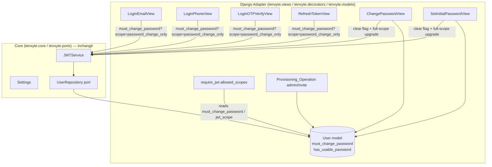

# Design Document

## Overview

Cette fonctionnalité force un utilisateur à (re)définir son mot de passe à la première connexion, sans introduire de nouvelle couche architecturale : tout le nouveau code s'insère dans les patterns `Django_Adapter` déjà en place (champ additif sur `User`, vues DRF d'authentification, décorateur `require_jwt` avec enforcement de scope, endpoints `/password/change/` et `/password/set-initial/` déjà livrés par la fonctionnalité `passwordless-phone`).

Trois briques sont ajoutées :

1. **Un flag `must_change_password`** : un champ booléen additif sur `User` (défaut `False`), positionné à `True` lorsqu'un compte est provisionné par un tiers (admin ou invitation d'organisation) avec un mot de passe temporaire ou sans mot de passe.
2. **Un jeton à portée restreinte `password_change_only`** : lorsque la fonctionnalité est activée et qu'un `Forced_Change_Account` se connecte (ou rafraîchit ses jetons), le jeton d'accès émis porte le claim `scope="password_change_only"` et la réponse contient `must_change_password: true`. L'enforcement est délégué au décorateur `require_jwt` existant : ce jeton n'est accepté que sur les `Password_Change_Endpoints`, et renvoie `403 INSUFFICIENT_SCOPE` partout ailleurs.
3. **La levée automatique de l'obligation** : après un changement réussi via `ChangePasswordView` (compte avec mot de passe) ou `SetInitialPasswordView` (Passwordless_Account), `must_change_password` passe à `False` et une paire de jetons **pleine portée** est émise dans la réponse, exactement comme le fait déjà `TwoFactorConfirmView` après la confirmation du bootstrap 2FA.

Toutes ces briques sont **additives et opt-in** : elles n'ont d'effet sur l'émission/enforcement des jetons que lorsque `TENXYTE_FORCE_PASSWORD_CHANGE_ON_FIRST_LOGIN_ENABLED=True` (défaut `False`) **et** qu'un compte porte `must_change_password=True`. Aucun compte existant, aucun format de requête/réponse existant, aucune valeur par défaut de setting existant n'est modifié (Requirement 7).

### État actuel constaté (pertinent pour cette fonctionnalité)

Une lecture du code confirme que l'infrastructure nécessaire est déjà présente (livrée par `passwordless-phone` et le bootstrap 2FA admin) :

- **Champ `has_usable_password`** sur `AbstractUser` (`src/tenxyte/models/auth.py`, défaut `True`), distinguant un `Passwordless_Account` (`False`) d'un compte doté d'un mot de passe. La dernière migration est `0017_login_otp_type_and_passwordless_account`.
- **Enforcement de scope dans `require_jwt`** (`src/tenxyte/decorators.py`) : un token dont le claim `scope` est non vide n'est accepté que si le scope figure dans `allowed_scopes`, sinon `403 INSUFFICIENT_SCOPE`. Un token sans scope (`request.jwt_scope is None`) est accepté partout (comportement inchangé). Le scope est exposé via `request.jwt_scope`.
- **Scope `2fa_setup_only`** : `LoginEmailView`/`LoginPhoneView` émettent un token restreint via `jwt_service.generate_access_token(..., extra_claims={"scope": "2fa_setup_only"}, custom_lifetime=timedelta(minutes=15))` pour un admin sans 2FA ; `TwoFactorSetupView`/`TwoFactorConfirmView` sont décorés `@require_jwt(allowed_scopes=["2fa_setup_only"])` ; après confirmation, `TwoFactorConfirmView` émet une paire de tokens pleine portée et blackliste le token bootstrap. C'est le patron exact repris ici.
- **`ChangePasswordView`** (`src/tenxyte/views/password_views.py`) : rejette un `Passwordless_Account` (`PASSWORDLESS_ACCOUNT_USE_SET_INITIAL_PASSWORD`, 400) et, sinon, délègue la preuve à `ReauthService.verify(password=..., otp_code=...)` avant `user_repo.update_password(...)`.
- **`SetInitialPasswordView`** : réservé aux `Passwordless_Account`, exige un Login OTP valide, met à jour le mot de passe puis passe `has_usable_password` à `True`.

**Conséquence pour cette conception** : le nouveau scope `password_change_only` réutilise strictement le même mécanisme que `2fa_setup_only`. Le nouveau flag `must_change_password` est un simple champ additif. Les deux endpoints de changement de mot de passe existent déjà et n'ont besoin que d'un ajout minimal (basculer le flag et faire l'upgrade de token). Rien n'est ajouté au Core.

## Architecture

L'architecture hexagonale existante est respectée : l'émission des jetons reste dans les vues `Django_Adapter` qui consomment `JWT_Service` (`generate_new_token_pair`, `generate_access_token`) via ses `extra_claims` ; l'enforcement reste dans `require_jwt`. Aucune logique de scope ou de flag n'est introduite dans `tenxyte.core` / `tenxyte.ports`.



### Décision de conception : précédence de scope quand 2FA bootstrap ET changement forcé s'appliquent (Requirement 3.5)

Un même login peut théoriquement déclencher deux conditions de scope restreint : l'admin sans 2FA (`2fa_setup_only`) et le changement de mot de passe forcé (`password_change_only`). Un jeton ne peut porter qu'un seul scope. La règle de précédence retenue, déterministe et documentée :

1. **Le bootstrap 2FA (`2fa_setup_only`) est prioritaire.** Si le compte est un admin (`is_superuser` ou `is_staff`) sans 2FA configurée, le login émet le token `2fa_setup_only` comme aujourd'hui, **sans changement**. La sécurité du compte (activer la 2FA) prime, et ce chemin est déjà en production.
2. **Sinon, si `Feature_Enabled_Setting` est activé et `must_change_password` est `True`**, le login émet le token `password_change_only`.
3. **Sinon**, le login émet un `Full_Scope_Token` comme aujourd'hui.

Cette précédence garantit qu'aucun jeton n'a un scope ambigu : les conditions sont évaluées dans un ordre unique et exclusif. Après avoir activé sa 2FA (upgrade full-scope de `TwoFactorConfirmView`), l'admin encore soumis à `must_change_password=True` re-déclenchera le gating `password_change_only` à son prochain appel de login/refresh, préservant l'obligation.

### Décision de conception : quels endpoints un `Restricted_Password_Token` peut atteindre (Requirement 4.1/4.2)

Le `Restricted_Password_Token` (scope `password_change_only`) est accepté uniquement sur les endpoints décorés `@require_jwt(allowed_scopes=["password_change_only"])` :

- `POST /password/change/` (`ChangePasswordView`) — pour un compte avec `has_usable_password=True` (mot de passe temporaire).
- `POST /password/set-initial/` (`SetInitialPasswordView`) — pour un `Passwordless_Account`.
- `POST /logout/` et `POST /logout/all/` — pour permettre à l'utilisateur d'abandonner le flux.

Tous les autres endpoints protégés restent décorés `@require_jwt` sans `allowed_scopes`, donc un `Restricted_Password_Token` y est refusé avec `403 INSUFFICIENT_SCOPE` (comportement natif du décorateur, aucun code supplémentaire par endpoint). `/me/` en lecture n'est **pas** ajouté aux endpoints autorisés par défaut afin de bloquer réellement « l'accès à quoi que ce soit d'autre » ; le client dispose déjà de `must_change_password` dans la réponse de login pour router l'utilisateur.

### Décision de conception : découplage `must_change_password` / `has_usable_password`

Les deux champs sont orthogonaux (Requirement 1.5) :

| has_usable_password | must_change_password | Endpoint de sortie du flux |
|---|---|---|
| `True` (mot de passe temporaire) | `True` | `/password/change/` |
| `False` (invitation sans mot de passe) | `True` | `/password/set-initial/` |
| `True` | `False` | flux normal (aucun gating) |
| `False` | `False` | Passwordless_Account normal (login OTP) |

Le routage entre les deux endpoints est **déjà** imposé par le code existant : `ChangePasswordView` refuse un `Passwordless_Account` et `SetInitialPasswordView` refuse un compte avec mot de passe. Cette feature ne fait qu'y ajouter la bascule du flag et l'upgrade de token.

## Components and Interfaces

### 1. `User` (additif) — `src/tenxyte/models/auth.py` (`AbstractUser`)

```python
# Force password change on first login (feature: force_password_change_on_first_login)
must_change_password = models.BooleanField(
    default=False,
    help_text=(
        "True lorsqu'un compte a été provisionné par un tiers (admin ou "
        "invitation) et doit (re)définir son mot de passe à la première "
        "connexion avant tout autre accès. Remis à False après un changement "
        "réussi via /password/change/ ou /password/set-initial/."
    ),
)
```

- **Additif** : nouveau champ, défaut `False` → tous les comptes existants restent `must_change_password=False`, comportement inchangé. Aucune colonne/contrainte/choix existant n'est modifié.
- Positionné à `True` uniquement par une `Provisioning_Operation`.
- Remis à `False` uniquement par `ChangePasswordView` / `SetInitialPasswordView` après succès.

### 2. Réglage (additif) — `src/tenxyte/conf/auth.py` (`AuthSettingsMixin`)

```python
@property
def FORCE_PASSWORD_CHANGE_ON_FIRST_LOGIN_ENABLED(self):
    """Active l'émission/enforcement du token restreint password_change_only
    pour les comptes must_change_password=True."""
    return self._get("TENXYTE_FORCE_PASSWORD_CHANGE_ON_FIRST_LOGIN_ENABLED", False)
```

Réglage nouveau, défaut `False` ; aucun réglage existant n'est renommé ni ne change de défaut (Requirement 6.3, 7.2). La convention `self._get("TENXYTE_...", default)` suit celle observée pour les settings récents.

### 3. Helper d'émission de scope (additif) — `src/tenxyte/views/auth_views.py`

Un unique helper factorise la décision de scope, réutilisé par les trois `Login_Endpoints` et par `RefreshTokenView`, pour éviter toute divergence :

```python
def resolve_forced_password_change_scope(user) -> str | None:
    """Retourne "password_change_only" si le gating de changement forcé
    s'applique à cet utilisateur, sinon None (token full-scope).
    N'a d'effet que si la feature est activée."""
    if not auth_settings.FORCE_PASSWORD_CHANGE_ON_FIRST_LOGIN_ENABLED:
        return None
    if getattr(user, "must_change_password", False):
        return "password_change_only"
    return None
```

Dans les `Login_Endpoints`, la logique existante d'émission de token est enveloppée ainsi (le bootstrap 2FA garde sa priorité, cf. précédence) :

- Le bloc admin-sans-2FA existant (`2fa_setup_only`) reste **intact** et prioritaire.
- Sinon, si `resolve_forced_password_change_scope(user)` retourne `"password_change_only"`, l'access token est généré avec `extra_claims={..., "scope": "password_change_only"}` et la réponse ajoute `must_change_password: true`.
- Sinon, comportement actuel inchangé, avec `must_change_password: false` ajouté à la réponse.

Le champ `must_change_password` est **ajouté** au corps de réponse des `Login_Endpoints` et de `RefreshTokenView` (nouveau champ, aucun champ retiré — Requirement 3.2/3.3/7.3).

### 4. Enforcement (réutilisation) — `src/tenxyte/decorators.py`

Aucune modification du décorateur `require_jwt` : il applique déjà l'enforcement de scope. Seuls les endpoints du flux sont annotés :

```python
# ChangePasswordView.post et SetInitialPasswordView.post
@require_jwt(allowed_scopes=["password_change_only"])
def post(self, request): ...

# LogoutView / LogoutAllView : ajouter "password_change_only" à allowed_scopes
```

Tous les autres endpoints protégés conservent `@require_jwt` (sans `allowed_scopes`), donc refusent nativement le token restreint (`403 INSUFFICIENT_SCOPE`).

### 5. `ChangePasswordView` (additif minimal) — `src/tenxyte/views/password_views.py`

Après le `user_repo.update_password(...)` réussi existant, ajouter :

```python
issued_full_scope = None
if request.user.must_change_password:
    request.user.must_change_password = False
    request.user.save(update_fields=["must_change_password"])
    # Upgrade token si l'appel a été fait avec un Restricted_Password_Token,
    # exactement comme TwoFactorConfirmView après le bootstrap 2FA.
    if getattr(request, "jwt_scope", None) == "password_change_only":
        jwt_service = get_core_jwt_service()
        app_id = str(request.application.id) if getattr(request, "application", None) else "default"
        token_pair = jwt_service.generate_new_token_pair(user_id=str(request.user.id), application_id=app_id)
        issued_full_scope = token_pair
```

La réponse existante (`message`, `password_strength`, `sessions_revoked`) est **conservée** ; si `issued_full_scope` est défini, on **ajoute** `access_token`, `refresh_token`, `token_type`, `expires_in` (champs additifs). Le rejet préalable d'un `Passwordless_Account` et la garde `ReauthService` restent inchangés (Requirement 5.6).

### 6. `SetInitialPasswordView` (additif minimal) — `src/tenxyte/views/password_views.py`

Après le passage existant de `has_usable_password=True`, ajouter la même bascule de `must_change_password` et le même upgrade full-scope conditionnel. La réponse existante (`{"message": "Password set successfully"}`) est conservée, enrichie des champs de token additifs le cas échéant. La garde `ALREADY_HAS_PASSWORD`, la vérification OTP obligatoire, le contrôle de complexité et le contrôle HIBP restent inchangés (Requirement 5.6).

### 7. `Provisioning_Operation` (additif) — vues admin / invitation

Le positionnement du flag réutilise un chemin de création existant (vue admin de gestion d'utilisateurs et/ou invitation d'organisation) :

- Lors d'une création admin avec mot de passe temporaire : `has_usable_password=True`, `must_change_password=True`.
- Lors d'une invitation sans mot de passe : `has_usable_password=False`, `must_change_password=True`.

L'autorisation d'appeler ce chemin reste celle déjà en place sur la vue admin/invitation (Requirement 2.3) ; aucune nouvelle règle d'autorisation n'est introduite. L'endpoint exact (nouveau champ optionnel `must_change_password` sur la création admin, ou setter dédié) est arrêté à l'implémentation, sans modifier le contrat des créations self-service (Requirement 2.4).

## Data Models

### `User` (additif) — `src/tenxyte/models/auth.py`

- Nouveau champ `must_change_password = models.BooleanField(default=False, help_text=...)`. Aucune autre modification.

### Migration

Une seule migration additive, `0018_user_must_change_password.py` :

```python
class Migration(migrations.Migration):
    dependencies = [("tenxyte", "0017_login_otp_type_and_passwordless_account")]
    operations = [
        migrations.AddField(
            model_name="user",
            name="must_change_password",
            field=models.BooleanField(default=False, help_text="..."),
        ),
    ]
```

Seule une opération `AddField` apparaît ; aucune `RemoveField`, `RemoveConstraint`, ou `AlterField` restreignant l'existant (Requirement 1.2, 7.4).

## Correctness Properties

*Une propriété est une caractéristique ou un comportement qui doit rester vrai pour toutes les exécutions valides d'un système — un énoncé formel de ce que le système doit faire. Les propriétés servent de pont entre les spécifications lisibles par des humains et des garanties de correction vérifiables automatiquement.*

### Property 1: Défaut inerte du flag

Pour tout compte créé par un flux d'inscription self-service, `must_change_password` vaut `False`, et pour tout compte préexistant (créé avant cette fonctionnalité), la migration additive laisse `must_change_password` à `False`.

**Validates: Requirements 1.1, 1.3, 7.4**

### Property 2: Provisionnement positionne le flag et les deux variantes de compte

Pour tout compte créé par une `Provisioning_Operation`, `must_change_password` vaut `True`, avec `has_usable_password=True` si un mot de passe temporaire est fourni et `has_usable_password=False` sinon.

**Validates: Requirements 2.1, 2.2, 1.5**

### Property 3: Émission d'un token restreint à la connexion d'un compte forcé

Pour tout `Forced_Change_Account` et tout `Login_Endpoint`, lorsque `Feature_Enabled_Setting` est activé et que la connexion réussit (hors cas admin-sans-2FA), le token d'accès émis porte le claim `scope="password_change_only"` et la réponse contient `must_change_password=true`.

**Validates: Requirements 3.1, 3.2**

### Property 4: Token full-scope pour un compte non forcé

Pour tout compte dont `must_change_password` est `False`, tout `Login_Endpoint` qui réussit émet un `Full_Scope_Token` (aucun claim `scope`) et la réponse contient `must_change_password=false`.

**Validates: Requirements 3.3**

### Property 5: Feature désactivée n'altère aucun token

Pour toute connexion réussie et tout compte (y compris un compte avec `must_change_password=True`), lorsque `Feature_Enabled_Setting` est désactivé, le token émis est identique (même absence de scope restreint) à celui émis avant l'introduction de cette fonctionnalité.

**Validates: Requirements 3.4, 6.2**

### Property 6: Précédence déterministe du bootstrap 2FA

Pour tout compte admin (`is_superuser` ou `is_staff`) sans 2FA configurée qui est aussi un `Forced_Change_Account`, une connexion réussie émet un token de scope `2fa_setup_only` (et non `password_change_only`), le bootstrap 2FA restant prioritaire.

**Validates: Requirements 3.5**

### Property 7: Le refresh préserve la restriction

Pour tout `Forced_Change_Account` avec `Feature_Enabled_Setting` activé, un rafraîchissement de jetons n'émet jamais un `Full_Scope_Token` tant que `must_change_password` reste `True`.

**Validates: Requirements 3.6**

### Property 8: Un token restreint est refusé hors des endpoints autorisés

Pour tout `Restricted_Password_Token` et tout endpoint protégé ne figurant pas dans `Password_Change_Endpoints`, la requête est rejetée avec `403 INSUFFICIENT_SCOPE` et l'action de l'endpoint n'est pas exécutée.

**Validates: Requirements 4.1**

### Property 9: Un token restreint est accepté sur les endpoints de changement de mot de passe

Pour tout `Restricted_Password_Token`, une requête vers un `Password_Change_Endpoint` passe le contrôle de scope de `require_jwt`.

**Validates: Requirements 4.2, 4.5**

### Property 10: Un token full-scope reste accepté partout

Pour tout `Full_Scope_Token`, toute requête vers tout endpoint protégé (y compris les `Password_Change_Endpoints`) passe le contrôle de scope exactement comme avant cette fonctionnalité.

**Validates: Requirements 4.3, 7.2**

### Property 11: Levée du flag après changement de mot de passe

Pour tout `Forced_Change_Account` avec un mot de passe utilisable, un `Change_Password_Operation` réussi met `must_change_password` à `False`.

**Validates: Requirements 5.1**

### Property 12: Levée du flag après définition du premier mot de passe

Pour tout `Forced_Change_Account` qui est un `Passwordless_Account`, un `Set_Initial_Password_Operation` réussi met `must_change_password` à `False`.

**Validates: Requirements 5.2**

### Property 13: Upgrade full-scope après succès avec un token restreint

Pour tout `Forced_Change_Account` complétant avec succès `Change_Password_Operation` ou `Set_Initial_Password_Operation` en présentant un `Restricted_Password_Token`, la réponse contient une nouvelle paire de jetons pleine portée.

**Validates: Requirements 5.3**

### Property 14: Un échec ne lève pas le flag ni n'émet de token

Pour tout `Forced_Change_Account`, tout `Change_Password_Operation` ou `Set_Initial_Password_Operation` en échec (réauthentification invalide, OTP invalide, mot de passe non conforme, ou mot de passe compromis) laisse `must_change_password` inchangé à `True` et n'émet aucun `Full_Scope_Token`.

**Validates: Requirements 5.4**

### Property 15: Préconditions des opérations de changement inchangées

Pour tout compte atteignant `Change_Password_Operation` ou `Set_Initial_Password_Operation` avec un `Restricted_Password_Token`, toutes les préconditions existantes (réauthentification mot de passe/OTP, preuve OTP, complexité du mot de passe, contrôle de fuite, rejet croisé passwordless/mot de passe) s'appliquent à l'identique.

**Validates: Requirements 5.5, 5.6, 7.6**

### Property 16: Non-régression du contrat existant

Pour tout endpoint existant et tout compte dont `must_change_password` est `False` (ou avec la fonctionnalité désactivée), la forme de requête/réponse et les codes HTTP restent identiques à ceux d'avant cette fonctionnalité, à l'exception du seul champ additif `must_change_password` ajouté aux réponses de login/refresh.

**Validates: Requirements 7.1, 7.2, 7.3**

## Error Handling

| Situation | Vue | Code HTTP | `code` |
|---|---|---|---|
| Token restreint sur endpoint non autorisé | tout endpoint `@require_jwt` sans le scope | 403 | `INSUFFICIENT_SCOPE` (inchangé) |
| Passwordless_Account sur `/password/change/` | `ChangePasswordView` | 400 | `PASSWORDLESS_ACCOUNT_USE_SET_INITIAL_PASSWORD` (inchangé) |
| Compte déjà doté d'un mot de passe sur `/password/set-initial/` | `SetInitialPasswordView` | 400 | `ALREADY_HAS_PASSWORD` (inchangé) |
| Réauthentification manquante/incorrecte sur `/password/change/` | `ChangePasswordView` (via `ReauthService`) | 400 | `REAUTH_REQUIRED` / `INVALID_PASSWORD` / `OTP_INVALID` (inchangé) |
| OTP manquant/invalide sur `/password/set-initial/` | `SetInitialPasswordView` | 400 | `OTP_REQUIRED` / `OTP_INVALID` (inchangé) |
| Nouveau mot de passe compromis | `ChangePasswordView` / `SetInitialPasswordView` | 400 | `PASSWORD_BREACHED` (inchangé) |

Aucun nouveau format de réponse d'erreur n'est introduit : tout réutilise les codes existants (`{"error": ..., "code": ...}`). Le seul nouveau comportement observable en succès est l'ajout du champ `must_change_password` et, après levée du flag, des champs de token d'upgrade.

## Testing Strategy

### Approche

Approche duale conforme au reste du projet :

- **Tests unitaires** (`pytest`, style de `tests/integration/django/unit/`) pour les exemples concrets : valeurs par défaut du réglage et du champ, structure de la migration additive, `allowed_scopes` des endpoints du flux, précédence 2FA vs changement forcé, formes de réponse figées (snapshot) des endpoints existants.
- **Tests de propriétés** (`hypothesis`, ≥100 exemples chacun) pour les 16 propriétés ci-dessus. Chaque test référence sa propriété au format :

  **Feature: force_password_change_on_first_login, Property N: <texte de la propriété>**

### Tests unitaires ciblés (exemples, pas de PBT)

- Valeur par défaut : `FORCE_PASSWORD_CHANGE_ON_FIRST_LOGIN_ENABLED is False` ; aucun défaut de setting préexistant modifié.
- Champ par défaut : un `User` créé sans préciser le flag a `must_change_password is False`.
- Migration `0018_user_must_change_password` : `operations` ne contient qu'un `AddField` (aucune suppression/altération de l'existant), dépend de `0017_...`.
- `ChangePasswordView`/`SetInitialPasswordView`/`LogoutView`/`LogoutAllView` déclarent `allowed_scopes` incluant `password_change_only` ; tous les autres endpoints protégés ne l'incluent pas.
- Snapshot des réponses de `/login/email/`, `/login/phone/`, `/login/otp/verify/`, `/refresh/`, `/password/change/`, `/password/set-initial/` : aucun champ documenté retiré, `must_change_password` présent en plus.
- Suite de tests existante : doit continuer à passer intégralement (Requirement 7.7), exécutée telle quelle en CI sans modification.

### Tests de propriétés (hypothesis, ≥100 exemples chacun)

Un test par propriété (Property 1 à 16), avec des générateurs pour :

- Combinaisons `(has_usable_password, must_change_password, is_superuser/is_staff, mfa_type)` couvrant le tableau de découplage et la précédence de scope (Property 2, 3, 4, 6).
- État `Feature_Enabled_Setting` activé/désactivé via `override_settings` (Property 5, et invariant de non-régression Property 16).
- Chemins de login/refresh (email, phone, OTP) et scope résultant du token (Property 3, 7).
- Présentation d'un `Restricted_Password_Token` vs `Full_Scope_Token` contre un échantillon d'endpoints autorisés/non autorisés (Property 8, 9, 10).
- Résultats de `Change_Password_Operation`/`Set_Initial_Password_Operation` succès/échec (réauthentification, OTP, complexité, HIBP mockés) pour la bascule du flag et l'upgrade de token (Property 11–15).

Les appels réseau (envoi SMS/email, HIBP) restent mockés, comme dans les suites existantes.
