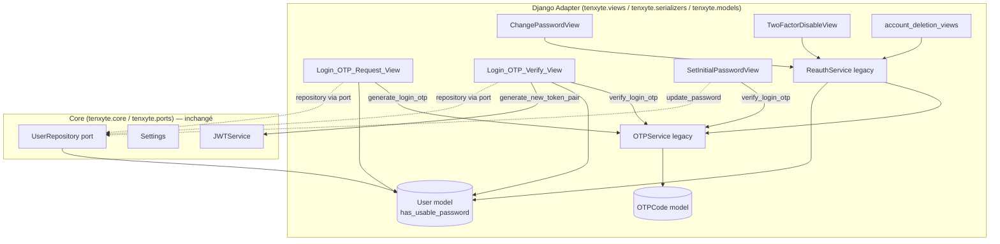

# Design Document

## Overview

Cette fonctionnalité ajoute une voie de connexion passwordless native par téléphone (OTP SMS/WhatsApp) à Tenxyte, sans introduire de nouvelle couche architecturale : tout le nouveau code s'insère dans les patterns `Django_Adapter` déjà en place (vues DRF façades, serializers, throttles dédiés, `OTPService` legacy, services Core pour JWT et repository utilisateur).

Trois capacités sont ajoutées :

1. **Connexion par OTP téléphonique** : deux nouveaux endpoints publics (`Login_OTP_Request_View`, `Login_OTP_Verify_View`) qui répliquent le comportement de sécurité et la forme de réponse de `LoginPhoneView`, mais sans jamais exiger de mot de passe. Un nouveau type d'OTP `login` est ajouté à `OTPCode`/`OTPService`.
2. **Comptes passwordless (`Passwordless_Account`)** : un nouveau champ additif sur `User` (`has_usable_password`) qui distingue les comptes ayant un mot de passe défini par leur propriétaire de ceux créés (ou réduits) à un mot de passe aléatoire inutilisable. Les endpoints sensibles existants (`/password/change/`, `/2fa/disable/`, suppression de compte, export de données) acceptent désormais une preuve OTP (`OTP_Reauth_Challenge`) comme alternative au mot de passe actuel.
3. **Création volontaire d'un premier mot de passe (`Set_Initial_Password_Operation`)** : un nouvel endpoint dédié, distinct de `/password/change/`, permettant à un `Passwordless_Account` de définir un mot de passe après preuve OTP fraîche, sans jamais rendre cette étape obligatoire.

Toutes ces capacités sont **additives** : elles n'existent que lorsqu'un intégrateur les active explicitement (`TENXYTE_OTP_LOGIN_ENABLED=False` par défaut) ou les invoque explicitement (nouveaux endpoints), et ne modifient aucun comportement, format de requête/réponse, ou valeur par défaut de setting existant (Requirement 8).

### État actuel constaté (pertinent pour cette fonctionnalité)

Une lecture du code existant confirme que les deux correctifs mentionnés dans les notes de planification (`base.md`) sont **déjà appliqués** dans la base actuelle :

- `PasswordResetConfirmSerializer` utilise déjà le champ `otp_code` (et non `code`) — voir `src/tenxyte/serializers/password_serializers.py`. C'est la convention à répliquer pour tout nouveau serializer OTP de connexion/réauthentification.
- `phone_country_code` est déjà stocké sans `+` : `normalize_phone_country_code()` (dans `validators.py`) retire le `+` à la validation, et `AbstractUser.save()` (dans `models/auth.py`) réapplique `strip().lstrip("+")` à **chaque** sauvegarde, quel que soit le chemin d'écriture (serializer, `create_user`, `register_user_with_core`, admin, etc.). L'affichage (`full_phone`, `AuthUserSerializer.get_phone`) ajoute le `+` une seule fois, uniquement à la sérialisation. La migration `0016_normalize_phone_country_code` a nettoyé les données historiques.

**Conséquence pour cette conception** : ces correctifs n'ont pas besoin d'être refaits. La contrainte de conception est de **ne pas régresser** cet invariant : tout nouveau serializer qui accepte un `phone_country_code` (`Login_OTP_Request_View`, `Login_OTP_Verify_View`) DOIT appeler `normalize_phone_country_code()` dans un `validate_phone_country_code`, exactement comme `LoginPhoneSerializer` et `PasswordResetRequestSerializer` le font déjà. Aucun nouveau point d'ajout du `+` ne doit être introduit hors de la sérialisation de sortie (`get_phone`/`full_phone`).

## Architecture

L'architecture hexagonale existante est respectée : les nouvelles vues sont des façades `Django_Adapter` qui consomment les ports `Core` (`DjangoUserRepository`, `JWTService`, `Settings`, `DjangoCacheService`, `DjangoTOTPStorage`) exactement comme `LoginPhoneView`/`authenticate_by_phone_with_core`, et utilisent le service legacy `OTPService` pour la génération/vérification des codes OTP (comme le fait déjà `RegisterView`, `RequestOTPView`, etc.). Aucune logique Django (ORM, DRF, settings Django) n'est introduite dans `tenxyte.core` / `tenxyte.ports`.



### Décision de conception : résolution du conflit apparent entre Requirement 6.4 et Requirement 6.7

Requirement 6.4 dit que l'`OTP_Reauth_Challenge` est acceptable comme alternative au mot de passe pour **toute** `Sensitive_Password_Action`, "*regardless of whether the requesting account is a Passwordless_Account*". Requirement 6.7 dit qu'un `Passwordless_Account` ne peut **jamais** utiliser l'opération de changement de mot de passe existante — même avec une preuve OTP — pour poser son premier mot de passe.

Ces deux règles ne se contredisent pas si on les applique dans cet ordre, spécifiquement pour `/password/change/` :

1. Si `request.user.has_usable_password is False` (compte `Passwordless_Account`) → **rejet systématique** de `/password/change/`, quelle que soit la preuve fournie (mot de passe ou OTP), avec un code d'erreur dirigeant vers `Set_Initial_Password_Operation`. C'est l'application stricte de 6.7.
2. Sinon (`has_usable_password is True`) → le comportement actuel (mot de passe courant requis) est conservé, **et** un `OTP_Reauth_Challenge` valide est désormais accepté comme preuve alternative. C'est l'application de 6.4 pour ce cas.

Pour les quatre autres `Sensitive_Password_Action` (`/2fa/disable/`, `DELETE /me/`, demande/annulation de suppression de compte, export des données), qui ne "remplacent" pas un mot de passe mais servent uniquement de preuve d'identité, 6.4 s'applique sans restriction : mot de passe courant OU OTP valide, pour tout compte (passwordless ou non).

## Components and Interfaces

### 1. `OTPCode` (additif) — `src/tenxyte/models/operational.py`

- Ajout de `"login"` à `OTPCode.TYPE_CHOICES` (choix additif, aucune valeur existante retirée). Le champ `otp_type` reste un `CharField`, donc cet ajout ne nécessite aucune modification de colonne en base ; il est néanmoins livré via une migration Django (`AlterField` sur les `choices`, conformément à Requirement 8.6) pour que `makemigrations`/l'historique des migrations reflète le changement de schéma logique.
- Aucune autre modification du modèle `OTPCode`.

### 2. `OTPService` (additif) — `src/tenxyte/services/otp_service.py`

Deux nouvelles méthodes, calquées sur `generate_password_reset_otp` / `verify_password_reset_otp` (mêmes garanties : invalidation des anciens codes non utilisés, pas de mutation d'un flag `is_*_verified` par la méthode de vérification elle-même) :

```python
def generate_login_otp(self, user: User) -> Tuple[OTPCode, str]:
    """Invalide les login OTP non utilisés puis génère un nouveau code."""
    OTPCode.objects.filter(user=user, otp_type="login", is_used=False).update(is_used=True)
    validity = auth_settings.OTP_LOGIN_VALIDITY_MINUTES
    return OTPCode.generate(user, "login", validity_minutes=validity)

def verify_login_otp(self, user: User, code: str) -> Tuple[bool, str]:
    """Vérifie un login OTP. Ne mute aucun flag — l'appelant décide de la suite."""
    try:
        otp = OTPCode.objects.filter(user=user, otp_type="login", is_used=False).latest("created_at")
    except OTPCode.DoesNotExist:
        return False, "No login code found"
    if not otp.is_valid():
        return False, "Code expired or too many attempts. Please request a new code."
    if otp.verify(code):
        return True, ""
    otp.refresh_from_db()
    if otp.attempts >= otp.max_attempts:
        return False, "Too many attempts. Please request a new code."
    return False, f"Invalid code. {otp.max_attempts - otp.attempts} attempt(s) remaining."
```

`verify_login_otp` est réutilisée à trois endroits : `Login_OTP_Verify_View` (preuve de connexion), l'`OTP_Reauth_Challenge` des actions sensibles (via `ReauthService`, voir plus bas), et `SetInitialPasswordView` (preuve de possession du téléphone). Dans les trois cas, c'est le même contrat (code frais, non utilisé, type `login`) qui est vérifié — cohérent avec la définition du glossaire d'`OTP_Reauth_Challenge` comme "une vérification OTP de type `login`".

### 3. Réglages (additifs) — `src/tenxyte/conf/auth.py` (`AuthSettingsMixin`, section "OTP Settings" existante)

```python
@property
def OTP_LOGIN_ENABLED(self):
    """Active/désactive la connexion passwordless par OTP téléphonique."""
    return self._get("TENXYTE_OTP_LOGIN_ENABLED", False)

@property
def OTP_LOGIN_AUTO_REGISTER(self):
    """Crée automatiquement un compte phone-only si le numéro n'existe pas."""
    return self._get("TENXYTE_OTP_LOGIN_AUTO_REGISTER", True)

@property
def OTP_LOGIN_VALIDITY_MINUTES(self):
    """Durée de validité (minutes) d'un Login_OTP_Code."""
    return self._get("TENXYTE_OTP_LOGIN_VALIDITY_MINUTES", 10)
```

Ces trois réglages sont nouveaux ; aucun réglage existant n'est renommé ni ne change de valeur par défaut (Requirement 8.7). Note : `_get()` (voir `conf/base.py`) résout déjà le préfixe `TENXYTE_` — la convention observée dans le reste de `auth.py`/`communication.py` est de passer le nom complet préfixé à `_get`, ce qui est repris ici pour cohérence avec `SMS_ENABLED`, `AIRS_ENABLED`, etc.

### 4. Serializers (nouveaux, additifs) — `src/tenxyte/serializers/login_otp_serializers.py`

```python
class LoginOTPRequestSerializer(serializers.Serializer):
    phone_country_code = serializers.CharField(max_length=5)
    phone_number = serializers.CharField(max_length=20)

    def validate_phone_country_code(self, value):
        return normalize_phone_country_code(value)


class LoginOTPVerifySerializer(serializers.Serializer):
    phone_country_code = serializers.CharField(max_length=5)
    phone_number = serializers.CharField(max_length=20)
    otp_code = serializers.CharField(max_length=6, min_length=6)
    totp_code = serializers.CharField(max_length=10, required=False, allow_blank=True)
    device_info = serializers.CharField(max_length=255, required=False, allow_blank=True, default="")

    def validate_phone_country_code(self, value):
        return normalize_phone_country_code(value)

    def validate_device_info(self, value):
        if value:
            is_valid, errors = _validate_device_info(value)
            if not is_valid:
                raise serializers.ValidationError(errors)
        return value
```

Le champ de code est nommé `otp_code` (et non `code`), conformément à la convention déjà en place sur `PasswordResetConfirmSerializer` et rappelée dans les notes de conception ouvertes des requirements.

```python
class SetInitialPasswordSerializer(serializers.Serializer):
    otp_code = serializers.CharField(max_length=6, min_length=6)
    new_password = serializers.CharField(min_length=8, write_only=True)

    def validate_new_password(self, value):
        is_valid, errors = validate_password(value, email=None)
        if not is_valid:
            raise serializers.ValidationError(errors)
        return value
```

```python
class ReauthSerializer(serializers.Serializer):
    """Preuve de réauthentification pour une Sensitive_Password_Action : mot
    de passe courant OU OTP_Reauth_Challenge (otp_code). Champs optionnels
    ajoutés en plus des champs métier existants de chaque action ; aucun champ
    existant n'est retiré ni renommé."""
    password = serializers.CharField(required=False, allow_blank=True, write_only=True)
    otp_code = serializers.CharField(required=False, allow_blank=True, max_length=6, min_length=6)
```

### 5. `ReauthService` (nouveau, additif) — `src/tenxyte/services/reauth_service.py`

Point unique de la logique de la porte de réauthentification, réutilisé par `ChangePasswordView`, `TwoFactorDisableView`, `request_account_deletion`, `cancel_account_deletion`, `export_user_data`, `UserDetailView.delete` (compte courant). Vit dans `Django_Adapter` (il dépend du modèle `User` Django et d'`OTPService` legacy, comme le reste des vues d'authentification) :

```python
class ReauthService:
    def __init__(self, otp_service: OTPService = None):
        self.otp_service = otp_service or OTPService()

    def verify(self, user, password: str = "", otp_code: str = "") -> Tuple[bool, str, str]:
        """
        Retourne (success, error_code, error_message).
        - password non vide et correct -> succès (comportement actuel inchangé).
        - otp_code non vide et valide (Login_OTP_Code frais) -> succès.
        - aucune preuve valide -> échec REAUTH_REQUIRED.
        """
        if password:
            if user.check_password(password):
                return True, "", ""
            return False, "INVALID_PASSWORD", "Current password is incorrect"
        if otp_code:
            ok, err = self.otp_service.verify_login_otp(user, otp_code)
            if ok:
                return True, "", ""
            return False, "OTP_INVALID", err
        return False, "REAUTH_REQUIRED", "Current password or a valid OTP code is required"
```

`/password/change/` n'utilise **pas** directement `ReauthService` sans garde : la vue vérifie d'abord `request.user.has_usable_password`. Si `False`, elle rejette immédiatement (`PASSWORDLESS_ACCOUNT_USE_SET_INITIAL_PASSWORD`, 400) sans même consulter `ReauthService`, conformément à la décision de conception ci-dessus. Si `True`, elle délègue à `ReauthService.verify(user, password=..., otp_code=...)`.

### 6. `Login_OTP_Request_View` (nouveau) — `src/tenxyte/views/login_otp_views.py`

`POST {API_PREFIX}/auth/login/otp/request/`, `permission_classes = [AllowAny]`, `throttle_classes = [LoginOTPRequestThrottle, LoginOTPRequestDailyThrottle]`.

Logique (reprend le squelette de `authenticate_by_phone_with_core` pour la résolution utilisateur, et de `RegisterView` pour l'anti-énumération) :

1. Si `not auth_settings.OTP_LOGIN_ENABLED` → `404` (`code: "FEATURE_DISABLED"`), aucun traitement interne, aucune génération d'OTP. Le choix de `404` plutôt que `403` évite de révéler l'existence de la fonctionnalité désactivée à un tiers non authentifié ; c'est cohérent avec le principe "reject every request without generating or sending" de Requirement 2.1 (statut exact non contraint par les requirements, mais aucun effet de bord n'est permis).
2. `validate_application_required(request)` (identique aux autres vues).
3. `LoginOTPRequestSerializer(data=request.data)` — 400 si invalide.
4. Résolution : `UserModel.objects.filter(phone_country_code=..., phone_number=..., is_deleted=False).first()`.
5. Si trouvé → `otp, raw = otp_service.generate_login_otp(user)` puis `otp_service.send_phone_otp(user, raw)`.
6. Si absent et `auth_settings.OTP_LOGIN_AUTO_REGISTER` → création via `register_user_with_core(phone_country_code=..., phone_number=..., password=secrets.token_urlsafe(32))` (mot de passe aléatoire inutilisable, cohérent avec le glossaire `Passwordless_Account`), puis sur le `User` Django rechargé : `has_usable_password=False`, `is_phone_verified=False` (déjà le défaut), puis génération/envoi d'OTP comme à l'étape 5.
7. Si absent et auto-register désactivé → **aucune** création, **aucun** envoi d'OTP, mais réponse `200` de forme strictement identique à celle de l'étape 5/6 (mêmes clés : `message`, `otp_id`, `expires_at`, `channel`), avec des valeurs de substitution non exploitables (ex. `otp_id` généré aléatoirement, `expires_at` calculé sur la même formule) — anti-énumération.
8. Réponse `200 { message, otp_id, expires_at, channel: "sms" }`.

### 7. `Login_OTP_Verify_View` (nouveau) — `src/tenxyte/views/login_otp_views.py`

`POST {API_PREFIX}/auth/login/otp/verify/`, `permission_classes = [AllowAny]`, `throttle_classes = [OTPVerifyThrottle]` (throttle existant, réutilisé — Requirement 4.2).

Logique (réplique le corps de `LoginPhoneView.post` / `authenticate_by_phone_with_core`, en remplaçant la vérification de mot de passe par une vérification OTP) :

1. Si `not auth_settings.OTP_LOGIN_ENABLED` → `404` (`FEATURE_DISABLED`), aucun traitement, aucune vérification de code, aucun jeton.
2. `validate_application_required(request)`.
3. `LoginOTPVerifySerializer(data=request.data)` — 400 si invalide/champs manquants.
4. Résolution utilisateur (`is_deleted=False`). **Absent** → `401 { error, code: "OTP_INVALID" }` — message et forme **strictement identiques** à ceux retournés à l'étape 5 en cas de code invalide (anti-énumération).
5. `success, err = otp_service.verify_login_otp(user, otp_code)`. Échec → `401 { error: err, code: "OTP_INVALID" | "OTP_EXPIRED" }`, aucun jeton.
6. `Account_Status_Checks` (repris tels quels de la logique déjà utilisée par `authenticate_by_phone_with_core` / `user_repo.is_account_locked`, `is_banned`, `is_active`) :
   - Verrouillé → `423 { error, code: "ACCOUNT_LOCKED", retry_after }`, aucun jeton.
   - Banni / inactif → `401 { error, code }`, aucun jeton.
7. `user.is_phone_verified = True; user.save(update_fields=["is_phone_verified"])`.
8. Bloc 2FA identique à celui de `LoginPhoneView` (`mfa_type_value != "none"` → `totp_code` requis, vérifié via `TOTPService.verify_2fa`) : manquant/invalide → `401 { code: "2FA_REQUIRED" | "INVALID_2FA_CODE" }`, aucun jeton.
9. `update_last_login`, `jwt_service.generate_new_token_pair(...)`, persistance du `RefreshToken` — code identique à `authenticate_by_phone_with_core`.
10. `200` avec exactement les mêmes clés que la réponse de succès de `/login/phone/` (`access_token`, `refresh_token`, `token_type`, `expires_in`, `refresh_expires_in`, `user`, `requires_2fa`, `session_id`, `device_id`).

### 8. Throttles (nouveaux, additifs) — `src/tenxyte/throttles.py`

```python
class LoginOTPRequestThrottle(IPBasedThrottle):
    """Dédié à /login/otp/request/, jamais partagé avec /register/."""
    scope = "login_otp_request"
    rate = "5/min"

class LoginOTPRequestDailyThrottle(IPBasedThrottle):
    scope = "login_otp_request_daily"
    rate = "20/day"
```

`Login_OTP_Verify_View` réutilise `OTPVerifyThrottle` déjà existant (pas de nouvelle classe).

### 9. Routing (additif) — `src/tenxyte/urls.py`, `src/tenxyte/views/__init__.py`

Sous la section `# Login` :

```python
path("login/otp/request/", LoginOTPRequestView.as_view(), name="login_otp_request"),
path("login/otp/verify/", LoginOTPVerifyView.as_view(), name="login_otp_verify"),
```

Sous la section `# Password management` :

```python
path("password/set-initial/", SetInitialPasswordView.as_view(), name="password_set_initial"),
```

### 10. `SetInitialPasswordView` (nouveau) — `src/tenxyte/views/password_views.py`

`POST {API_PREFIX}/auth/password/set-initial/`, authentifié (`@require_jwt`), pas de `permission_classes = [AllowAny]`.

1. Si `request.user.has_usable_password` (déjà un mot de passe utilisable) → `400 { code: "ALREADY_HAS_PASSWORD" }` — dirige vers `/password/change/`.
2. `SetInitialPasswordSerializer(data=request.data)` — 400 si invalide (champs manquants, `new_password` non conforme à `validate_password` → **aucun** état modifié, conforme Requirement 7.6).
3. `otp_service.verify_login_otp(request.user, otp_code)` — échec → `400 { code: "OTP_REQUIRED" | "OTP_INVALID" }`, aucun mot de passe modifié, aucun changement de statut.
4. Contrôle anti-fuite (HIBP) identique à `ChangePasswordView`.
5. `user_repo.update_password(...)`, puis sur le `User` Django : `has_usable_password=True`.
6. `200 { message: "Password set successfully" }`.

Après succès, le compte peut s'authentifier à la fois via `/login/email/`/`/login/phone/` (nouveau mot de passe) et via `/login/otp/verify/` (toujours disponible, Requirement 7.8).

## Data Models

### `User` (additif) — `src/tenxyte/models/auth.py`

```python
has_usable_password = models.BooleanField(
    default=True,
    help_text=(
        "False pour un Passwordless_Account : le mot de passe stocké est une "
        "valeur aléatoire inutilisable (créé via login OTP auto-register, ou "
        "jamais remplacé par un mot de passe choisi par l'utilisateur)."
    ),
)
```

- **Additif** : nouveau champ, valeur par défaut `True` → tous les comptes existants (créés avant cette fonctionnalité, tous dotés d'un mot de passe choisi par leur propriétaire) restent `has_usable_password=True` sans action de migration de données. Aucune colonne, contrainte ou choix existant n'est modifié ou supprimé.
- Mis à `False` uniquement par le chemin d'auto-enregistrement de `Login_OTP_Request_View`.
- Remis à `True` uniquement par `SetInitialPasswordView` (`Set_Initial_Password_Operation`).

### `OTPCode` (additif) — `src/tenxyte/models/operational.py`

- `TYPE_CHOICES` étendu avec `("login", "Login OTP")`. Aucune valeur retirée.

### Migration

Une seule migration additive, `0017_login_otp_type_and_passwordless_account.py` :

```python
class Migration(migrations.Migration):
    dependencies = [("tenxyte", "0016_normalize_phone_country_code")]
    operations = [
        migrations.AddField(
            model_name="user",
            name="has_usable_password",
            field=models.BooleanField(default=True, help_text="..."),
        ),
        migrations.AlterField(
            model_name="otpcode",
            name="otp_type",
            field=models.CharField(
                max_length=20,
                choices=[
                    ("email_verification", "Email Verification"),
                    ("phone_verification", "Phone Verification"),
                    ("password_reset", "Password Reset"),
                    ("login_2fa", "Login 2FA"),
                    ("login", "Login OTP"),
                ],
            ),
        ),
    ]
```

Seules des opérations `AddField`/`AlterField` (ajout de choix) apparaissent ; aucune `RemoveField`, `RemoveConstraint` ou `AlterField` restreignant une valeur existante (Requirement 8.6).

## Correctness Properties

*Une propriété est une caractéristique ou un comportement qui doit rester vrai pour toutes les exécutions valides d'un système — en somme, un énoncé formel de ce que le système doit faire. Les propriétés servent de pont entre les spécifications lisibles par des humains et des garanties de correction vérifiables automatiquement.*

### Property 1: Génération de Login OTP invalide les codes précédents

Pour tout utilisateur, générer un nouveau `Login_OTP_Code` invalide (marque `is_used=True`) tout `Login_OTP_Code` non utilisé précédemment généré pour ce même utilisateur, et le nouveau code est utilisable.

**Validates: Requirements 1.1**

### Property 2: La durée de validité suit le réglage configuré

Pour toute valeur configurée de `TENXYTE_OTP_LOGIN_VALIDITY_MINUTES` et tout utilisateur, le `Login_OTP_Code` généré a `expires_at` égal à `created_at` + la durée configurée (à la seconde près).

**Validates: Requirements 1.2**

### Property 3: Une vérification correcte marque le code comme utilisé et réussit

Pour tout `Login_OTP_Code` fraîchement généré et son code brut correct, `verify_login_otp` retourne succès et le code est marqué `is_used=True` ; une vérification ultérieure avec le même code échoue toujours.

**Validates: Requirements 1.4**

### Property 4: Tout échec de vérification est signalé sans authentifier

Pour tout `Login_OTP_Code` et tout code fourni qui ne correspond pas, ou pour tout code correct présenté après expiration ou après épuisement des tentatives autorisées, `verify_login_otp` retourne un échec avec un message descriptif, et aucun effet d'authentification n'a lieu (le code n'est pas marqué comme utilisé par un succès, aucun flag utilisateur n'est modifié).

**Validates: Requirements 1.5**

### Property 5: Effet nul de `Login_OTP_Request_View` quand la fonctionnalité est désactivée

Pour toute charge de requête (valide, malformée ou vide) envoyée à `Login_OTP_Request_View` lorsque `TENXYTE_OTP_LOGIN_ENABLED` est désactivé, aucun `OTPCode` de type `login` n'est créé, aucun envoi SMS n'est déclenché, et aucun compte n'est créé.

**Validates: Requirements 2.1**

### Property 6: Rejet des requêtes malformées sans effet de bord

Pour toute charge de requête à `Login_OTP_Request_View` (fonctionnalité activée) dans laquelle `phone_country_code` et/ou `phone_number` sont absents, vides, ou mal formés, la vue répond par une erreur de validation et aucun `Login_OTP_Code` n'est généré.

**Validates: Requirements 2.3**

### Property 7: Application requise et absente bloque toute génération

Pour toute charge de requête par ailleurs valide, si `APPLICATION_AUTH_ENABLED` est actif et qu'aucune application valide n'est résolue sur la requête, `Login_OTP_Request_View` répond par une erreur d'authentification d'application et aucun `Login_OTP_Code` n'est généré.

**Validates: Requirements 2.4**

### Property 8: Requête pour un compte existant génère et envoie un code pour ce compte

Pour tout utilisateur non supprimé existant identifié par un couple (`phone_country_code`, `phone_number`), une requête valide à `Login_OTP_Request_View` avec ce couple génère exactement un nouveau `Login_OTP_Code` non utilisé pour cet utilisateur et déclenche l'envoi du code par le canal téléphonique.

**Validates: Requirements 2.5**

### Property 9: L'auto-enregistrement crée un compte passwordless correctement initialisé

Pour tout couple (`phone_country_code`, `phone_number`) ne correspondant à aucun utilisateur non supprimé, lorsque `TENXYTE_OTP_LOGIN_AUTO_REGISTER` est activé, une requête valide crée exactement un nouvel utilisateur avec ce téléphone, `is_phone_verified=False`, `has_usable_password=False`, et génère/envoie un `Login_OTP_Code` pour ce nouvel utilisateur.

**Validates: Requirements 2.6, 6.2**

### Property 10: Anti-énumération sur la demande d'OTP de connexion

Pour tout couple (`phone_country_code`, `phone_number`) ne correspondant à aucun utilisateur non supprimé, lorsque `TENXYTE_OTP_LOGIN_AUTO_REGISTER` est désactivé, la réponse HTTP 200 de `Login_OTP_Request_View` a le même ensemble de clés et les mêmes types de valeurs que la réponse retournée pour un compte existant (Property 8), tout en ne créant ni compte, ni `Login_OTP_Code`, ni envoi réel.

**Validates: Requirements 2.7**

### Property 11: Effet nul de `Login_OTP_Verify_View` quand la fonctionnalité est désactivée

Pour toute charge de requête (valide, malformée ou vide) envoyée à `Login_OTP_Verify_View` lorsque `TENXYTE_OTP_LOGIN_ENABLED` est désactivé, aucune vérification de code OTP n'est effectuée, aucun flag utilisateur n'est modifié, et aucun jeton n'est émis.

**Validates: Requirements 3.1**

### Property 12: Anti-énumération sur la vérification — réponse générique identique

Pour tout couple téléphone ne correspondant à aucun compte non supprimé, et pour tout compte existant recevant un code incorrect, `Login_OTP_Verify_View` répond avec le même code HTTP 401 et la même forme de corps (`code: "OTP_INVALID"`), et n'émet aucun jeton dans les deux cas.

**Validates: Requirements 3.4, 3.6**

### Property 13: Les contrôles de statut de compte bloquent l'émission de jeton avec le code HTTP attendu

Pour tout compte dont le statut correspond à une combinaison de `Account_Status_Checks` en échec (banni, inactif, ou verrouillé) et un code OTP par ailleurs correct, `Login_OTP_Verify_View` répond `423` si le compte est verrouillé ou `401` pour toute autre raison d'échec, et n'émet aucun jeton dans tous les cas.

**Validates: Requirements 3.8, 3.9**

### Property 14: Le login OTP réussi marque le téléphone comme vérifié

Pour tout compte, avec `is_phone_verified` initialement vrai ou faux, une vérification de `Login_OTP_Code` réussie (code correct, statut de compte sain, 2FA satisfaite si requise) laisse le compte avec `is_phone_verified=True`.

**Validates: Requirements 3.10**

### Property 15: La porte 2FA n'émet un jeton que si le code TOTP est valide

Pour tout compte avec un type de MFA différent de `none`, un `Login_OTP_Code` correct, et un statut de compte sain, `Login_OTP_Verify_View` n'émet un jeton que si un `totp_code` valide est fourni ; en l'absence de `totp_code` ou avec un `totp_code` invalide, la réponse est `401` (`2FA_REQUIRED` ou `INVALID_2FA_CODE`) et aucun jeton n'est émis.

**Validates: Requirements 3.11, 3.12**

### Property 16: La réponse de succès a la même forme que `/login/phone/`

Pour tout compte complétant intégralement le flux `Login_OTP_Verify_View` avec succès (code correct, statut sain, 2FA satisfaite si nécessaire), la réponse HTTP 200 contient exactement le même ensemble de clés et types que la réponse de succès de `authenticate_by_phone_with_core` (`access_token`, `refresh_token`, `token_type`, `expires_in`, `refresh_expires_in`, `user`, `requires_2fa`, `session_id`, `device_id`), et un nouvel enregistrement `RefreshToken` valide est persisté pour ce compte.

**Validates: Requirements 3.13**

### Property 17: Porte de réauthentification des actions sensibles

Pour toute `Sensitive_Password_Action` autre que `/password/change/` sur un `Passwordless_Account`, et pour tout compte, fournir soit le mot de passe actuel correct soit un `Login_OTP_Code` frais et valide autorise l'action ; fournir un mot de passe incorrect et un code OTP invalide/absent simultanément rejette l'action avec une erreur de réauthentification requise, sans exécuter l'effet sensible.

**Validates: Requirements 6.4, 6.5**

### Property 18: Compatibilité ascendante du mot de passe actuel

Pour tout compte ayant `has_usable_password=True` et toute `Sensitive_Password_Action`, fournir le mot de passe actuel correct (sans code OTP) autorise l'action exactement comme avant l'introduction de cette fonctionnalité.

**Validates: Requirements 6.6, 8.4**

### Property 19: Un compte passwordless ne peut jamais définir son mot de passe via le changement de mot de passe existant

Pour tout `Passwordless_Account` et toute combinaison de `current_password`/`otp_code` fournie à `/password/change/` (valide ou non), la requête est rejetée et `has_usable_password` reste `False`.

**Validates: Requirements 6.7**

### Property 20: L'authentification OTP reste disponible indépendamment de la définition d'un mot de passe

Pour tout `Passwordless_Account`, qu'il ait ou non complété `Set_Initial_Password_Operation`, une requête valide à `Login_OTP_Verify_View` avec un `Login_OTP_Code` frais et correct continue de réussir.

**Validates: Requirements 7.2**

### Property 21: Porte OTP de `Set_Initial_Password_Operation`

Pour tout `Passwordless_Account`, `Set_Initial_Password_Operation` ne réussit que si un `Login_OTP_Code` frais et valide est fourni ; aucun mot de passe actuel ne peut s'y substituer, et toute tentative avec un code OTP absent ou invalide échoue sans modifier le mot de passe ni `has_usable_password`.

**Validates: Requirements 7.3, 7.4**

### Property 22: Succès de `Set_Initial_Password_Operation`

Pour tout `Passwordless_Account`, un `Login_OTP_Code` frais et valide, et un nouveau mot de passe respectant les règles de complexité existantes, `Set_Initial_Password_Operation` définit ce mot de passe sur le compte (vérifiable via `check_password`) et fait passer `has_usable_password` à `True`.

**Validates: Requirements 7.5, 6.3**

### Property 23: Un mot de passe non conforme ne modifie aucun état

Pour tout `Passwordless_Account`, un `Login_OTP_Code` valide, et un nouveau mot de passe qui ne respecte pas les règles de complexité existantes, `Set_Initial_Password_Operation` échoue avec une erreur de validation, `has_usable_password` reste `False`, et le hash de mot de passe existant n'est pas modifié.

**Validates: Requirements 7.6**

### Property 24: Un compte déjà doté d'un mot de passe ne peut pas utiliser `Set_Initial_Password_Operation`

Pour tout compte avec `has_usable_password=True`, toute requête à `Set_Initial_Password_Operation` (quel que soit le code OTP fourni, valide ou non) est rejetée, et le mot de passe existant n'est pas modifié.

**Validates: Requirements 7.7**

### Property 25: Double disponibilité après création du premier mot de passe

Pour tout `Passwordless_Account` ayant complété `Set_Initial_Password_Operation` avec un nouveau mot de passe donné, ce compte peut ensuite s'authentifier avec succès à la fois via un endpoint de connexion par mot de passe (`/login/phone/` ou `/login/email/`, selon les identifiants disponibles) avec ce nouveau mot de passe, et via `Login_OTP_Verify_View` avec un `Login_OTP_Code` frais.

**Validates: Requirements 7.8**

## Error Handling

| Situation | Vue | Code HTTP | `code` |
|---|---|---|---|
| Fonctionnalité désactivée | `Login_OTP_Request_View`, `Login_OTP_Verify_View` | 404 | `FEATURE_DISABLED` |
| Champs manquants/malformés | `Login_OTP_Request_View`, `Login_OTP_Verify_View` | 400 | validation DRF standard |
| Application requise absente | toutes vues concernées | 401 | `APP_AUTH_REQUIRED` (inchangé) |
| Compte inexistant (anti-énumération) | `Login_OTP_Verify_View` | 401 | `OTP_INVALID` (forme identique à un code incorrect) |
| Code OTP incorrect/expiré/épuisé | `Login_OTP_Verify_View`, `SetInitialPasswordView`, `ReauthService` | 401 (verify) / 400 (set-initial, reauth) | `OTP_INVALID` / `OTP_EXPIRED` |
| Compte verrouillé | `Login_OTP_Verify_View` | 423 | `ACCOUNT_LOCKED` |
| Compte banni/inactif | `Login_OTP_Verify_View` | 401 | `ACCOUNT_BANNED` / `ACCOUNT_INACTIVE` |
| 2FA requise/invalide | `Login_OTP_Verify_View` | 401 | `2FA_REQUIRED` / `INVALID_2FA_CODE` |
| Ni mot de passe ni OTP valides sur action sensible | `ReauthService` (via chaque vue) | 400/401 (inchangé par vue) | `REAUTH_REQUIRED` |
| `Passwordless_Account` sur `/password/change/` | `ChangePasswordView` | 400 | `PASSWORDLESS_ACCOUNT_USE_SET_INITIAL_PASSWORD` |
| Compte déjà avec mot de passe sur `Set_Initial_Password_Operation` | `SetInitialPasswordView` | 400 | `ALREADY_HAS_PASSWORD` |
| Nouveau mot de passe non conforme sur `Set_Initial_Password_Operation` | `SetInitialPasswordView` | 400 | validation DRF / `PASSWORD_BREACHED` |

Toutes les erreurs suivent le format déjà utilisé par les vues existantes (`{"error": ..., "code": ..., "details": ...}`), sans introduire de nouveau format de réponse d'erreur.

## Testing Strategy

### Approche

Approche duale conforme au reste du projet :

- **Tests unitaires** (`pytest`, style déjà utilisé dans `tests/integration/django/unit/`) pour les exemples concrets, les codes d'erreur exacts, le câblage des throttles/routes, les valeurs par défaut des settings, et la structure de la migration additive.
- **Tests de propriétés** (`hypothesis`, déjà une dépendance du projet — voir `tests/integration/django/unit/test_decorators.py`, `test_super_admin_2fa_bootstrap.py`) pour les 25 propriétés listées ci-dessus. Chaque test de propriété est configuré pour au moins 100 exemples (`@settings(max_examples=100, ...)`), et référence sa propriété de conception dans un commentaire/docstring au format :

  **Feature: passwordless-phone, Property N: <texte de la propriété>**

### Tests unitaires ciblés (exemples, pas de PBT)

- `OTPCode` accepte `"login"` comme valeur de `otp_type` (création directe).
- `LoginOTPRequestView.throttle_classes` contient `LoginOTPRequestThrottle`/`LoginOTPRequestDailyThrottle`, distincts de `RegisterThrottle`/`RegisterDailyThrottle`.
- `LoginOTPVerifyView.throttle_classes` contient `OTPVerifyThrottle` (réutilisé, pas de nouvelle classe).
- Valeurs par défaut : `OTP_LOGIN_ENABLED is False`, `OTP_LOGIN_AUTO_REGISTER is True`, `OTP_LOGIN_VALIDITY_MINUTES == 10`, et aucune valeur par défaut d'un setting préexistant n'a changé (test de non-régression sur `auth_settings`).
- Migration `0017_login_otp_type_and_passwordless_account` : ses `operations` ne contiennent que des `AddField`/`AlterField` ajoutant un choix, jamais de `RemoveField`/`RemoveConstraint`/suppression de choix existant.
- Contrat de réponse figé (snapshot) des endpoints existants (`/register/`, `/login/email/`, `/login/phone/`, `/password/change/`, `/2fa/disable/`, endpoints de suppression de compte) pour garantir qu'aucun champ documenté n'a été retiré (Requirement 8.3) — non couvert par PBT, car ce sont des formes fixes, pas des comportements variant avec l'entrée.
- Suite de tests existante : doit continuer à passer intégralement (Requirement 8.8), exécutée telle quelle en CI sans modification.

### Tests de propriétés (hypothesis, ≥100 exemples chacun)

Un test par propriété listée dans "Correctness Properties" (Property 1 à Property 25), utilisant des générateurs pour :

- Numéros de téléphone valides/invalides (`phone_country_code`, `phone_number`) y compris variantes avec/sans `+`, espaces, longueurs limites.
- États de compte combinés (`is_banned`, `is_active`, `is_locked`/`locked_until`, `mfa_type`, `has_usable_password`, `is_phone_verified`) pour couvrir les propriétés de gating (Property 13, 15, 17, 21).
- Mots de passe valides/invalides vis-à-vis de `validate_password` (longueur, classes de caractères, réutilisation) pour Property 22/23.
- Durées de validité OTP aléatoires (`TENXYTE_OTP_LOGIN_VALIDITY_MINUTES`) via `override_settings` pour Property 2.
- Séquences temporelles (génération, expiration simulée via `timezone.now` figé/avancé, épuisement des tentatives) pour Property 1, 4, 12.

Les appels réseau (envoi SMS réel) restent mockés (`send_phone_otp` patché ou `SMS_DEBUG=True`), comme le fait déjà `OTPService.send_phone_otp` en mode debug — cohérent avec la recommandation de ne pas payer le coût d'un vrai envoi SMS sur 100+ itérations.
