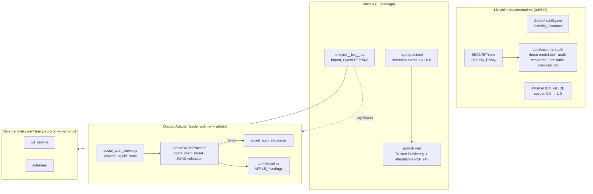

# Design Document

## Overview

Cette phase est une **consolidation**, pas une extension fonctionnelle : quatre des sept chantiers
(stabilité, SECURITY.md, préparation d'audit, release engineering) sont documentaires ou
processuels ; deux (packaging, signature de releases) touchent l'outillage de build/CI ; un seul
(Apple Sign-In) ajoute du code runtime — en réutilisant strictement le pattern
`AbstractOAuthProvider` existant.

Trois principes gouvernent la conception :

1. **Un seul breaking, au seul endroit permis** : l'inversion du packaging est le breaking change
   de la 1.0. Tout le reste est additif. Le runtime avec `tenxyte[django]` installé est
   byte-identique à la 0.9.x.
2. **Fail-closed partout où la sécurité est en jeu** : validation d'`id_token` Apple (JWKS
   indisponible → refus), Import_Guard (symbole Django sans Django → erreur explicite, jamais de
   dégradation silencieuse), publication PyPI (OIDC uniquement, pas de fallback token).
3. **Vérifiabilité** : chaque engagement (stabilité, SLA sécurité, provenance des artefacts) est
   accompagné soit d'un test automatisé, soit d'une procédure de vérification manuelle consignée
   dans `manual_tests.md`.

### État actuel constaté (pertinent pour cette phase)

Lecture du code et de la configuration à la v0.9.6.4 :

- **Packaging** (`pyproject.toml`) : `dependencies` par défaut = stack Django complète ; l'extra
  `[core]` minimal existe déjà (les listes de dépendances cibles sont donc déjà écrites — il
  s'agit d'une permutation, pas d'une redéfinition). Classifieur actuel :
  `Development Status :: 4 - Beta`.
- **`tenxyte/__init__.py`** contient ~50 lignes avec une logique d'import (lignes 74–161 non
  couvertes par les tests core) — l'Import_Guard devra auditer précisément ce qui est importé au
  top-level et le rendre paresseux.
- **Providers sociaux** (`services/social_auth_service.py`) : `AbstractOAuthProvider` définit
  `provider_name`, `get_user_info(access_token)`, `exchange_code(code, redirect_uri,
  code_verifier)` + helpers `_get`/`_post`. `GoogleOAuthProvider` possède déjà un
  `verify_id_token` — précédent direct pour Apple. `SocialAuthService.authenticate` consomme un
  dict normalisé et applique déjà le refus de fusion des emails non vérifiés (F-03).
- **Settings sociaux** (`conf/social.py`) : convention établie — propriétés plates
  `<PROVIDER>_CLIENT_ID` / `<PROVIDER>_CLIENT_SECRET` lues via `getattr(settings, ...)`, et
  `SOCIAL_PROVIDERS` avec défaut `["google", "github", "microsoft", "facebook"]`.
- **CI/CD** : workflows `ci.yml`, `publish.yml`, `security.yml` (Gitleaks), `validate-docs.yml`
  existants. Pas de `SECURITY.md`, pas de Trusted Publishing constaté.
- **Dépendances** : `cryptography>=42` et `PyJWT>=2.12` sont déjà dans le Core → la génération
  ES256 du client secret Apple et la validation JWKS (`PyJWKClient`) n'ajoutent **aucune
  dépendance**.

## Architecture



### Décision de conception : Import_Guard via PEP 562 (`__getattr__` de module)

Deux stratégies étaient possibles pour que `import tenxyte` réussisse sans Django :

- (a) `try/except ImportError` au top-level avec symboles `None` — rejetée : dégradation
  silencieuse, erreurs tardives incompréhensibles (`NoneType is not callable`).
- (b) **PEP 562** : `tenxyte/__init__.py` n'importe au top-level que les symboles Core
  (version, exceptions, `tenxyte.core.*`) ; les symboles Django-only (`setup`, modèles, urls…)
  sont résolus dans `__getattr__(name)` qui tente l'import Django et, en cas d'`ImportError`,
  lève `TenxyteMissingDependencyError` avec le message
  `"'tenxyte.setup' requires the Django stack. Install it with: pip install tenxyte[django]"`.

**Retenu : (b).** Propriétés garanties : import toujours possible, erreur explicite au point
d'usage, `__dir__` surchargé pour que l'introspection reste correcte, et comportement strictement
identique quand Django est présent (le lazy import est transparent). Le snapshot des exports
publics (Requirement 1.4) liste les symboles via `__all__` explicite, indépendant de la présence
de Django.

### Décision de conception : `get_user_info` pour Apple sans endpoint userinfo

Apple ne fournit pas d'endpoint userinfo : l'identité vit dans l'`id_token` retourné par
`exchange_code`. Pour respecter la signature d'`AbstractOAuthProvider` sans casser
l'orchestrateur :

- `exchange_code()` retourne le dict token Apple complet (contenant `id_token`).
- `verify_id_token(id_token)` (méthode dédiée, symétrique de `GoogleOAuthProvider.verify_id_token`)
  effectue la validation JWKS et retourne le dict normalisé.
- `get_user_info(access_token)` : Apple n'exposant rien, la vue sociale détecte
  `provider_name == "apple"` et passe par `verify_id_token(tokens["id_token"])` — exactement le
  chemin déjà emprunté par le flow Google `id_token`. `get_user_info` est implémentée pour
  satisfaire l'ABC et retourne `None` avec un log explicite si appelée directement.

### Décision de conception : validation JWKS fail-closed avec cache

`PyJWT` fournit `PyJWKClient` avec cache intégré (`cache_keys=True`, TTL par défaut). Comportement
spécifié :

- JWKS joignable + token valide → authentification continue.
- JWKS injoignable (timeout, 5xx) → **refus** (`PROVIDER_AUTH_FAILED`), jamais de validation
  dégradée sans vérification de signature.
- `kid` inconnu → un seul refresh du JWKS puis refus si toujours inconnu (rotation de clés Apple).

### Décision de conception : périmètre exact de l'inversion de packaging

| Élément `pyproject.toml` | 0.9.6.4 (actuel) | 1.0.0 (cible) |
|---|---|---|
| `dependencies` | stack Django complète | contenu actuel de l'extra `[core]` |
| `[django]` | extra partiel redondant | stack Django complète (django, DRF, cors, spectacular, google-auth×2) |
| `[core]` | dépendances Core | **alias no-op déprécié** (liste vide, conservé pour ne pas casser `pip install tenxyte[core]`) |
| `[fastapi]`, `[postgres]`, `[mysql]`, `[mongodb]`, `[twilio]`, `[sendgrid]`, `[webauthn]` | inchangés | inchangés |
| `[all]` | features uniquement | **+ django + fastapi** (méta-extra complet) |
| `version` | 0.9.6.4 | 1.0.0 |
| classifieur statut | `4 - Beta` | `5 - Production/Stable` |

## Components and Interfaces

### 1. `AppleOAuthProvider` (nouveau) — `src/tenxyte/services/social_auth_service.py`

```python
class AppleOAuthProvider(AbstractOAuthProvider):
    """Sign in with Apple provider.

    Particularités Apple :
    - client_secret = JWT ES256 signé avec la clé privée .p8, généré à la volée.
    - Pas d'endpoint userinfo : l'identité vient de l'id_token (validé via JWKS).
    - Le nom n'est fourni que lors de la première autorisation (payload `user`).
    """

    APPLE_TOKEN_URL = "https://appleid.apple.com/auth/token"
    APPLE_JWKS_URL = "https://appleid.apple.com/auth/keys"
    APPLE_ISSUER = "https://appleid.apple.com"

    @property
    def provider_name(self) -> str:
        return "apple"

    def _generate_client_secret(self) -> str:
        """JWT ES256 : iss=TEAM_ID, sub=CLIENT_ID, aud=APPLE_ISSUER,
        iat=now, exp=now+180j (max 6 mois), kid=KEY_ID dans le header.
        Signé avec APPLE_PRIVATE_KEY (PEM .p8) via PyJWT/cryptography.
        Jamais persisté ni mis en cache au-delà de l'appel."""

    def exchange_code(self, code, redirect_uri, code_verifier=None):
        """POST APPLE_TOKEN_URL avec client_id, client_secret généré,
        grant_type=authorization_code. Retourne le dict token Apple complet
        (access_token, id_token, refresh_token) ou None."""

    def verify_id_token(self, id_token: str) -> Optional[Dict[str, Any]]:
        """Validation fail-closed via PyJWKClient(APPLE_JWKS_URL) :
        signature RS256, iss==APPLE_ISSUER, aud==APPLE_CLIENT_ID, exp.
        Retourne le dict normalisé :
        {provider_user_id: sub, email, email_verified (normalise 'true'/'false'
         string → bool), first_name: '', last_name: '', avatar_url: ''}."""

    def get_user_info(self, access_token):
        """Apple n'a pas d'endpoint userinfo. Retourne None + log ;
        le chemin nominal passe par verify_id_token (voir la vue)."""
```

Points d'attention implémentation :

- `email_verified` arrive parfois comme chaîne `"true"`/`"false"` → normalisation booléenne
  explicite (sinon le F-03 refuserait des emails vérifiés).
- Un **Private_Relay_Email** est un email vérifié valide : aucun traitement spécial hormis une
  note de doc (l'intégrateur doit configurer le relay Apple pour ses emails sortants).
- `First_Auth_User_Payload` : la vue sociale accepte un champ optionnel `user` (dict
  `{name: {firstName, lastName}}`) dans le body de `POST /social/apple/` et enrichit le dict
  normalisé avant `SocialAuthService.authenticate`. Absent = noms vides, jamais d'échec.

### 2. Settings Apple (additifs) — `src/tenxyte/conf/social.py`

```python
@property
def APPLE_CLIENT_ID(self):
    """Apple Services ID (client_id OAuth, ex: com.example.app.signin)."""
    return getattr(settings, "APPLE_CLIENT_ID", "")

@property
def APPLE_TEAM_ID(self):
    """Apple Developer Team ID (10 caractères)."""
    return getattr(settings, "APPLE_TEAM_ID", "")

@property
def APPLE_KEY_ID(self):
    """Key ID de la clé privée Sign in with Apple (.p8)."""
    return getattr(settings, "APPLE_KEY_ID", "")

@property
def APPLE_PRIVATE_KEY(self):
    """Contenu PEM de la clé privée .p8 (jamais le chemin — le contenu)."""
    return getattr(settings, "APPLE_PRIVATE_KEY", "")
```

`SOCIAL_PROVIDERS` : défaut étendu à `["google", "github", "microsoft", "facebook", "apple"]`.
Extension **additive** : un provider listé mais non configuré échoue proprement à l'usage
(comportement identique aux 4 providers actuels sans credentials).

### 3. Import_Guard — `src/tenxyte/__init__.py`

```python
# Top-level : uniquement version + symboles Core (aucun import Django)
__version__ = "1.0.0"
_DJANGO_SYMBOLS = {"setup": "tenxyte._django_entry", ...}
__all__ = [...]  # liste explicite, base du test snapshot (Req 1.4)

def __getattr__(name):           # PEP 562
    if name in _DJANGO_SYMBOLS:
        try:
            module = importlib.import_module(_DJANGO_SYMBOLS[name])
        except ImportError as exc:
            raise TenxyteMissingDependencyError(
                f"'tenxyte.{name}' requires the Django stack. "
                f"Install it with: pip install tenxyte[django]"
            ) from exc
        return getattr(module, name)
    raise AttributeError(f"module 'tenxyte' has no attribute {name!r}")

def __dir__():
    return sorted(list(globals()) + list(_DJANGO_SYMBOLS))
```

`TenxyteMissingDependencyError(ImportError)` est ajoutée à `tenxyte/exceptions.py` (import-safe,
sans dépendance Django).

### 4. `publish.yml` (modifié) — Trusted Publishing + attestations

```yaml
jobs:
  publish:
    environment: pypi            # environnement protégé, approbation manuelle
    permissions:
      id-token: write            # OIDC pour Trusted Publishing
      contents: read
    steps:
      - ...build sdist+wheel...
      - uses: pypa/gh-action-pypi-publish@release/v1
        with:
          attestations: true     # PEP 740 (Sigstore)
        # AUCUN password/token : OIDC uniquement
```

Prérequis manuels (consignés dans `manual_tests.md`) : déclaration du Trusted Publisher côté
PyPI (projet `tenxyte`, repo `tenxyte/tenxyte`, workflow `publish.yml`, environnement `pypi`),
création de l'environnement GitHub protégé, suppression du secret token PyPI.

### 5. Livrables documentaires

| Fichier | Contenu clé |
|---|---|
| `SECURITY.md` | Tableau versions supportées ; canal = GitHub PVR uniquement ; SLA 72 h / 7 j / 14-30-90 j ; embargo ≤ 90 j ; crédit ; périmètre in/out ; lien vers `docs/security-audit/` |
| `docs/en/stability.md` + `docs/fr/stability.md` | Énumération de la Public_API_Surface ; politique SemVer ; Deprecation_Policy ; liste explicite du non-couvert |
| `docs/security-audit/threat-model.md` | Actifs (credentials, tokens, secrets TOTP, clés) ; acteurs (anonyme, utilisateur, admin, agent IA, insider) ; STRIDE léger par domaine ; hypothèses (TLS terminé en amont, DB de confiance) |
| `docs/security-audit/audit-scope.md` | Modules in-scope, exclusions, environnement de test (docker-compose + seed), formats de livrable attendus du prestataire |
| `docs/security-audit/pre-audit-checklist.md` | ASVS L2 sections V2/V3/V6, statut ✅/❌/N/A + référence de code par point |
| `docs/*/MIGRATION_GUIDE.md` | Section « 0.9 → 1.0 » : commande d'install, Import_Guard, aucun changement runtime |
| `CHANGELOG.md` | Entrée 1.0.0 : Breaking (packaging), Added (apple, SECURITY.md, attestations, stability), Docs |

## Data Models

**Aucun changement de schéma.** Cette phase n'ajoute ni champ, ni modèle, ni migration :
- `SocialConnection` existant stocke déjà `provider` en `CharField` libre → `"apple"` est accepté
  sans migration.
- Les settings Apple sont des propriétés de configuration, pas des données.

C'est une propriété vérifiable : le nombre de fichiers dans `src/tenxyte/migrations/` est
identique avant/après la phase (25).

## Correctness Properties

*Une propriété est un invariant vérifiable automatiquement pour toutes les exécutions valides.*

### Property 1: Import sans Django réussit et expose le Core

Dans un environnement sans Django installé, `import tenxyte` réussit, `tenxyte.__version__` est
lisible, et les symboles Core listés dans le Stability_Contract sont importables.

**Validates: Requirements 2.3**

### Property 2: Accès à un symbole Django-only sans Django échoue explicitement

Dans un environnement sans Django, l'accès à tout symbole de `_DJANGO_SYMBOLS` lève
`TenxyteMissingDependencyError` dont le message contient `pip install tenxyte[django]`, et ne
retourne jamais `None` ni un objet dégradé.

**Validates: Requirements 2.4**

### Property 3: Transparence de l'Import_Guard avec Django présent

Avec la stack Django installée, tout symbole accessible avant la 1.0 via `import tenxyte` reste
accessible avec le même objet résolu (identité de comportement).

**Validates: Requirements 2.5, 8.2**

### Property 4: Snapshot des exports publics

L'ensemble des symboles de `tenxyte.__all__` contient tous les symboles publics documentés dans le
Stability_Contract ; la disparition de l'un d'eux fait échouer le test.

**Validates: Requirements 1.4**

### Property 5: Le client secret Apple est un JWT ES256 bien formé et éphémère

Pour toute configuration Apple valide, `_generate_client_secret()` produit un JWT dont le header
contient `alg=ES256` et `kid=APPLE_KEY_ID`, dont les claims valent `iss=APPLE_TEAM_ID`,
`sub=APPLE_CLIENT_ID`, `aud=https://appleid.apple.com`, avec `exp - iat ≤ 15777000` s (6 mois), et
vérifiable avec la clé publique correspondante. Aucune persistance : deux appels produisent deux
JWT distincts (iat différents) et aucun écrit en base/cache.

**Validates: Requirements 5.2**

### Property 6: Validation fail-closed de l'Apple_ID_Token

Pour tout id_token dont la signature est invalide, dont l'`iss` diffère de
`https://appleid.apple.com`, dont l'`aud` diffère du client configuré, ou qui est expiré — et pour
toute indisponibilité du JWKS — `verify_id_token` retourne `None` et aucune authentification,
création ou fusion d'utilisateur n'a lieu.

**Validates: Requirements 5.4, 5.5**

### Property 7: Normalisation du dict utilisateur Apple

Pour tout id_token Apple valide, le dict retourné contient exactement les clés du contrat
(`provider_user_id`, `email`, `email_verified`, `first_name`, `last_name`, `avatar_url`),
`provider_user_id == sub`, et `email_verified` est un booléen Python quel que soit le type source
(`True`, `"true"`, `False`, `"false"`, absent → False).

**Validates: Requirements 5.6**

### Property 8: Le payload de première autorisation est optionnel

Pour toute requête `POST /social/apple/` valide, la présence du champ `user` peuple
`first_name`/`last_name` ; son absence produit des noms vides sans erreur — dans les deux cas,
l'authentification aboutit à l'identique.

**Validates: Requirements 5.7**

### Property 9: Non-régression des providers existants

Pour chaque provider parmi google, github, microsoft, facebook, le comportement de
`exchange_code`, `get_user_info` et du flow de vue est identique avant/après l'ajout d'Apple
(mêmes suites de tests, aucun test modifié).

**Validates: Requirements 5.10, 8.1**

### Property 10: Le refus de fusion email non vérifié s'applique à Apple

Pour tout compte Apple dont `email_verified` est `False` et dont l'email correspond à un compte
local existant, l'authentification est refusée avec le code d'erreur existant du F-03, sans
création de `SocialConnection`.

**Validates: Requirements 5.11**

### Property 11: Invariance du schéma de données

Le nombre et le contenu des migrations sont identiques avant/après la phase ; aucun
`makemigrations` en attente.

**Validates: Requirements 8.1**

### Property 12: Équivalence des ensembles de dépendances

L'ensemble `dependencies ∪ extras[django]` de la 1.0 est exactement égal à l'ensemble
`dependencies` de la 0.9.6.4 (mêmes packages, contraintes ≥ identiques) — garantissant qu'un
utilisateur `tenxyte[django]` obtient l'environnement actuel.

**Validates: Requirements 2.1, 2.2, 2.5**

## Error Handling

| Situation | Composant | Comportement | Code |
|---|---|---|---|
| Symbole Django-only sans Django | Import_Guard | `TenxyteMissingDependencyError` avec instruction d'install | — (ImportError) |
| Provider `apple` non configuré (settings vides) | `AppleOAuthProvider` | Échec propre à l'usage, log explicite | `PROVIDER_AUTH_FAILED` (401) |
| id_token invalide (signature/iss/aud/exp) | `verify_id_token` | Refus, aucun effet de bord | `PROVIDER_AUTH_FAILED` (401) |
| JWKS Apple injoignable | `verify_id_token` | Refus fail-closed (jamais de skip de signature) | `PROVIDER_AUTH_FAILED` (401) |
| `kid` inconnu après refresh JWKS | `verify_id_token` | Refus | `PROVIDER_AUTH_FAILED` (401) |
| Échange de code Apple refusé (4xx) | `exchange_code` | `None`, log warning | `CODE_EXCHANGE_FAILED` (401) |
| Provider inconnu dans l'URL | vue sociale (existant) | Liste `supported_providers` incluant `apple` | `INVALID_PROVIDER` (400) |
| Email Apple non vérifié + compte local existant | `SocialAuthService` (existant) | Refus de fusion F-03 inchangé | existant |

Tous les codes réutilisent le format d'erreur existant `{"error", "code", "details"}` — aucun
nouveau format (Requirement 8.1).

## Testing Strategy

### Approche

Trois niveaux, car cette phase mélange code, build et process :

1. **Tests unitaires + property-based** (pytest, Hypothesis ≥ 100 exemples) pour tout le code
   runtime : Properties 1–12. Les appels réseau Apple (token endpoint, JWKS) sont mockés ; les
   property tests de `verify_id_token` génèrent des id_tokens signés localement avec une paire
   RS256 de test injectée dans un `PyJWKClient` mocké.
2. **Tests d'installation** (CI matrix) : jobs dédiés créant des venvs propres —
   `pip install .` (sans Django : import + smoke Core), `pip install .[django]` (démarrage Django
   + `tenxyte_quickstart`), `pip install .[core]` (alias no-op). Property 12 vérifiée par un test
   qui parse `pyproject.toml` et compare les ensembles.
3. **Tests manuels** (`manual_tests.md`) pour le non-automatisable : login Apple E2E (compte
   développeur requis), configuration du Trusted Publisher PyPI, vérification des attestations
   d'un artefact publié, activation GitHub PVR, rendu de `SECURITY.md` dans l'onglet Security.

### Tests unitaires ciblés (exemples, pas de PBT)

- Header et claims exacts du client secret Apple (exemple concret avec clé EC de test).
- Normalisation `email_verified` : cas `"true"`, `"false"`, `True`, `False`, absent.
- `SOCIAL_PROVIDERS` par défaut contient `apple` ; les 4 défauts précédents inchangés.
- `INVALID_PROVIDER.supported_providers` contient `apple`.
- Vue `POST /social/apple/` avec et sans `First_Auth_User_Payload`.
- `tenxyte.__all__` == snapshot du Stability_Contract (Property 4).
- Nombre de migrations == 25 (Property 11).
- `pyproject.toml` : version, classifieur, équivalence des ensembles (Property 12).
- Suite existante complète : doit passer sans modification (Requirement 8.4).

### Tests de propriétés (Hypothesis)

- **Property 5** : générateurs de configurations Apple (team/key/client IDs aléatoires valides) →
  invariants du JWT généré.
- **Property 6** : générateurs de tokens corrompus (signature altérée, iss/aud aléatoires, exp
  passé, kid inconnu) → toujours `None`, jamais d'effet de bord (aucun User/SocialConnection créé).
- **Property 7** : générateurs de payloads id_token (types variés d'`email_verified`, emails
  relay/normaux, sub aléatoires) → forme du dict normalisé.
- **Property 2** : générateur sur les noms de `_DJANGO_SYMBOLS` → l'erreur contient toujours
  l'instruction d'install (exécuté dans un sous-processus sans Django via `sys.modules` patching).

### Environnements de test d'installation (CI)

```yaml
install-matrix:
  strategy:
    matrix:
      target: ["", "[django]", "[core]", "[django,webauthn]"]
  steps:
    - pip install ".${{ matrix.target }}"
    - python -c "import tenxyte; print(tenxyte.__version__)"
    - if django in target: run migration check + quickstart smoke
    - else: run core smoke (JWT sign/verify, TOTP generate)
```
