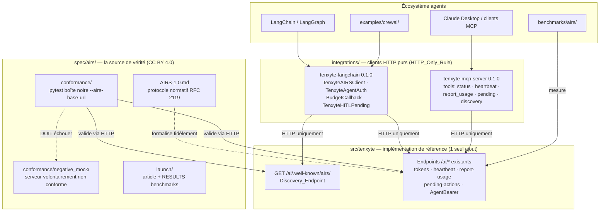

# Design Document

## Overview

Cette phase inverse le rapport habituel entre code et documentation : le code AIRS existe et
fonctionne — c'est le **protocole** qui n'existe pas encore en tant qu'objet public. La conception
s'articule donc autour d'un principe central : **la spec est la source de vérité, Tenxyte en est
l'implémentation de référence**. Tout le reste en découle :

1. **Un seul ajout serveur** : l'endpoint de découverte `.well-known/airs` — parce qu'un protocole
   sans introspection n'est pas implémentable par des tiers. Tout le reste du protocole existe déjà.
2. **Les connecteurs prouvent la spec** : `tenxyte-langchain` et `tenxyte-mcp-server` sont des
   clients HTTP purs, interdits d'importer `tenxyte` (HTTP_Only_Rule). S'ils ont besoin d'un
   import interne, la spec est incomplète — le test d'import-graph transforme cette règle en
   invariant vérifiable.
3. **La conformité est opposable** : la Conformance_Suite boîte noire est le même outil pour la CI
   interne (non-régression du protocole) et pour les implémenteurs tiers (badge de conformité).
4. **Fail-safe côté agent** : un token suspendu/révoqué produit des erreurs structurées et
   actionnables dans les connecteurs (jamais de crash, jamais de retry aveugle) — l'agent doit
   pouvoir s'arrêter proprement, c'est le but même d'AIRS.

### État actuel constaté (pertinent pour cette phase)

Lecture du code à la v0.9.6.4 / post-Phase 1 :

- **Modèles** (`src/tenxyte/models/agent.py`) : `AgentToken` — hash SHA-256 seul persisté
  (`_hash_token`, `get_by_raw_token`), `triggered_by` (Delegating_User), `granted_permissions`
  (M2M `Permission`), statuts `ACTIVE/SUSPENDED/REVOKED/EXPIRED`, `SuspendedReason`
  `{RATE_LIMIT, ANOMALY, MANUAL, HEARTBEAT_MISSING, BUDGET_EXCEEDED}`, circuit breaker
  (`max_requests_per_minute/total`, `max_failed_requests` + compteurs), dead man's switch
  (`heartbeat_required_every`, `last_heartbeat_at`), budget (`budget_limit_usd`,
  `current_spend_usd` en `Decimal(10,4)`). `AgentPendingAction` — `confirmation_token` unique,
  `expires_at` (défaut 10 min), `confirmed_at`/`denied_at`, `prompt_trace_id`.
- **Service** (`services/agent_service.py`) : `create`, `validate`, `validate_permission`
  (Double_Validation), `revoke`, `suspend`, `revoke_all_for_user/agent`, `send_heartbeat`,
  `check_circuit_breaker`, `create/confirm/deny_pending_action`, `report_usage` — la totalité de
  la sémantique normative de la spec est déjà implémentée.
- **Endpoints** (`urls.py`) : 10 routes `/ai/*` (tokens CRUD, revoke, suspend, heartbeat,
  report-usage, revoke-all, pending-actions list/confirm/deny).
- **Protocole filaire** : `Authorization: AgentBearer <raw>`, `X-Action-Confirmation`,
  `X-Prompt-Trace-ID`, HITL `202 {status: "pending_confirmation", confirmation_token, expires_at}`
  via `@require_agent_clearance` (`decorators.py`).
- **Settings** (`conf/airs.py`) : `AIRS_ENABLED` (défaut True), `AIRS_TOKEN_MAX_LIFETIME` (86400),
  `AIRS_DEFAULT_EXPIRY` (3600), `AIRS_CIRCUIT_BREAKER_ENABLED`, `AIRS_BUDGET_TRACKING_ENABLED`
  (défaut False), `AIRS_CONFIRMATION_REQUIRED`, `AIRS_REDACT_PII`.
- **Précédent feature-flag** : le pattern `FEATURE_DISABLED` 404 (OTP login) est réutilisé pour la
  découverte quand `AIRS_ENABLED=False`.

**Conséquence :** la spec AIRS/1.0 est un travail de **formalisation fidèle** — chaque clause
normative doit être adossée à un comportement existant vérifié, et la Conformance_Suite verrouille
cette fidélité dans les deux sens (spec ↔ implémentation).

## Architecture



### Décision de conception : chemin et forme de la découverte

Le chemin retenu est `GET {API_PREFIX}/auth/ai/.well-known/airs/` — sous le routage existant de
`tenxyte.urls` (section `# Agent / AIRS`), et non à la racine du domaine : Tenxyte est un package
monté par l'intégrateur, il ne contrôle pas `/.well-known/` racine. La spec formule donc la
découverte comme « relative à une base URL AIRS communiquée à l'agent », ce que le champ
`endpoints` du document de découverte résout ensuite. Forme de réponse :

```json
{
  "airs_version": "1.0",
  "conformance": ["core", "hitl", "guards", "trace"],
  "endpoints": {
    "tokens": "/api/v1/auth/ai/tokens/",
    "heartbeat": "/api/v1/auth/ai/tokens/{id}/heartbeat/",
    "report_usage": "/api/v1/auth/ai/tokens/{id}/report-usage/",
    "pending_actions": "/api/v1/auth/ai/pending-actions/"
  },
  "limits": { "token_max_lifetime": 86400, "default_expiry": 3600 }
}
```

`conformance` est calculé à la requête depuis les settings réels :
`core`/`hitl`/`trace` toujours présents si `AIRS_ENABLED` ; `guards` ssi
`AIRS_CIRCUIT_BREAKER_ENABLED` ; `budget` ssi `AIRS_BUDGET_TRACKING_ENABLED`. Aucune donnée, aucun
état par tenant — capacités uniquement (Requirement 2.4). `AIRS_ENABLED=False` → 404
`FEATURE_DISABLED`, à l'identique du pattern OTP login.

### Décision de conception : structure de la spec AIRS/1.0

```
spec/airs/
├── AIRS-1.0.md          # document normatif unique (11 sections, cf. base.md)
├── LICENSE              # CC BY 4.0
├── conformance/         # suite pytest boîte noire + mock négatif
│   ├── conftest.py      # options --airs-base-url, --airs-user-jwt, --airs-app-key/secret
│   ├── test_core.py     # niveau core (obligatoire)
│   ├── test_hitl.py     # skip si "hitl" absent de la découverte
│   ├── test_guards.py   # skip si "guards" absent
│   ├── test_budget.py   # skip si "budget" absent
│   ├── test_trace.py    # skip si "trace" absent
│   └── negative_mock/   # serveur FastAPI/stdlib minimal non conforme + test l'exécutant
└── launch/              # article de lancement + gabarit résultats
```

Règle d'écriture : chaque exigence normative (MUST/SHOULD) porte un identifiant stable
(`[AIRS-CORE-7]`, `[AIRS-HITL-3]`…) référencé par les tests de conformité — traçabilité
spec ↔ suite identique au lien requirements ↔ property tests du projet.

### Décision de conception : HITL dans LangChain — exception typée + reprise

```python
class TenxyteHITLPending(Exception):
    confirmation_token: str
    expires_at: datetime
    original_request: PreparedRequestSnapshot  # méthode, URL, body, headers rejouables

client.resume(confirmation_token)  # rejoue original_request + X-Action-Confirmation
```

Deux modes d'usage documentés sur la même primitive : (a) try/except applicatif simple ;
(b) recette LangGraph — l'outil attrape `TenxyteHITLPending`, appelle `interrupt()` avec le
`confirmation_token`, et le nœud de reprise appelle `resume()` après approbation humaine. Le
connecteur ne confirme **jamais** lui-même (la confirmation est un acte humain via l'API Tenxyte,
hors du connecteur agent).

### Décision de conception : heartbeat en tâche de fond

`TenxyteAgentAuth` démarre un thread daemon dédié uniquement si la découverte du token expose
`heartbeat_required_every` non nul, avec un intervalle de `max(1, heartbeat_required_every // 2)`
secondes (marge de sécurité 2×), arrêt propre via `Event` sur `close()`/context manager, et jamais
d'exception propagée depuis le thread (échec de heartbeat → log + flag consultable ; la suspension
serveur reste l'autorité). Choix du thread plutôt qu'asyncio : fonctionne dans les deux contextes
d'exécution LangChain (sync et async) sans imposer de boucle.

### Décision de conception : MCP sans amplification de privilèges

Surface d'outils volontairement **asymétrique** : tout ce qui relève de l'entretien du token par
l'agent (status, heartbeat, report_usage, lecture des pending actions, découverte) est exposé ;
tout ce qui relève de l'autorité humaine (création de token, confirm/deny HITL, revoke) est
**absent par construction**. Un test dédié verrouille la liste exacte des tools enregistrés
(Property 10) — l'ajout accidentel d'un tool d'autorité humaine casse la CI.

## Components and Interfaces

### 1. `AIRSDiscoveryView` (nouveau) — `src/tenxyte/views/agent_views.py`

```python
class AIRSDiscoveryView(APIView):
    """GET {API_PREFIX}/auth/ai/.well-known/airs/ — découverte AIRS (spec §9)."""
    permission_classes = [AllowAny]

    def get(self, request):
        if not auth_settings.AIRS_ENABLED:
            return Response({"error": "This feature is not enabled", "code": "FEATURE_DISABLED"},
                            status=404)
        conformance = ["core", "hitl", "trace"]
        if auth_settings.AIRS_CIRCUIT_BREAKER_ENABLED:
            conformance.append("guards")
        if auth_settings.AIRS_BUDGET_TRACKING_ENABLED:
            conformance.append("budget")
        return Response({
            "airs_version": "1.0",
            "conformance": sorted(conformance),
            "endpoints": _build_endpoint_map(),   # reverse() sur les routes existantes
            "limits": {
                "token_max_lifetime": auth_settings.AIRS_TOKEN_MAX_LIFETIME,
                "default_expiry": auth_settings.AIRS_DEFAULT_EXPIRY,
            },
        })
```

Route ajoutée dans `urls.py` section `# Agent / AIRS` ; export dans `views/__init__.py` ; schéma
`drf_spectacular` documenté. **Aucune autre modification de `src/tenxyte`.**

### 2. `tenxyte-langchain` — `integrations/langchain/`

```
integrations/langchain/
├── pyproject.toml            # name=tenxyte-langchain, version=0.1.0
│                             # deps: httpx>=0.27, langchain-core>=0.3
├── src/tenxyte_langchain/
│   ├── __init__.py           # exports publics
│   ├── client.py             # TenxyteAIRSClient (bas niveau, découverte auto)
│   ├── auth.py               # TenxyteAgentAuth (AgentBearer + heartbeat thread)
│   ├── callbacks.py          # TenxyteBudgetCallbackHandler
│   ├── hitl.py               # TenxyteHITLPending + resume()
│   ├── trace.py              # run_id → X-Prompt-Trace-ID (fallback uuid4)
│   └── exceptions.py         # TenxyteAIRSError, TenxyteBudgetExceededError, ...
└── tests/                    # respx (mock httpx) + intégration optionnelle
```

Contrats clés :

- `TenxyteAIRSClient(base_url, access_key, access_secret, agent_token)` — appelle la découverte au
  premier usage, met en cache la carte d'endpoints, expose `token_status()`, `heartbeat()`,
  `report_usage(cost_usd, prompt_tokens, completion_tokens)`, `pending_actions()`,
  `request(method, path, **kw)` (usage générique outillé).
- `TenxyteBudgetCallbackHandler(client)` — `on_llm_end` : lit `llm_output.token_usage` (ou
  `usage_metadata`), calcule/reçoit le coût, POST `report-usage` ; réponse indiquant
  `SUSPENDED/BUDGET_EXCEEDED` → lève `TenxyteBudgetExceededError` (l'agent s'arrête, c'est voulu).
- Erreurs : hiérarchie typée reflétant les codes serveur (`TOKEN_SUSPENDED(reason)`,
  `TOKEN_REVOKED`, `TOKEN_EXPIRED`, `PERMISSION_DENIED`) — jamais de retry automatique sur ces
  familles (fail-safe).

### 3. `tenxyte-mcp-server` — `integrations/mcp-server/`

```
integrations/mcp-server/
├── pyproject.toml            # name=tenxyte-mcp-server, version=0.1.0
│                             # deps: mcp>=1.2, httpx ; [project.scripts] tenxyte-mcp-server=...
├── src/tenxyte_mcp_server/
│   ├── __init__.py
│   ├── server.py             # FastMCP, transport stdio, enregistrement des 5 tools
│   ├── airs_client.py        # client HTTP minimal (réutilise le protocole, pas le package LC)
│   └── config.py             # lecture/validation des 4 variables d'env au démarrage
└── tests/
```

- Tools : `airs_token_status`, `airs_heartbeat`, `airs_report_usage(cost_usd, prompt_tokens,
  completion_tokens)`, `airs_list_pending_actions`, `airs_discovery` — mapping 1:1 vers les
  endpoints existants, schémas d'entrée validés.
- Resources : `airs://token/status`, `airs://budget` (lecture seule).
- Démarrage : variables d'env manquantes → message d'erreur explicite sur stderr + exit ≠ 0
  (jamais de démarrage dégradé).
- Erreurs runtime : token suspendu/révoqué/expiré → `McpError` structurée
  `{code, reason, suspended_reason?}` ; le process survit (Requirement 5.5).

### 4. Conformance_Suite — `spec/airs/conformance/`

- `conftest.py` : fixtures de session — découverte initiale, émission d'un Agent_Token de test via
  le JWT utilisateur fourni, marqueurs `pytest.mark.airs_level("hitl")` avec skip automatique
  selon `conformance` découvert.
- Chaque test référence son identifiant normatif : `def test_revoked_token_rejected(): "[AIRS-CORE-9]"`.
- `negative_mock/` : serveur HTTP minimal (stdlib `http.server` ou FastAPI) violant sciemment
  3 clauses (accepte un token révoqué, 200 au lieu de 202 sur action HITL, découverte sans
  `airs_version`) + un test wrapper vérifiant que la suite échoue contre lui (Property 4).
- CI : job dédié — démarre un Tenxyte éphémère (sqlite, seed), exécute la suite complète tous
  niveaux activés (Requirement 3.6).

### 5. Exemple CrewAI et Benchmark_Harness

- `examples/crewai/` : `docker-compose.yml` (Tenxyte démo + API métier factice avec un endpoint
  `@require_agent_clearance(human_in_the_loop_required=True)`), `crew.py` (2 agents, FakeLLM par
  défaut), `README.md` pas-à-pas aligné sur MT-4.
- `benchmarks/airs/` : `bench_validation.py` (3 cibles : AgentBearer+Double_Validation, JWT nu,
  baseline ; N requêtes, warm-up, sortie JSON p50/p95/p99), `bench_hitl.py` (cycle complet
  auto-confirmé pour exclure le temps humain), `RESULTS.md` gabarit. Hors suite pytest par défaut
  (Requirement 7.4).

## Data Models

**Aucun changement de schéma.** La découverte est calculée depuis les settings ; les connecteurs
sont hors de la base de données ; la spec formalise l'existant. Invariant vérifiable : le contenu
de `src/tenxyte/migrations/` est identique avant/après la phase (Property 12).

## Correctness Properties

*Une propriété est un invariant vérifiable automatiquement pour toutes les exécutions valides.*

### Property 1: Forme et exactitude de la découverte

Pour toute combinaison des settings `AIRS_CIRCUIT_BREAKER_ENABLED` × `AIRS_BUDGET_TRACKING_ENABLED`
(AIRS activé), la réponse de la découverte contient exactement les clés du contrat, `airs_version
== "1.0"`, et `conformance` contient `guards` ssi le circuit breaker est activé et `budget` ssi le
budget tracking est activé (`core`, `hitl`, `trace` toujours présents).

**Validates: Requirements 2.1, 2.2**

### Property 2: Effet nul de la découverte quand AIRS est désactivé

Lorsque `AIRS_ENABLED` est faux, la découverte répond 404 `FEATURE_DISABLED` sans effet de bord,
pour toute forme de requête.

**Validates: Requirements 2.3**

### Property 3: La découverte ne divulgue jamais de données

Pour tout état de la base (tokens, users, orgs générés aléatoirement), le corps de la réponse de
découverte est indépendant de cet état : aucune valeur issue d'un modèle persistant n'y figure.

**Validates: Requirements 2.4**

### Property 4: La suite de conformité discrimine

La Conformance_Suite passe intégralement contre l'implémentation de référence (tous niveaux
activés) et échoue contre le mock négatif — les deux vérifications sont automatisées en CI.

**Validates: Requirements 3.4, 3.5, 3.6**

### Property 5: Le connecteur LangChain authentifie chaque requête

Pour toute séquence d'appels via `TenxyteAgentAuth`, chaque requête HTTP sortante porte
`Authorization: AgentBearer <token>` et un `X-Prompt-Trace-ID` non vide ; aucun appel n'est émis
sans ces deux en-têtes.

**Validates: Requirements 4.3, 4.7**

### Property 6: Le callback budget rapporte l'agrégation exacte

Pour toute suite d'événements `on_llm_end` avec des usages générés aléatoirement, la somme des
`cost_usd`/`prompt_tokens`/`completion_tokens` rapportés à `report-usage` égale exactement la
somme des usages émis (pas de perte, pas de double comptage).

**Validates: Requirements 4.5**

### Property 7: Contrat HITL du connecteur

Pour toute réponse 202 du backend mocké, le connecteur lève `TenxyteHITLPending` portant le
`confirmation_token` exact et n'exécute pas l'effet ; `resume(confirmation_token)` rejoue la
requête originale (méthode, URL, corps identiques) augmentée du seul en-tête
`X-Action-Confirmation`.

**Validates: Requirements 4.6**

### Property 8: Le heartbeat respecte la contrainte déclarée

Pour tout `heartbeat_required_every` ∈ [2 s, 3600 s] déclaré par le backend mocké, l'intervalle
effectif entre deux heartbeats émis par `TenxyteAgentAuth` est strictement inférieur à la
contrainte, et l'arrêt du contexte stoppe le thread sans exception.

**Validates: Requirements 4.4**

### Property 9: Fail-safe des connecteurs sur token invalide

Pour tout état terminal du token (suspendu — chacune des 5 raisons —, révoqué, expiré) simulé par
le backend mocké, le connecteur LangChain lève l'exception typée correspondante sans retry, et
chaque tool MCP retourne une erreur structurée portant la raison, sans crash du process serveur.

**Validates: Requirements 4.8, 5.5**

### Property 10: Surface MCP sans amplification de privilèges

L'ensemble exact des tools enregistrés par le MCP_Server est
`{airs_token_status, airs_heartbeat, airs_report_usage, airs_list_pending_actions, airs_discovery}` ;
aucun tool de création de token, de confirmation ou de refus d'action n'existe, et aucune option de
configuration n'accepte un JWT utilisateur.

**Validates: Requirements 5.3, 5.4**

### Property 11: Étanchéité HTTP des intégrations

L'analyse du graphe d'imports de `tenxyte_langchain` et `tenxyte_mcp_server` ne contient aucun
module `tenxyte.*` ; leurs dépendances déclarées se limitent aux clients HTTP, `langchain-core` et
`mcp` respectivement.

**Validates: Requirements 4.2, 5.2, 9.3**

### Property 12: Non-régression du serveur

L'ensemble des routes `/ai/*` existantes, leurs formes de réponses et le contenu de
`src/tenxyte/migrations/` sont identiques avant/après la phase ; la suite de tests existante passe
sans modification.

**Validates: Requirements 9.1, 9.2, 9.4**

## Error Handling

| Situation | Composant | Comportement | Code |
|---|---|---|---|
| AIRS désactivé | Discovery_Endpoint | 404, aucun traitement | `FEATURE_DISABLED` |
| Backend injoignable à la découverte | Connecteurs | Exception typée `TenxyteAIRSUnavailable`, message avec l'URL tentée | — |
| Niveau requis absent de `conformance` | LangChain_Connector | `TenxyteCapabilityError` explicite (ex : budget callback sur serveur sans `budget`) | — |
| 202 HITL | LangChain_Connector | `TenxyteHITLPending(confirmation_token, expires_at)` — jamais silencieux | — |
| `confirmation_token` expiré au `resume()` | Backend (existant) → connecteur | Erreur serveur relayée typée, pas de retry | existant |
| Token suspendu (5 raisons) / révoqué / expiré | Connecteurs | Exception/erreur MCP typée portant `suspended_reason`, zéro retry automatique | relayé |
| Variables d'env manquantes | MCP_Server | stderr explicite + exit ≠ 0 au démarrage | — |
| Réponse serveur inattendue (5xx, JSON invalide) | Connecteurs | Exception générique `TenxyteAIRSError` avec statut + extrait de corps | — |
| Mock négatif atteint par la suite | Conformance_Suite | Échec de tests avec identifiants normatifs `[AIRS-*]` en clair | — |

Côté serveur, aucun nouveau format d'erreur : la découverte réutilise `{"error", "code"}` existant.

## Testing Strategy

### Approche

Quatre niveaux, adaptés à la nature hybride de la phase (serveur, spec, packages externes, E2E) :

1. **Tests serveur** (pytest Django existant + Hypothesis ≥ 100 exemples) : Properties 1–3, 12 —
   la découverte sous toutes les combinaisons de settings (`override_settings`), l'absence de
   fuite de données (générateurs d'états de base), la non-régression des routes `/ai/*`.
2. **Tests des packages d'intégration** (pytest par package, backend AIRS mocké via `respx`) :
   Properties 5–11 — chaque connecteur a sa propre suite, exécutée dans sa propre matrice CI
   (Python 3.10–3.13), incluant le test d'import-graph (Property 11) et le test de surface MCP
   (Property 10).
3. **Conformité** (Property 4) : job CI dédié — Tenxyte éphémère (sqlite + seed) → suite complète ;
   puis mock négatif → vérification d'échec. C'est le verrou bidirectionnel spec ↔ implémentation.
4. **Tests manuels** (`manual_tests.md`) : E2E non automatisables — MCP dans Claude Desktop,
   LangChain avec vrai LLM, walkthrough CrewAI, publication TestPyPI/PyPI, exécution de référence
   des benchmarks, soumissions communautaires.

### Tests unitaires ciblés (exemples, pas de PBT)

- Découverte : forme exacte de la réponse pour la configuration par défaut ; présence dans le
  schéma OpenAPI ; route nommée correcte.
- `TenxyteAIRSClient` : résolution des endpoints depuis la découverte, cache, en-têtes
  application (`X-Access-Key/Secret`) présents.
- `TenxyteBudgetCallbackHandler` : lecture des deux formats d'usage LangChain (`token_usage`,
  `usage_metadata`), coût fourni vs calculé.
- MCP : schémas d'entrée des 5 tools, validation d'env au démarrage, config Claude Desktop
  d'exemple parsable.
- Mock négatif : les 3 violations sont bien détectées individuellement.
- Import-graph : parcours `sys.modules`/AST des deux packages → zéro `tenxyte.*`.
- Suite Tenxyte existante complète : verte sans modification (Requirement 9.4).

### Tests de propriétés (Hypothesis)

- **Property 1** : générateur booléen × booléen sur les deux settings de gating → invariants de
  `conformance`.
- **Property 3** : générateurs d'états de base (tokens, users aléatoires) → réponse de découverte
  constante.
- **Property 6** : listes d'usages aléatoires (montants `Decimal`, compteurs) → égalité des sommes
  rapportées.
- **Property 7** : corps/méthodes/chemins aléatoires pour la requête originale → identité du rejeu
  modulo `X-Action-Confirmation`.
- **Property 8** : `heartbeat_required_every` échantillonné → intervalle effectif < contrainte
  (horloge simulée pour éviter les tests lents).
- **Property 9** : énumération des 7 états terminaux × endpoints → exception/erreur typée, zéro
  retry observé sur le transport mocké.

### CI

```yaml
jobs:
  server-tests:        # suite Django existante + tests découverte (inchangé + additif)
  integrations-tests:  # matrice {langchain, mcp-server} × {3.10..3.13}, backend mocké
  conformance:         # Tenxyte éphémère → suite complète ; puis negative_mock → doit échouer
  # benchmarks : déclenchement manuel uniquement (workflow_dispatch)
```
