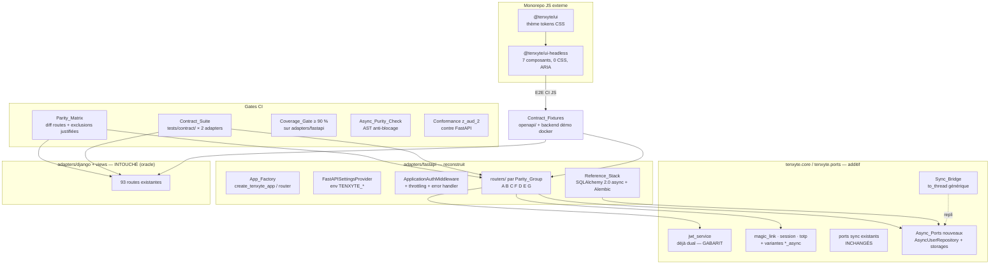

# Design Document

## Overview

Cette phase est la plus lourde des quatre — mais elle n'est pas une réécriture : c'est une
**généralisation de patterns déjà éprouvés dans le code**. Trois constats de lecture du code
dictent toute la conception :

1. **Le pattern async existe déjà** : `core/jwt_service.py` implémente une API duale complète
   (protocole async optionnel, détection `hasattr(x, "*_async")`, repli `asyncio.to_thread`).
   Le chantier async consiste à **répliquer ce pattern** sur les ports et les services restants —
   pas à inventer une architecture.
2. **Le contrat filaire existe déjà** : 93 endpoints documentés, snapshots de forme, tests
   canoniques, anti-énumération systématique. Le chantier FastAPI consiste à **reproduire un
   contrat existant**, avec le Django_Adapter comme oracle — pas à concevoir une API.
3. **La qualité est déjà outillée** : couverture 90 % imposée, property-based testing, validation
   de docs en CI. Le chantier parité consiste à **étendre ces gates** à l'adapter FastAPI
   (matrice, suite partagée, pureté async) — pas à créer une culture de test.

Le risque principal de la phase n'est donc pas technique mais **de dérive** : dupliquer de la
logique de sécurité dans les handlers FastAPI (comme le fait le `routers.py` actuel avec son
bcrypt inline), ou laisser la parité régresser silencieusement. Les deux risques sont neutralisés
par des invariants CI (Requirement 8.3 via revue + Property 3 ; Requirement 5.1 via la matrice).

### État actuel constaté (pertinent pour cette phase)

- **FastAPI** (`adapters/fastapi/`) : 2 endpoints (`POST /auth/login`, `POST /auth/magic-link`),
  DI en `NotImplementedError`, bcrypt inline dans le handler, `application_id="fastapi-app"` et
  `ip_address="0.0.0.0"` codés en dur, répertoire `services/` vide, base SQLAlchemy sync dans
  `models.py`/`repositories.py`, 4 fichiers de tests.
- **Async Core** : `jwt_service` dual complet (45 occurrences async, `AsyncTokenBlacklistProtocol`,
  `decode_token_async`, `refresh_tokens_async`…) ; `ports/repositories.py` 0 % async ;
  `totp/magic_link/session/webauthn` services 0 % async.
- **Contrat** : `endpoints.md` (EN/FR) validé en CI par `scripts/validate_endpoints.py` ;
  snapshots de forme (`test_endpoint_response_shape_snapshots.py`) ; spec canonique
  (`test_canonical_spec.py`) — matière première directe de la Contract_Suite.
- **SDK JS** : `@tenxyte/core|react|vue` documentés (hooks/logique), monorepo externe, zéro
  composant UI.
- **Packaging** (post-`z_aud_1`) : `[fastapi]` extra = fastapi, uvicorn, sqlalchemy,
  python-multipart, pydantic — à compléter (aiosqlite, asyncpg optionnel, alembic, throttling).

## Architecture



### Décision de conception : Async_Ports dans un module dédié, résolution normalisée

Les interfaces async vivent dans `ports/async_repositories.py` (nouveau module) plutôt qu'en
extension du module sync : (a) l'import du module sync reste inchangé pour tous les consommateurs
existants ; (b) la doc peut pointer « le fichier async » ; (c) le module expose aussi le
`Sync_Bridge` et le résolveur :

```python
# tenxyte/ports/async_repositories.py
class AsyncUserRepository(ABC):
    """Miroir async exact de UserRepository — mêmes méthodes, mêmes contrats,
    signatures async def. Aucune méthode supplémentaire."""

class SyncToAsyncUserRepository(AsyncUserRepository):
    """Sync_Bridge : enveloppe to_thread de n'importe quel UserRepository sync."""
    def __init__(self, sync_repo: UserRepository): ...
    async def get_by_email(self, email):  # pour chaque méthode
        return await asyncio.to_thread(self._sync.get_by_email, email)

def as_async(repo) -> AsyncUserRepository:
    """Résolution normalisée (JWT_Async_Pattern) : natif si AsyncUserRepository,
    sinon pont. Point d'entrée UNIQUE des consommateurs async."""
    return repo if isinstance(repo, AsyncUserRepository) else SyncToAsyncUserRepository(repo)
```

La génération du miroir est **manuelle et testée** (Property 4 : équivalence sémantique
sync/async par property testing sur un repo in-memory), pas métaprogrammée — la lisibilité d'un
port public prime sur l'économie de lignes.

### Décision de conception : services Core — extraction du pur, duplication interdite

Pour `magic_link_service` et `session_service`, la logique métier (validation, expiration,
anti-énumération, génération de tokens) est extraite en fonctions pures privées ; les méthodes
sync et async ne diffèrent que par leurs appels d'I/O :

```python
def _validate_magic_token(record, now) -> ValidationResult: ...   # pur, testé une fois

def verify_magic_link(self, token):            # sync — comportement inchangé
    record = self.storage.get(token_hash)
    return self._finalize(_validate_magic_token(record, now()))

async def verify_magic_link_async(self, token):
    record = await self._astorage.get(token_hash)   # via as_async(storage)
    return self._finalize(_validate_magic_token(record, now()))
```

Aucun `if is_async` dans la logique métier ; aucune règle de sécurité écrite deux fois
(Requirement 2.3). `totp_service` : seule la lecture/écriture du storage passe en async — la
vérification TOTP (CPU-bound, microsecondes) reste synchrone par conception.

### Décision de conception : structure de l'adapter FastAPI reconstruit

```
adapters/fastapi/
├── __init__.py            # exports publics : create_tenxyte_app, create_tenxyte_router
├── app.py                 # App_Factory + lifespan (engine, healthcheck)
├── settings.py            # FastAPISettingsProvider (pydantic-settings, env TENXYTE_*)
├── deps.py                # DI par défaut → Reference_Stack, surchargeable
├── middleware.py          # ApplicationAuthMiddleware, error handler {error, code, details}
├── throttling.py          # limites par famille d'endpoints sur le port cache
├── security.py            # require_jwt (dépendance), scopes restreints, AgentBearer
├── models_sa.py           # modèles SQLAlchemy 2.0 (async) du Reference_Stack
├── repositories_async.py  # implémentations des Async_Ports
├── migrations/            # Alembic
└── routers/
    ├── auth.py            # Groupe A     ├── rbac.py      # Groupe D
    ├── password.py        # Groupe B     ├── orgs.py      # Groupe E
    ├── otp_2fa.py         # Groupe C     ├── webauthn_social.py  # Groupe G
    └── airs.py            # Groupe F (incl. découverte z_aud_2)
```

Le `routers.py` actuel (2 endpoints, logique inline) est remplacé ; ses deux routes sont
réimplémentées dans `routers/auth.py` et `routers/otp_2fa.py` **au contrat Django** (le contrat
actuel du login FastAPI diverge déjà — c'est un bug de parité, pas un existant à préserver ; la
divergence est documentée dans le CHANGELOG de l'adapter, qui est explicitement hors
Existing_Public_Contract, l'adapter étant marqué partiel/PoC).

### Décision de conception : la Parity_Matrix comme gate et comme documentation

```python
# scripts/parity_matrix.py
# 1. Introspection Django : get_resolver() → liste normalisée (méthode, chemin relatif)
# 2. Introspection FastAPI : create_tenxyte_app().routes → même normalisation
# 3. Chargement parity_exclusions.toml :
#    [[exclusion]]
#    endpoint = "GET /admin/django-specific/"
#    reason = "Intégration admin Django, non applicable hors Django"
# 4. Diff → exit 1 si manquant non exclu ; sortie docs/parity_table.md (EN/FR)
```

La table publiée montre trois états par endpoint : ✅ porté · 🚫 exclu (raison) · 🔜 vague
planifiée — pendant les vagues intermédiaires, la CI ne gate que sur les groupes déjà livrés
(paramètre `--groups=A,B,C`).

### Décision de conception : Contract_Suite paramétrée par adapter

```python
# tests/contract/conftest.py
@pytest.fixture(params=["django", "fastapi"])
def api(request):
    """Client HTTP uniforme. django → APIClient DRF wrappé ;
    fastapi → httpx.AsyncClient(app=create_tenxyte_app(test_settings))."""
```

Les tests de contrat sont écrits une fois en termes de `api.post(path, json)` ; les snapshots de
forme existants sont refactorés en fonctions partagées consommées (a) par les tests Django
actuels — inchangés dans leurs assertions — et (b) par la Contract_Suite. Le job CI exécute la
suite deux fois (une par param) avec les mêmes attentes (Requirement 5.2).

### Décision de conception : Async_Purity_Check (AST)

`scripts/check_async_purity.py` parcourt `adapters/fastapi/` : pour chaque `AsyncFunctionDef`,
interdit les motifs — appel d'attribut figurant dans la liste des méthodes des ports sync,
`requests.<verbe>`, `time.sleep`, `open(` hors bloc `to_thread` — et échoue avec fichier:ligne.
Liste des motifs maintenue en tête du script, faux positifs contournables par un commentaire
`# async-purity: ignore[raison]` (chaque usage revu).

### Décision de conception : UI headless — la machine à états vient du contrat

Chaque composant headless encapsule la machine à états **déjà définie par le Wire_Contract** ;
exemple `SignIn` :

```
idle → submitting → { success(tokens)
                    | error(code)                    # LOGIN_FAILED, ACCOUNT_LOCKED(retry_after)…
                    | twoFactorRequired              # 2FA_REQUIRED → afficher TOTP
                    | twoFactorSetupRequired         # scope 2fa_setup_only (bootstrap admin)
                    | passwordChangeRequired }       # must_change_password: true → ForcedPasswordChange
```

Le composant expose la machine via un hook (`useSignIn()`) + un composant compound sans style
(`<SignIn.Root><SignIn.EmailField/><SignIn.Errors/>…`). `@tenxyte/ui` n'ajoute que la couche
visuelle (classes + tokens `--tenxyte-*`, thèmes clair/sombre) — jamais de logique
(Requirement 6.4). Les Contract_Fixtures (backend démo docker + OpenAPI diffé entre adapters)
donnent à la CI JS un oracle exécutable.

## Data Models

- **Django : aucun changement** — zéro migration ajoutée par cette phase (invariant testé).
- **Reference_Stack FastAPI** : schéma SQLAlchemy propre (users, roles, permissions,
  applications, refresh_tokens, otp_codes, magic_links, webauthn_credentials, organizations,
  agent_tokens, agent_pending_actions, audit_logs) sous migrations **Alembic** — versionné
  indépendamment des migrations Django, mêmes invariants de sécurité (hash des tokens, secrets
  TOTP chiffrés, mots de passe bcrypt+pre-hash identiques au Core).

## Correctness Properties

*Une propriété est un invariant vérifiable automatiquement pour toutes les exécutions valides.*

### Property 1: La matrice de parité est exhaustive et bloquante

Pour l'ensemble des routes du Django_Adapter, chaque route est soit présente dans le
FastAPI_Adapter (méthode + chemin normalisés), soit dans la liste d'exclusions avec justification
non vide ; toute route documentée absente des deux fait échouer la CI.

**Validates: Requirements 4.1, 4.5, 5.1**

### Property 2: Équivalence du contrat entre adapters

Pour chaque test de la Contract_Suite, l'exécution contre le Django_Adapter et contre le
FastAPI_Adapter produit les mêmes assertions vraies : mêmes codes HTTP, mêmes ensembles de clés
de réponse, mêmes codes d'erreur.

**Validates: Requirements 4.2, 5.2**

### Property 3: Parité de l'anti-énumération

Pour les endpoints concernés (register, reset request, login OTP request/verify) sur le
FastAPI_Adapter, la forme de réponse pour un compte existant et un compte inexistant est
identique (mêmes clés, mêmes types), à l'instar du comportement Django.

**Validates: Requirements 4.3**

### Property 4: Équivalence sémantique sync/async des ports

Pour toute séquence d'opérations générée (création, lecture, mise à jour, verrouillage…) exécutée
sur un même état initial, le repo sync in-memory et son enveloppe `Sync_Bridge` produisent des
états finaux et des valeurs de retour identiques.

**Validates: Requirements 1.1, 1.3**

### Property 5: L'API sync du Core est intouchée

Le snapshot des signatures publiques sync des services et ports Core est identique avant/après la
phase ; les variantes `*_async` sont strictement additives.

**Validates: Requirements 1.2, 2.4, 8.2**

### Property 6: Résolution async normalisée

Pour toute implémentation fournie (native async, sync pur), `as_async()` retourne un objet
satisfaisant l'interface async, utilise la méthode native quand elle existe (vérifiable par
espionnage) et le pont sinon — jamais d'appel sync direct depuis un contexte async.

**Validates: Requirements 1.4, 2.1, 2.2**

### Property 7: Pureté async des handlers

L'Async_Purity_Check ne détecte aucun motif bloquant dans `adapters/fastapi/` ; l'introduction
d'un appel interdit dans un handler fait échouer la CI (vérifié par un cas de test du checker
lui-même).

**Validates: Requirements 5.4**

### Property 8: Parité des feature-flags et des scopes

Pour chaque feature-flag du contrat (`OTP_LOGIN_ENABLED`, `MAGIC_LINK_ENABLED`,
`WEBAUTHN_ENABLED`, `AIRS_ENABLED`, `FORCE_PASSWORD_CHANGE_ON_FIRST_LOGIN_ENABLED`…) et chaque
état activé/désactivé, le FastAPI_Adapter reproduit le comportement Django (404
`FEATURE_DISABLED`, gating de scope `2fa_setup_only`/`password_change_only` avec 403
`INSUFFICIENT_SCOPE`).

**Validates: Requirements 4.4**

### Property 9: Format d'erreur canonique universel

Pour toute erreur produite par le FastAPI_Adapter (validation, auth, throttle, 500 masqué), le
corps de réponse contient les clés `error` et `code` (et `details` le cas échéant), conformément
au format canonique — y compris pour les erreurs levées par FastAPI lui-même (422 → converti).

**Validates: Requirements 3.6**

### Property 10: Le stack de référence démarre sans surcharge

`create_tenxyte_app(test_settings)` produit une application où aucun appel de DI ne lève
`NotImplementedError` et où le parcours register → login → me fonctionne sur aiosqlite vierge
(migrations Alembic appliquées par le lifespan de test).

**Validates: Requirements 3.1, 3.2, 3.3**

### Property 11: Conformité AIRS indépendante de l'adapter

La Conformance_Suite de `z_aud_2` exécutée contre le FastAPI_Adapter (tous niveaux activés) passe
intégralement.

**Validates: Requirements 4.6, 5.5**

### Property 12: Les exports OpenAPI décrivent le même contrat

Pour l'ensemble des endpoints partagés (non exclus), la comparaison normalisée des exports
OpenAPI Django et FastAPI (chemins, méthodes, schémas de réponse) ne présente aucune divergence.

**Validates: Requirements 6.6**

### Property 13: Headless sans style, styled sans logique

Le build de `@tenxyte/ui-headless` n'émet aucun fichier CSS ni style inline ; l'analyse des
imports de `@tenxyte/ui` montre que toute logique de flux provient de `ui-headless` (aucun appel
direct à `@tenxyte/core` pour les machines à états). *(Vérifié dans la CI du monorepo JS.)*

**Validates: Requirements 6.1, 6.4**

### Property 14: Non-régression Django totale

La suite de tests Django existante passe sans modification ; aucune migration Django ajoutée ;
aucun fichier de `tenxyte/views`, `tenxyte/serializers`, `tenxyte/urls.py` modifié par la phase.

**Validates: Requirements 8.1, 8.5**

## Error Handling

| Situation | Composant | Comportement | Code |
|---|---|---|---|
| Erreur de validation Pydantic (422 natif) | error handler global FastAPI | Converti en 400 `{error: "Validation error", code, details}` — parité DRF | `VALIDATION_ERROR` |
| App credentials absents/invalides | ApplicationAuthMiddleware | 401, parité Django | `APP_AUTH_REQUIRED` |
| Feature désactivée | routers concernés | 404, parité Django | `FEATURE_DISABLED` |
| Scope restreint hors endpoints autorisés | dépendance `require_jwt` FastAPI | 403, parité Django | `INSUFFICIENT_SCOPE` |
| Throttle dépassé | throttling.py | 429 `{error, retry_after}`, parité Django | — |
| Exception non gérée | error handler global | 500 générique `{error, code}`, détail loggé jamais exposé | `INTERNAL_ERROR` |
| Divergence de parité | Parity_Matrix (CI) | Échec de build avec liste des endpoints manquants | — |
| Motif bloquant dans un handler | Async_Purity_Check (CI) | Échec de build avec fichier:ligne | — |
| Drift OpenAPI entre adapters | check Contract_Fixtures (CI) | Échec de build avec le diff | — |

## Testing Strategy

### Approche

Cinq niveaux, chacun avec sa gate CI :

1. **Tests Core async** (pytest, `-p no:django`, Hypothesis ≥ 100 exemples) : Properties 4, 5, 6 —
   équivalence sync/async sur repo in-memory, snapshot des signatures, résolution `as_async`.
2. **Tests unitaires FastAPI** (pytest + httpx.AsyncClient + aiosqlite) : chaque router, la DI,
   le middleware, le throttling (temps simulé), Properties 3, 8, 9, 10 — sous Coverage_Gate 90 %.
3. **Contract_Suite** (`tests/contract/`, paramétrée) : Properties 1, 2 — exécutée deux fois par
   la CI ; la Parity_Matrix tourne dans le même job.
4. **Conformité et fixtures croisées** : Conformance_Suite z_aud_2 contre FastAPI (Property 11) ;
   diff OpenAPI (Property 12) ; Async_Purity_Check (Property 7).
5. **Tests manuels** (`manual_tests.md`) : quickstart chronométré, parcours Postman croisés,
   tenue en charge async, revue UI/a11y — registre obligatoire.

### Tests de propriétés (Hypothesis)

- **Property 4** : générateurs de séquences d'opérations repo (CRUD, lockout, verify) → états
  finaux identiques sync vs bridge.
- **Property 3** : emails/téléphones existants et inexistants générés → formes de réponse
  identiques sur FastAPI.
- **Property 8** : combinatoire feature-flags × endpoints gated → comportements attendus.
- **Property 9** : corpus de requêtes invalides générées (champs manquants, types faux, JSON
  malformé) → format d'erreur canonique systématique.

### CI (jobs ajoutés/étendus)

```yaml
core-async-tests:    # pytest tests/core/ -p no:django (étendu aux Async_Ports)
fastapi-tests:       # matrice py 3.10–3.13, --cov=tenxyte.adapters.fastapi --cov-fail-under=90
contract-parity:     # Parity_Matrix (--groups livrés) + Contract_Suite × {django, fastapi}
airs-conformance:    # suite z_aud_2 contre l'app FastAPI éphémère (tous niveaux)
async-purity:        # scripts/check_async_purity.py
openapi-drift:       # export + diff des deux OpenAPI
# django-tests : job existant INCHANGÉ — sa stabilité est le test de Requirement 8.1
```

### Jalonnement des vagues

Chaque vague de parité (A→G) n'est fusionnée que si : tests unitaires du groupe verts sous la
Coverage_Gate, Contract_Suite du groupe verte sur les deux adapters, matrice partielle verte
(`--groups` cumulés), purity check vert. Le checkpoint de vague dans `tasks.md` matérialise cette
règle.
