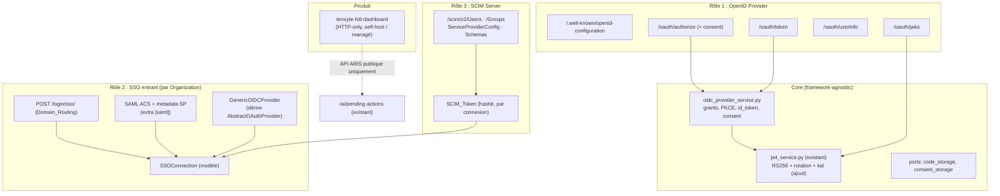

# Design Document — Phase 4 « Enterprise » (z_aud_4)

## Overview

Le constat directeur : **Tenxyte possède déjà tous les organes, il lui manque les rôles.**
La crypto asymétrique et sa rotation existent (`conf/jwt.py`), la validation de redirect URIs
existe (`Application.redirect_uris`), une pile OAuth cliente avec PKCE existe
(`AbstractOAuthProvider`), les organisations et le multi-tenant existent, l'API HITL existe.
La phase 4 n'invente pas de primitives : elle **assemble ces organes en trois rôles standards**
(OpenID Provider, SAML SP/OIDC RP par organisation, serveur SCIM) et **emballe l'API HITL dans
un produit**.

Trois risques dominent et structurent le design :

1. **Risque protocolaire** — OIDC/SAML/SCIM sont des standards à pièges (code replay, confusion
   de redirect_uri, signature XML, filtres SCIM). Réponse : validation fail-closed systématique,
   propriétés de correction dédiées, et confrontation à des implémentations réelles
   (conformance suite OpenID, Okta, Entra) en tests manuels.
2. **Risque de régression** — la phase touche au cœur (JWT, login). Réponse : tout est additif,
   flags à False, schéma OpenAPI existant prouvé byte-identique flags éteints (Property 13).
3. **Risque de confiance communautaire** — l'offre commerciale peut être perçue comme un
   verrouillage. Réponse : frontière open-core écrite AVANT le code du dashboard, garde-fou
   « zéro license-check dans l'OSS » testable (Requirement 7.2).

## Architecture

## Décisions de conception

### D1 — RS256 obligatoire en mode OP, JWKS dérivé de l'existant

Un OP publie ses clés de vérification ; HS256 (symétrique) rendrait le secret public. Au boot,
si `OIDC_PROVIDER_ENABLED=True` et algorithme HS*, levée d'une erreur de configuration explicite
(pattern des checks Django `ImproperlyConfigured`). Le `kid` est dérivé de manière déterministe
(empreinte SHA-256 tronquée de la clé publique DER) — pas de nouvelle table, pas d'état : deux
instances avec la même clé publient le même `kid`. Pendant une rotation,
`JWT_PREVIOUS_PUBLIC_KEY` est publiée dans le JWKS avec son propre `kid`, exactement comme le
`decode` la tolère déjà côté validation interne. *Alternative rejetée : gestion de clés en base
(à la Keycloak) — sur-ingénierie tant qu'on n'a pas de multi-issuer.*

### D2 — Cœur protocolaire dans le Core, adapters minces

`core/oidc_provider_service.py` porte 100 % de la logique : validation de la requête
d'autorisation, génération/consommation des codes (via un port `AuthorizationCodeStorage`),
vérification PKCE (S256 uniquement), construction de l'id_token (délégation à `JWTService`
pour la signature), logique de consentement (port `ConsentStorage`). Zéro import Django,
fonctions pures pour tout ce qui est calculable (at_hash, kid, validation d'URI) — même recette
que l'extraction z_aud_3, ce qui rend l'exposition FastAPI triviale.

### D3 — `OIDCClient` : nouveau modèle, `Application` intouchée

`Application` porte déjà `redirect_uris`, mais la sémantique diffère (origines d'app première
partie vs RP tiers avec secret, type, consentement, scopes). Fusionner créerait une migration
modifiante et un couplage de cycle de vie. `OIDCClient` = FK vers `Application` (rattachement
tenant/app), `client_id` (UUID public), `client_secret_hash` (SHA-256, retourné une seule fois
à la création — même pattern que les secrets d'application), `client_type`
(confidential|public), `redirect_uris` (exact-match, réutilise la logique de
`Application.is_valid_redirect_uri` comme précédent), `allowed_scopes`, `require_consent`,
`is_active`. Modèles compagnons : `OIDCAuthorizationCode` (code hashé, TTL, liaisons, flag
`used`), `OIDCConsent` (user × client × scopes, révocable).

### D4 — `SSOConnection` par organisation, domaine unique à l'échelle de l'instance

Le SSO enterprise est un attribut d'organisation (le client B2B « Acme » fédère SES employés).
`SSOConnection` : FK `Organization`, `protocol` (saml|oidc), `domains` (JSONField, contrainte
d'unicité applicative instance-wide sur chaque domaine actif — sinon le Domain_Routing est
ambigu), `config` (JSON : entity_id/SSO URL/certificat IdP côté SAML ; issuer/client_id/secret
côté OIDC), `jit_enabled`, `default_role`, `scim_enabled`. Le routage `POST /login/sso/`
répond avec la même forme qu'il y ait connexion ou non (anti-énumération, cohérent avec
register/reset).

### D5 — SAML confiné dans l'extra `[saml]`, validation fail-closed

xmlsec est une dépendance native lourde ; elle ne doit jamais être tirée par défaut
(cohérent avec l'inversion de packaging z_aud_1 : Import_Guard PEP 562 →
`TenxyteMissingDependencyError` nommant `pip install "tenxyte[saml]"`). La validation
d'assertion est fail-closed dans l'ordre : signature XML (certificat de LA connexion,
jamais de trust ambiant), `Audience`, corrélation `InResponseTo` avec un AuthnRequest émis
(stocké côté cache avec TTL), fenêtre `NotBefore`/`NotOnOrAfter` (skew ±60 s), unicité de
l'assertion ID (cache, TTL = NotOnOrAfter) contre le replay. Un seul échec = rejet total,
aucun effet partiel (pas de JIT, pas de session).

### D6 — OIDC entrant générique par dérivation, pas par duplication

`GenericOIDCProvider(AbstractOAuthProvider)` est construit depuis la `config` de la connexion
(discovery de l'issuer au moment de la config, endpoints figés ensuite), impose `state` (déjà
géré par le flux social) et `nonce`, et rend le dict normalisé existant. Bénéfice : tout le
durcissement du flux social (PKCE, timeout 10 s, logging) est hérité, et le code de liaison
utilisateur (Requirement 4.4) est partagé avec `SocialAuthService`.

### D7 — SCIM : l'IdP est la source de vérité, jamais de suppression physique

Les tokens SCIM sont générés par connexion, affichés une fois, stockés SHA-256 (pattern des
refresh tokens post-0005). `DELETE /Users/{id}` et `PATCH active=false` désactivent
(`is_active=False` + révocation sessions/refresh) — la suppression physique reste du ressort
exclusif du flux GDPR existant. Le sous-ensemble de filtres (`eq` sur userName/externalId/
email, conjonction `and`) couvre ce qu'Okta et Entra émettent réellement ; tout le reste
répond 400 au format SCIM avec `scimType`. Précédence SCIM > JIT (Requirement 4.3) : deux
écritures concurrentes du même compte par deux mécanismes est la première source d'incidents
de fédération.

### D8 — Dashboard HITL : produit HTTP-only, frontière open-core écrite d'abord

Le dashboard vit hors du package Python (monorepo intégrations z_aud_2 ou repo dédié) et est
soumis au même check automatisé que `tenxyte-langchain` : interdiction d'importer `tenxyte`.
Conséquence architecturale forte : il fonctionne contre N'IMPORTE QUEL backend conforme AIRS
(spec z_aud_2), ce qui en fait à la fois un produit et une **preuve vivante de la spec**.
L'authentification du dashboard est l'auth Tenxyte standard + RBAC existant des
pending-actions (No_Privilege_Amplification, hérité de z_aud_2). La frontière open-core est
publiée dans `docs/*/editions.md` avant la première ligne du dashboard, et le garde-fou
« aucun license-check dans l'OSS » est un test (grep CI sur motifs `license_key`/`entitlement`
dans `src/`).

## Correctness Properties

1. **Gating des trois rôles** — Pour tout endpoint OP, SSO ou SCIM, flag éteint ⇒ 404
   `FEATURE_DISABLED` ; flags éteints ⇒ schéma OpenAPI existant inchangé. *(Req 1.1, 3.1, 5.1, 9.3)*
2. **Refus de boot OP en symétrique** — `OIDC_PROVIDER_ENABLED=True` ∧ HS* ⇒ erreur de
   configuration au démarrage. *(Req 1.2)*
3. **Cohérence discovery/JWKS/réalité** — Toute URL et capacité annoncée par le
   Discovery_Document répond conformément ; le JWKS contient la clé active (kid déterministe)
   et la clé précédente ssi configurée ; un id_token émis est toujours vérifiable par le JWKS
   publié au même instant, y compris pendant une rotation. *(Req 1.3, 1.4)*
4. **Code d'autorisation à usage strictement unique** — Pour toute séquence générée
   d'échanges, un code n'aboutit qu'une fois ; le rejeu révoque les tokens issus du code ;
   expiré/mauvais client/mauvais redirect_uri/mauvais verifier ⇒ rejet standard. *(Req 1.5, 1.7)*
5. **PKCE obligatoire pour les clients publics** — client public sans challenge S256 ⇒ rejet
   à l'autorisation, jamais au token (échec au plus tôt). *(Req 1.8)*
6. **Exactitude des claims id_token** — Pour des configurations générées (client, scopes,
   nonce), l'id_token émis satisfait iss/sub/aud/exp/iat/nonce/at_hash selon OIDC Core
   3.1.3.6. *(Req 1.6)*
7. **redirect_uri exact-match** — Aucune variation générée (casse, slash final, query, port,
   sous-domaine, userinfo@) d'une URI enregistrée n'est acceptée. *(Req 2.2)*
8. **Consentement bloquant et fidèle** — `require_consent=True` sans Consent couvrant ⇒ aucun
   code émis ; le Consent enregistré énumère exactement les scopes accordés ; client désactivé
   ⇒ authorize et token rejetés. *(Req 2.3, 2.4)*
9. **Déterminisme et anti-énumération du Domain_Routing** — email → au plus une connexion
   active ; l'unicité de domaine est imposée à la création ; la forme de réponse de
   `/login/sso/` est identique avec ou sans connexion. *(Req 3.2, 3.3)*
10. **Validation SAML fail-closed sans effet partiel** — Pour des assertions mutées
    (signature altérée, audience étrangère, InResponseTo inconnu, horodatage hors fenêtre,
    ID rejoué), le rejet est total : ni utilisateur créé, ni session, ni token. *(Req 3.4)*
11. **JIT gouverné et précédence SCIM** — jit_enabled=False ⇒ jamais de création ;
    scim actif ⇒ JIT inhibé ; email vérifié existant ⇒ liaison sans doublon. *(Req 4.1–4.4)*
12. **Intégrité SCIM** — auth par token hashé de LA connexion uniquement ; `externalId`
    unique (409 sur doublon) ; `active=false` désactive et révoque sans suppression physique ;
    le sous-ensemble de filtres est correct sur des corpus générés ; les opérations Groups
    sont idempotentes au rejeu. *(Req 5.2–5.6)*
13. **Invisibilité totale flags éteints** — Suite existante verte sans modification,
    migrations additives, schéma OpenAPI pré-phase byte-identique. *(Req 9.1–9.3)*
14. **Pureté du cœur protocolaire et hygiène des secrets** — `core/oidc_provider_service.py`
    sans import Django ; secrets clients et tokens SCIM jamais en clair en base ni dans les
    logs ; aucun motif de license-check dans `src/`. *(Req 9.4, 8.3, 7.2)*

## Error Handling

| Surface | Format | Exemples |
|---|---|---|
| Endpoints OAuth2/OIDC (`/oauth/*`) | **RFC 6749 §5.2** : `{"error": "invalid_grant", "error_description": ...}` | `invalid_client`, `invalid_grant`, `unsupported_grant_type`, `invalid_scope` ; erreurs d'autorisation renvoyées par redirection quand le redirect_uri est validé, en page d'erreur sinon (jamais de redirection vers une URI non validée) |
| Endpoints SCIM (`/scim/v2/*`) | **RFC 7644 §3.12** : `{"schemas": [...:Error], "status": "409", "scimType": "uniqueness", "detail": ...}` | 401 sans token, 400 filtre non supporté, 404, 409 |
| Tout le reste (routage SSO, admin clients/connexions, dashboard) | Format canonique `{error, code, details}` | `FEATURE_DISABLED`, `SSO_AUTH_FAILED` (non-énumérant), `VALIDATION_ERROR` |
| Boot | `ImproperlyConfigured`-équivalent Core | OP+HS256, connexion `saml` sans extra installé (`TenxyteMissingDependencyError`) |

Règles transverses : aucune erreur ne divulgue l'existence d'un compte, d'un domaine fédéré ou
d'un client ; les échecs de validation SAML sont journalisés en détail côté audit log mais
répondent un message générique ; throttling avec `retry_after` sur authorize, token,
`/login/sso/`, ACS et SCIM (familles dédiées).

## Testing Strategy

- **Property tests** (Hypothesis, ≥ 100 exemples, docstring `Feature: z_aud_4, Property N: …`) :
  les 14 propriétés ci-dessus. Générateurs clés : mutations de redirect_uri (P7), séquences
  d'échanges de codes (P4), assertions SAML mutées via fixtures signées puis altérées (P10),
  corpus de filtres SCIM valides/invalides (P12), configurations client×scopes×nonce (P6).
- **Tests d'intégration Django** : flux authorize→consent→token→userinfo complet en client
  confidentiel et public ; ACS SAML avec assertions de fixture (clé de test dédiée, allowlist
  gitleaks) ; cycle SCIM create→patch→deactivate→filter ; suites dans
  `tests/integration/django/unit/` (conventions existantes, mots de passe concaténés).
- **Snapshot OpenAPI** : capture du schéma pré-phase, comparaison byte-identique flags éteints
  (P13) — job CI dédié.
- **Interop réelle (manuel)** : conformance suite OpenID Foundation, Okta, Microsoft Entra,
  Grafana — `manual_tests.md` MT-1 à MT-5 ; le protocole automatisé ne remplace pas la
  confrontation aux implémentations du terrain.
- **Dashboard** : tests E2E du produit contre le backend démo z_aud_3 + vérification
  HTTP_Only_Rule par le check z_aud_2 ; MT-6 pour le parcours humain.
- **Non-régression** : suite complète existante inchangée (P13) ; `validate_endpoints.py`
  sur les docs EN/FR augmentées.

## Jalonnement

Ordre imposé par les dépendances et la valeur : **OP d'abord** (différenciateur vs audit,
autonome), puis **SSO entrant** (réutilise le lien utilisateur du social), puis **SCIM**
(dépend de SSOConnection), puis **dashboard + offre** (dépend de rien côté backend, mais la
frontière open-core doit être publiée avant son code — D8). Chaque chantier est fusionnable
indépendamment derrière son flag.
