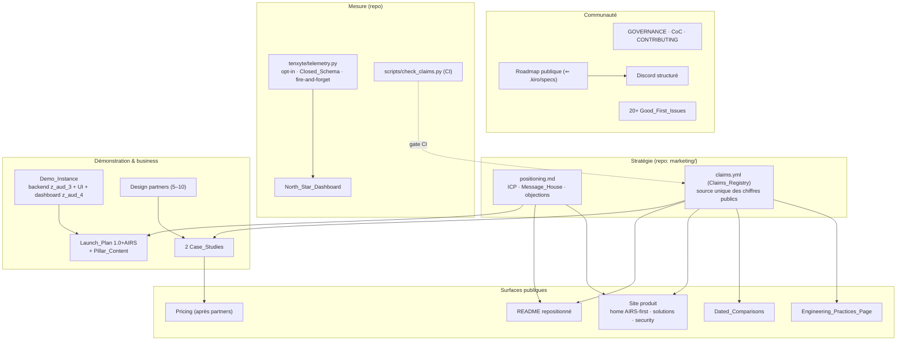

# Design Document — Phase 5 « Go-to-Market » (z_aud_5)

## Overview

Le constat directeur vient du verdict de l'audit : **le code est au niveau, la distribution
est à zéro**. Cette phase est donc atypique dans le dossier `.kiro/specs` : la majorité de ses
livrables sont des artefacts stratégiques, des campagnes et des processus — pas du code. Le
design applique néanmoins la même discipline que les phases techniques : chaque livrable
hors-code a un **critère de validation observable** (revue tierce, dry-run, chronométrage,
registre), et les trois livrables in-repo (télémétrie, Claims_Lint, gouvernance) portent des
**propriétés de correction testées**.

Trois risques dominent et structurent le design :

1. **Risque de dispersion** — Tenxyte chevauche 3 segments (§5.1) ; un message qui vend tout
   ne vend rien. Réponse : hiérarchie AIRS_First verrouillée dans un Positioning_Statement
   unique, réutilisé verbatim, et une règle de revue (tout asset menant par l'auth humaine
   est rejeté).
2. **Risque de trahison de la promesse** — un produit vendu sur la souveraineté qui téléphone
   à la maison, ou un produit de sécurité pris en défaut sur un chiffre, perd sa seule
   monnaie : la confiance. Réponse : télémétrie inerte par défaut avec confidentialité
   **structurelle** (schéma fermé property-testé), et Claims_Lint bloquant en CI.
3. **Risque d'essoufflement** — la communauté et le contenu sont des efforts « continus »
   (§8) portés par un bus factor ≈ 1. Réponse : tout engagement public (SLA, calendrier,
   revue semestrielle des comparatifs) est dimensionné pour être tenable, et le
   Maintainer_Path est un livrable de la phase, pas un vœu.

## Architecture

## Décisions de conception

### D1 — Un seul message d'attaque : AIRS_First

L'audit est formel : sur l'auth humaine, Tenxyte est « un excellent challenger mais pas un
game-changer » ; sur les agents IA, il a « le produit le plus complet du marché, tous segments
confondus ». Le Message_House verrouille cette hiérarchie : toit = Positioning_Statement
(la phrase §5.5 recentrée agents), piliers = (1) gouvernance d'agents prouvée (tableau §6.2 :
6 primitives que personne d'autre n'a), (2) souveraineté + coût zéro (§5.4), (3) largeur +
rigueur (remplace 6–8 packages, 2 605 tests). L'auth humaine complète n'est jamais le toit.
*Alternative rejetée : messaging « meilleure auth Django » — c'est le terrain d'allauth
(10k+ étoiles, 15 ans) ; le différentiel de features « ne suffit pas à déplacer des bases
installées » (§10).*

### D2 — Canaux : builders d'agents d'abord, Django jamais en priorité

§9 Phase 2 l'impose : « Cibler les communautés agents (pas les communautés Django) ». Les
canaux du plan éditorial et du launch sont ordonnés : écosystèmes LangChain/LangGraph, CrewAI,
MCP (le serveur MCP z_aud_2 est un cheval de Troie de distribution), HN, r/MachineLearning ;
puis self-hosted/homelab (r/selfhosted — affinité souveraineté) ; les canaux Python/Django ne
reçoivent que le contenu « remplace 6–8 packages », jamais le budget principal.

### D3 — La confidentialité de la télémétrie est structurelle, pas déclarative

Un produit d'auth self-hosted ne peut pas se permettre une télémétrie « faites-nous
confiance ». Le design rend la fuite **impossible par construction** : le Telemetry_Module
n'accepte que des évènements d'une énumération fermée (`TelemetryEvent` : nom ∈ enum, champs
∈ enum typés — versions, adapter, flags booléens, Install_ID aléatoire) ; il n'existe aucune
API acceptant une chaîne libre. La Property 3 le vérifie par génération : aucune séquence
d'appels ne peut produire un payload contenant une valeur hors schéma. L'émission est
fire-and-forget (thread détaché, timeout court, échec silencieux) et **aucun code de
télémétrie n'est joignable depuis un handler d'auth** (vérifié par test d'imports, Property 5).
La Transparency_Doc est générée depuis le même schéma (source unique) — la doc ne peut pas
mentir sur le payload. *Alternative rejetée : télémétrie opt-out « comme Next.js » — viable
pour un framework UI, fatal pour une brique de sécurité souveraine.*

### D4 — Les chiffres publics ont une seule source : le Claims_Registry

Tout chiffre public (« 2 605 tests », « 2 minutes », « 93 endpoints », benchmarks HITL) vient
de `marketing/claims.yml`, où chaque entrée porte : la valeur, le pointeur de preuve
(chemin de test, sortie de script, ligne de registre MT, rapport d'audit), la date de
vérification. `scripts/check_claims.py` échoue en CI si (a) un pointeur ne résout pas,
(b) un fichier public tracké contient un chiffre absent du registre (détection par motifs),
(c) une preuve recalculable a dérivé (ex. le compte de tests réel ≠ la valeur publiée).
C'est le pendant marketing des snapshots de non-régression : **le README est testé comme
les endpoints.** Les comparatifs héritent de la règle avec en plus la date d'évaluation et
la revue semestrielle (les concurrents bougent — un comparatif périmé est un claim faux).

### D5 — La communauté est un produit avec un funnel, pas un canal ouvert

Le parcours contributeur est conçu de bout en bout : découverte (README/site → Discord →
roadmap publique alimentée par `.kiro/specs`, qui devient un atout de transparence unique),
activation (20+ Good_First_Issues autoportantes — chacune rédigée avec contexte, fichiers,
critère d'acceptation, et calibrée < 4 h), rétention (SLA de réponse public mais tenable,
mentorat), conversion (Maintainer_Path : critères objectifs — N PR mergées, une feature
speccée `.kiro`, revues — et délégation progressive des droits). L'objectif F6 (2ᵉ mainteneur)
est un critère de sortie de phase, pas un espoir. Le parcours est validé par un cobaye
externe réel avant le launch (MT-5) — on ne découvre pas un onboarding cassé le jour du pic HN.

### D6 — Le lancement est répété, pas improvisé

Un Show HN se joue une fois. Le Launch_Plan est un artefact versionné : séquencement
(J-14 teasing communautés agents → J0 Show HN + post technique → J+1 relais LangChain/CrewAI/
MCP → J+7 récap chiffré), assets prêts avant J-14 (vidéo 90 s sur la Demo_Instance : agent →
202 HITL → approbation dashboard ; FAQ objections issue de la matrice du positionnement),
présence 48 h avec répondeurs nommés, et **dry-run complet** (MT-4) : post soumis à 3
relecteurs externes jouant les commentateurs HN hostiles (« yet another auth lib », « where's
the audit? », « MIT mais bus factor 1 » — les réponses existent grâce aux phases 1–4, il faut
les avoir écrites AVANT).

### D7 — Design partners avant pricing, études de cas avant publicité

Un produit sans marque ne vend pas sur promesse. La charte design partners échange l'offre
managée gratuite (z_aud_4) contre du feedback structuré mensuel et une Case_Study nominative.
Le pricing public n'est publié qu'après ≥ 5 partners actifs : il est alors dérivé de données
(willingness-to-pay observée, coûts réels du managé) et non d'hypothèses. Les chiffres des
études de cas passent par le Claims_Registry comme tout le reste. *Alternative rejetée :
pricing public immédiat — sans référence client, il n'ancre rien et se renie mal.*

### D8 — La Demo_Instance est le pilier de conversion ET un actif de test

L'instance démo assemble les briques existantes (backend démo z_aud_3, UI z_aud_3, dashboard
HITL z_aud_4) avec un seed déterministe, un reset périodique et du rate-limiting (c'est une
cible d'abus évidente : aucune donnée réelle, throttling agressif, pas d'emails sortants
réels). Le scénario scripté AIRS (déclencher une action d'agent → voir le 202 → approuver
dans le dashboard) est le « aha moment » du produit — il matérialise en 60 secondes ce
qu'aucun concurrent ne peut montrer (§6.2). Bénéfice secondaire : l'instance sert de cible
de smoke test permanent aux releases.

## Correctness Properties

Les propriétés 1–6 sont des property tests in-repo ; les propriétés 7–10 sont des invariants
de processus vérifiés par revue outillée (lint, checklists MT) — même numérotation, même
traçabilité.

1. **Télémétrie inerte par défaut** — Réglages par défaut ⇒ aucun appel réseau, aucun thread,
   aucun fichier créé par le Telemetry_Module, quelles que soient les séquences d'usage du
   package générées. *(Req 5.1, 9.2)*
2. **Kill switch total** — Pour toute séquence activation→usage→désactivation générée, l'état
   désactivé est indistinguable de l'état jamais-activé (inertie complète). *(Req 5.4)*
3. **Confidentialité structurelle** — Aucune séquence d'appels de l'API télémétrie ne peut
   produire un payload contenant un champ hors Closed_Schema ou une valeur non énumérée ;
   l'Install_ID est aléatoire (non dérivé d'aucune donnée du déploiement) et stable.
   *(Req 5.2, 5.3)*
4. **Innocuité d'émission** — Endpoint de collecte injoignable, lent ou renvoyant des erreurs
   ⇒ aucun impact observable sur les appels du package (latence des chemins d'auth inchangée,
   aucune exception propagée). *(Req 5.4, 9.2)*
5. **Isolement du chemin d'auth** — Aucun module de `telemetry.py` n'est importé (directement
   ou transitivement) par les handlers d'authentification, de tokens ou AIRS — vérifié par
   analyse d'imports. *(Req 9.3)*
6. **Cohérence doc/schéma** — La Transparency_Doc générée correspond exactement au
   Closed_Schema (générée depuis la même source, test de fraîcheur en CI). *(Req 5.5)*
7. **Traçabilité des claims** — Tout chiffre présent dans les fichiers publics trackés existe
   dans le Claims_Registry avec un pointeur de preuve qui résout ; les preuves recalculables
   n'ont pas dérivé. *(Req 8.1, 8.2, 8.3 — Claims_Lint CI)*
8. **Datation des comparatifs** — Tout comparatif public porte sa date d'évaluation et sa
   prochaine échéance de revue (≤ 6 mois). *(Req 8.4 — lint)*
9. **Hiérarchie de message** — Tout asset public passe la revue AIRS_First (checklist MT-1/
   MT-3 : le toit du message est la gouvernance d'agents, le Positioning_Statement est
   verbatim). *(Req 1.2)*
10. **Invisibilité totale** — Suite existante verte sans modification ; réglages par défaut ⇒
    schéma OpenAPI inchangé et zéro trafic réseau attribuable à la phase ; aucune API, modèle
    ou migration existants modifiés. *(Req 9.1, 9.2, 9.4)*

## Error Handling

| Situation | Traitement |
|---|---|
| Endpoint télémétrie injoignable/lent | Échec silencieux, timeout court (≤ 2 s), aucune retry-tempête (backoff avec plafond), jamais d'exception propagée |
| Claim sans preuve / preuve dérivée | Échec CI (Claims_Lint) avec message actionnable : claim, fichier, pointeur attendu |
| Comparatif au-delà de son échéance de revue | Warning CI à J-30, échec à échéance |
| Launch : métriques J+7 sous les seuils | Pas une « erreur » à cacher : debrief obligatoire, itération du plan éditorial — le template de debrief force l'analyse |
| Design partner inactif > 1 mois | Statut CRM dégradé, remplacement dans le vivier — le seuil « ≥ 5 actifs » conditionne le pricing |
| Demo_Instance abusée | Rate-limiting agressif, reset automatique, aucune donnée réelle ni email sortant réel (risque borné par construction) |
| SLA communauté non tenu un mois | Mesuré au North_Star_Dashboard, revu au rituel mensuel ; le SLA public est ajusté plutôt que silencieusement violé |

## Testing Strategy

- **Property tests** (Hypothesis, ≥ 100 exemples, docstring `Feature: z_aud_5, Property N: …`) :
  propriétés 1–6 (télémétrie). Générateurs clés : séquences d'usage du package avec/sans
  activation (P1, P2), séquences d'appels API télémétrie cherchant à injecter des valeurs
  libres (P3), comportements d'endpoint simulés — timeout, 500, connexion refusée (P4).
- **Lints CI** : Claims_Lint (P7, P8) sur README + `docs/` marketing + site (fichiers sources
  trackés) ; test de fraîcheur Transparency_Doc (P6) ; analyse d'imports (P5).
- **Snapshot OpenAPI + réseau** : réglages par défaut ⇒ schéma inchangé et zéro connexion
  sortante pendant la suite (P10) — réutilise le mécanisme z_aud_4.
- **Validation hors-code** : tout le reste passe par `manual_tests.md` — revue de
  positionnement avec test des 5 secondes (MT-1), audit du site (MT-2, MT-3), dry-run du
  launch (MT-4), parcours contributeur par cobaye externe (MT-5), revue télémétrie/
  transparence (MT-6), chronométrages (MT-7), revue du pipeline commercial (MT-8).
- **Non-régression** : suite complète existante inchangée ; `validate_endpoints.py` vert si
  des pages docs sont ajoutées.

## Jalonnement

L'ordre suit la dépendance narrative : **positionnement d'abord** (tout le reste l'utilise),
puis **fondations de preuve et de mesure** (Claims_Registry + lint, télémétrie, gouvernance —
avant toute exposition publique), puis **surfaces** (README, site, démo), puis **launch**
(après dry-run, avec la démo et le contenu prêts), enfin **business** (partners → études de
cas → pricing). La revue semestrielle des comparatifs et le rituel mensuel du dashboard sont
des tâches récurrentes qui survivent à la phase.
