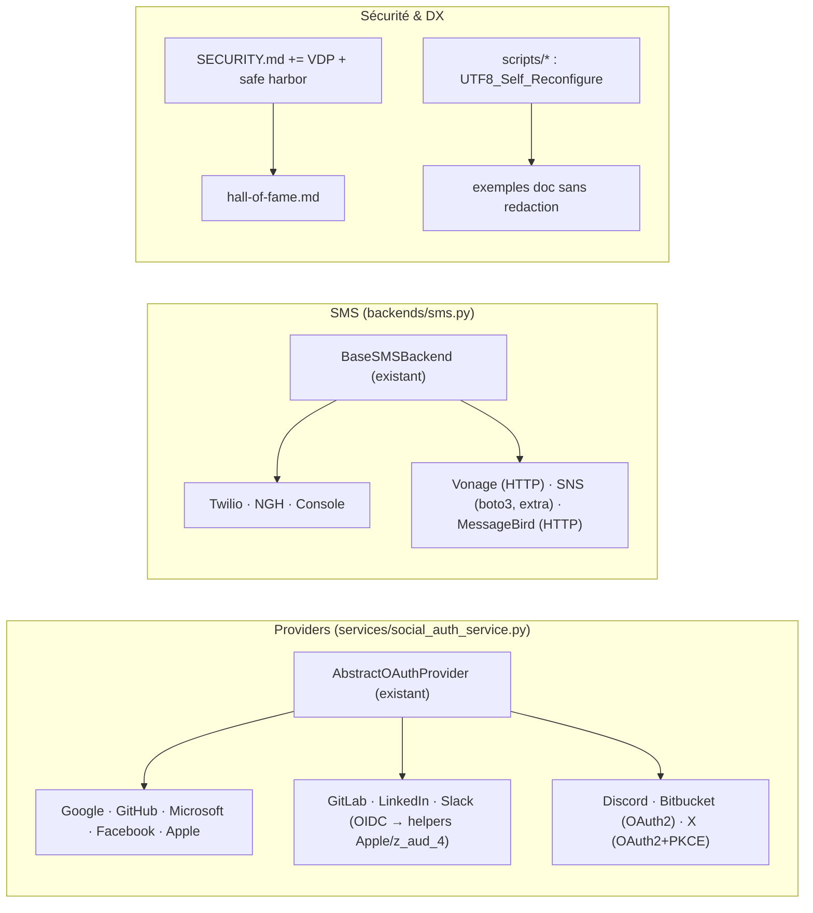

# Design Document — z_aud_backlog

## Overview

Spec de complétion, volontairement légère : les quatre chantiers sont indépendants, purement
additifs, et chacun réutilise un gabarit déjà éprouvé dans le code — `AbstractOAuthProvider`
(+ flux Apple z_aud_1) pour les providers, `TwilioBackend` pour les SMS, SECURITY.md
(z_aud_1) pour le VDP, `validate_endpoints.py` pour la DX. Le risque principal n'est pas la
conception mais la **dérive de contrat** (un 6ᵉ provider qui interprète différemment le dict
normalisé, un backend SMS qui loggue un numéro) : le design y répond par des property tests
de contrat partagés, exécutés sur TOUS les providers/backends, anciens et nouveaux.

## Architecture

## Décisions de conception

### D1 — Sélection des providers par ICP, contrat unique property-testé

GitLab et Bitbucket servent l'ICP dev/builders d'agents (z_aud_5), LinkedIn et Slack le B2B,
Discord les communautés, X la portée grand public. Chaque provider est une classe autonome ;
le point commun est vérifié par un **property test paramétré sur le registre entier** (les 11
providers) : tout `get_user_info` réussi produit un Normalized_Dict complet et typé, tout
échec produit `None` loggé — la Property 1 empêche structurellement la dérive de contrat, y
compris pour les providers futurs.

### D2 — OIDC par réutilisation, jamais par duplication

GitLab/LinkedIn/Slack valident l'id_token avec les helpers introduits pour Apple (JWKS
fail-closed, nonce) ; si z_aud_4 est déjà livré, le `GenericOIDCProvider` devient la base de
ces trois classes (configuration statique par provider). Le design fonctionne dans les deux
ordres d'exécution — aucune dépendance bloquante sur z_aud_4.

### D3 — Particularités par provider isolées dans la classe

X : PKCE S256 obligatoire (exigence plateforme) et email absent par défaut → le flux de
liaison existant traite déjà « pas d'email vérifié » (compte social sans liaison
automatique) ; Discord : `email_verified` reflété fidèlement depuis l'API ; Bitcket/GitLab :
emails récupérés via l'endpoint dédié si nécessaire (pattern GitHub existant). Aucune de ces
particularités ne remonte dans `SocialAuthService`.

### D4 — SMS : HTTP pur quand c'est possible, SDK seulement si nécessaire

Vonage et MessageBird ont des API REST simples → `requests` (déjà présent), timeout
explicite ≤ 10 s, aucun extra réel (l'extra sert de marqueur documentaire). AWS SNS exige
SigV4 → boto3 derrière `tenxyte[sns]` avec import paresseux (message d'erreur nommant
l'extra, pattern Twilio ligne 87). La Property 3 (masquage) s'applique au **registre entier**
des backends, comme D1.

### D5 — VDP sans plateforme : la promesse doit être tenable

Le « bug bounty léger » de l'audit est interprété au plus près du mot « léger » : cadre
juridique (safe harbor), périmètre net, reconnaissance publique — mais pas de récompenses
monétaires ni de plateforme, intenables avec un bus factor ≈ 1 (le SLA z_aud_1 reste la seule
promesse de délai). L'escalade vers une plateforme est un critère de révision explicite
(> N rapports valides/trimestre), documenté dans le VDP lui-même.

### D6 — DX réparée à la source

`sys.stdout.reconfigure(encoding="utf-8")` (avec garde `hasattr` pour compatibilité) en tête
des scripts de validation — le contournement `PYTHONIOENCODING` disparaît de la doc et de
CONTRIBUTING. Les exemples de doc avec artefacts de redaction sont réécrits en placeholders
`<YOUR_...>` (jamais de valeurs plausibles, pour gitleaks et pour les lecteurs).

## Correctness Properties

1. **Contrat de provider universel** — Pour chaque provider du registre (11) et des réponses
   API fixturées/mutées générées : succès ⇒ Normalized_Dict complet et typé ; échec/réponse
   malformée ⇒ `None` sans exception. *(Req 1.1, 1.5)*
2. **Validation OIDC fail-closed partagée** — Pour les OIDC_Providers, id_token mutés
   (signature, nonce, aud, exp) ⇒ rejet ; le chemin de validation est le même objet que
   celui d'Apple/z_aud_4 (identité de code vérifiée). *(Req 1.2)*
3. **Hygiène des logs SMS universelle** — Pour chaque backend du registre (6) et des
   numéros/messages générés : aucun log ne contient le numéro complet ni le corps du
   message. *(Req 2.1, 2.5)*
4. **Innocuité des backends** — credentials absents, API down, timeout ⇒ échec loggé,
   aucune exception propagée au flux OTP appelant. *(Req 2.1, 2.3, 2.4)*
5. **PKCE obligatoire pour X** — toute tentative d'échange sans verifier S256 ⇒ rejet.
   *(Req 1.3)*
6. **Liaison sans email vérifié inchangée** — pour des payloads générés sans email vérifié
   (Discord/X), jamais de liaison automatique ni de doublon ; formes de réponses sociales
   existantes byte-identiques (snapshot). *(Req 1.4, 1.5, 5.2)*
7. **Install par défaut inchangée** — l'arbre de dépendances de `tenxyte` et `tenxyte[django]`
   est identique avant/après (snapshot de résolution) ; boto3 uniquement via `[sns]`.
   *(Req 2.2, 5.1)*
8. **Scripts UTF-8 autonomes** — les scripts de validation s'exécutent avec succès sous un
   stdout forcé en cp1252, sans variable d'environnement. *(Req 4.1)*

## Error Handling

| Situation | Traitement |
|---|---|
| API provider down / réponse malformée | `None` + log warning (pattern `_get` existant), le flux social répond l'erreur générique existante |
| id_token OIDC invalide | Rejet fail-closed, même code de validation qu'Apple |
| SMS : credentials manquants | Log d'init explicite nommant les settings (pattern Twilio), envoi ⇒ False |
| SMS : extra non installé (SNS) | Log pointant `pip install "tenxyte[sns]"` (pattern ligne 87 de sms.py) |
| Rapport VDP hors périmètre | Réponse type documentée dans le processus de triage, sans engagement de correction |
| Script sur console exotique | Reconfigure best-effort ; si impossible, repli ASCII des symboles décoratifs |

## Testing Strategy

- **Property tests** (Hypothesis ≥ 100 exemples, docstring `Feature: z_aud_backlog,
  Property N: …`) : les 8 propriétés — dont les propriétés « universelles » (1, 3)
  paramétrées sur les registres complets, protégeant aussi l'existant.
- **Tests d'intégration** : un module de tests par provider (fixtures de réponses API
  réelles anonymisées, allowlist gitleaks) et par backend SMS ; flux OTP complet avec chaque
  backend en mode mock HTTP ; suites dans `tests/integration/django/unit/`.
- **Snapshots** : formes de réponses sociales existantes ; arbre de dépendances (P7) ;
  OpenAPI inchangé (Req 5.2).
- **Interop réelle (manuel)** : MT-1 (E2E OAuth réel par provider), MT-2 (envoi SMS réel par
  backend), MT-3 (soumission VDP à blanc), MT-4 (console Windows réelle).
- **Non-régression** : suite complète existante inchangée ; `validate_endpoints.py` vert
  EN/FR après réécriture des exemples.
