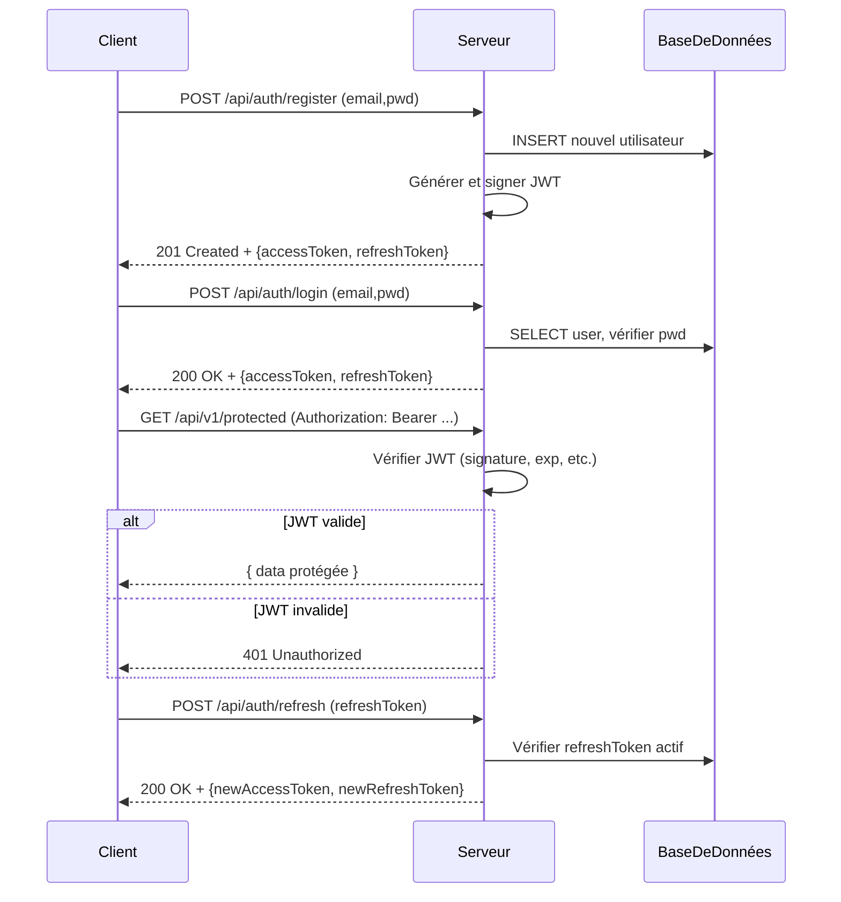
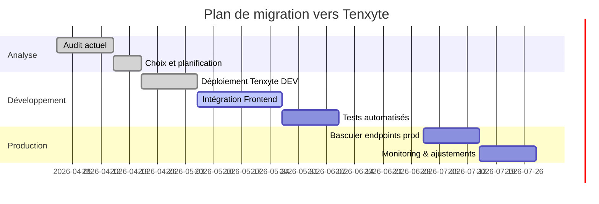

# Sécurisation de l’authentification backend

Dans un contexte où les attaques sur l’authentification se multiplient, il est impératif d’examiner les failles courantes et les bonnes pratiques. Ce rapport analyse les causes techniques (mauvaises utilisations de JWT, écueils de Passport.js, bricolages « fast and dirty »), les risques concrets (vol ou falsification de tokens, attaques CSRF/XSS, usurpation d’identité, escalade de privilèges), et expose des architectures et protocoles recommandés (utilisation correcte des JWT, OAuth2/OIDC avec PKCE, FIDO2/WebAuthn, gestion des sessions et tokens d’actualisation, anti-CSRF/XSS, etc.). Il cartographie également ces points aux exigences OWASP Top 10, au GDPR et aux standards FIDO2. Enfin, il présente **Tenxyte** – un framework d’authentification Python open-source (« framework-agnostic ») – comme solution potentielle, en détaillant ses fonctionnalités revendiquées, son intégration, et les stratégies de migration depuis Passport.js/JWT. 

**Résumé exécutif :** Les architectures d’authentification classiques basées sur JWT ou Passport.js comportent des fragilités majeures : secrets faibles ou mal gérés, absence de révocation de token, stockage côté client vulnérable (le stockage local est facilement exploitable via XSS【75†L93-L100】), schémas d’authentification DIY et évolutions précipitées. Ces vulnérabilités exposent aux attaques par vol et falsification de token【71†L292-L300】【70†L798-L804】 (par ex. algorithme `none` accepté par certaines bibliothèques【71†L296-L304】), à l’usurpation de contexte client【71†L328-L336】, au détournement de sessions (XSS/CSRF) et à l’écrasement de listes de révocation. Les solutions de troisième partie comme Auth0 ou Keycloak apportent robustesse et conformité, mais ont leurs inconvénients (coût ou complexité). **Tenxyte** se présente comme un compromis open-source combinant sécurité « par défaut » (2FA, FIDO2/Passkeys, RBAC, audit, rotation de tokens, etc.) et intégration aisée【37†L33-L37】【75†L151-L158】. Ce rapport propose un guide détaillé (flux de code sécurisés, checklist de migration, modèle de menaces, tableaux comparatifs, conseils DevOps et CI/CD) pour renforcer l’authentification backend et évaluer Tenxyte face aux alternatives.

## Causes techniques racines

- **Mauvaises pratiques JWT.** De nombreux projets implémentent des JWT mal configurés. L’algorithme `HS256` avec secret partagé est devenu insuffisant face à la puissance de calcul moderne【75†L79-L87】 ; OWASP souligne la faille critique du champ `alg: none` (autorise la falsification du token si non rejeté)【71†L296-L304】. Souvent, on stocke trop d’informations sensibles dans le JWT (« claims ») et on le conserve trop longtemps sans mécanisme de révocation【75†L151-L158】【71†L449-L452】. Par exemple, inclure des adresses e-mail ou IP dans le payload expose des données personnelles (une adresse IP est « donnée personnelle » GDPR【59†L52-L60】) et augmente la surface d’attaque【75†L151-L158】. Un secret JWT faible (court ou codé en dur) permet un cassage par force brute【71†L296-L304】【75†L79-L87】. L’absence de rotation ou de révocation laisse les tokens valides jusqu’à expiration, facilitant la réutilisation malveillante【71†L449-L452】. 

- **Complexité de Passport.js et redondance.** Passport.js est un middleware Node.js populaire, mais il nécessite de configurer manuellement chaque stratégie (local, JWT, OAuth, etc.) et de gérer le passage entre sessions server-side et tokens stateless. Dans une même application on se retrouve souvent avec des callback multiples et un « avalanche » de middleware : `passport.initialize()`, `passport.authenticate()`, puis code de gestion de session JWT, ce qui crée une complexité importante (« middleware hell »). Souvent, les développeurs réimplémentent des fonctionnalités (rafraîchissement de token, blacklist, OTP, etc.) manuellement faute de solution intégrée, ce qui génère des raccourcis dangereux (par ex. ne pas vérifier l’expiration, désactiver la double soumission CSRF pour gagner du temps). OWASP recommande de **ne pas réinventer l’authentification** et d’utiliser des solutions standardisées【73†L80-L88】, mais les délais serrés poussent hélas au bricolage.

- **Raccourcis de développement.** En production comme en pré-prod, on rencontre des anti-patterns : secrets JWT codés en clair dans le repo, expiration indéfinie, échec du logout (pas de blacklisting des refresh), omission des vérifications (audience, issuer) pour accélérer le développement. Le stockage client est souvent le maillon faible (web storage sans HttpOnly) : les Jetons Web stockés en localStorage/SessionStorage sont exposés à tout XSS【75†L91-L99】【70†L750-L759】. Ces « quick fixes » ouvrent la porte aux attaques XSS et vol de session.  

- **Frottements clients lors d’une migration.** Changer de schéma d’authentification impacte front-end et UX. Par exemple, migrer d’une session cookie classique vers du JWT impose de refactorer le stockage (cookies `HttpOnly` vs tokens JS) et l’envoi sur chaque requête. Passer d’une stratégie Passport à un autre système (Tenxyte ou Keycloak) requiert souvent d’adapter les workflows d’inscription, de confirmation d’email, et de gestion des erreurs. Un mauvais planning peut casser l’interface (changement des endpoints, des en-têtes attendus) et forcer une reconnexion massive des utilisateurs. Minimiser cette friction demande de conserver la compatibilité (par exemple en supportant provisoirement les anciens endpoints JWT tout en introduisant progressivement les nouveaux).

## Risques de sécurité et scénarios d’attaque

- **Vol ou falsification de token (JWT Sidejacking).** Si un attaquant intercepte un jeton (via XSS, sniffing réseau sans TLS, etc.), il peut l’utiliser pour s’authentifier tant que le token est valide【71†L328-L336】. OWASP préconise d’ajouter un « fingerprint » ou contexte utilisateur (token CSRF en cookie `HttpOnly` et hash dans le JWT) pour empêcher la réutilisation hors contexte【71†L332-L342】【71†L343-L350】. Sans cela, la moindre faille XSS ou un stockage non protégé suffit pour commettre une usurpation.

- **Rejeu de refresh token.** Les refresh tokens longs (stockés client) sont une cible majeure. Sans rotation, le même refresh peut être rejoué indéfiniment pour obtenir de nouveaux access tokens. Tenxyte encourage la rotation : chaque demande d’accès invalide l’ancien refresh et en délivre un nouveau【75†L124-L132】. Si cette mesure fait défaut, un vol de refresh permet une prise de contrôle persistante.

- **Attaques CSRF.** Avec des tokens en cookie, un site tiers peut forcer le navigateur à faire une requête authentifiée (puisque le cookie est envoyé automatiquement). Des protections *SameSite=strict* sur les cookies ou l’usage d’un token anti-CSRF sont nécessaires. Sans cela, un simple formulaire malveillant peut effectuer des actions sensibles à l’insu de l’utilisateur.

- **Brute force / Credential stuffing.** Sans MFA/2FA, un attaquant peut utiliser des listes de mots de passe volées pour tenter de se connecter (password spraying, credential stuffing). OWASP recommande l’**utilisation systématique de MFA** (OTP/TOTP, WebAuthn) pour tous les utilisateurs【73†L85-L88】【67†L453-L462】. En l’absence de 2FA, la compromission de quelques comptes est quasiment certaine sur du JSON en clair.

- **Attaques sur OAuth/OIDC.** Une mauvaise configuration (redirection URI non contrainte, scopes excessifs, absence de PKCE) peut permettre des attaques de type « code hijacking » ou l’octroi de tokens à une application malveillante. Les flux *Implicit* (obsolètes) exposent les tokens directement à l’URL, d’où la recommandation actuelle d’utiliser le flux Code + PKCE【68†L0-L3】.  

- **Exfiltration de données sensibles.** Inclure des données sensibles dans le JWT (e.g. crédits bancaires, attributs personnels, roles détaillés) risque de les divulguer si le jeton est capturé. OWASP/OWASP France recommande un *principe du moindre privilège* : seuls quelques attributs essentiels (ID utilisateur, autorité minimale) doivent figurer dans le JWT; les autres infos sensibles doivent rester côté serveur【75†L151-L158】.

- **Mauvaise gestion de session serveur.** Les frameworks classiques (sessions Express, Passport Local) peuvent conduire à des sessions longévives mal nettoyées. Un attaquant retournant de vieux cookies de session peut reprendre la session sans obligation de re-vérification. De même, l’usage du cache Redis pour blacklister des millions de tokens est problématique : il peut saturer la mémoire et empêcher de révoquer efficacement un token volé (capacité de blacklist limitée).

## Bonnes pratiques d’architecture et protocoles

- **JWT : usage approprié.** Choisir un **algorithme fort** (p.ex. *RS256* ou *EdDSA*/Ed25519) plutôt que HS256【75†L79-L87】. Toujours **vérifier** explicitement l’algorithme attendu (pour éviter l’attaque “alg none”）【71†L296-L304】. Configurer un **secret/clée longue et unique**, stockée hors code source (ex. Hashicorp Vault). Signer en **RS256** permet de ne plus partager de secret mais d’utiliser un couple clé privé/publique. Mettre un **délai de validité court** (p.ex. 15 min) pour les access tokens, avec rotation fréquente via refresh tokens【75†L124-L132】. Surveiller et forcer la **révocation des tokens** compromis : implémenter une liste noire ou une base de données d’état (adapter une stratégie « d’empreinte » ou “token binding” comme DPoP【75†L134-L142】) pour invalider à distance un token volé. Ne pas oublier de vérifier toutes les **revendications** (issuer, audience, subject). Finalement, adopter le *« stateless by design »* n’exclut pas quelques vérifications d’état (ex : stocker les refresh tokens ou jti dans une DB) pour couper court aux attaques en replay.

- **Gestion des sessions et cookies.** Si l’application utilise encore des sessions serveur (cookies), configurer le cookie avec `HttpOnly; Secure; SameSite=Strict` et activer d’éventuelles politiques avancées (cookies partitionnés, **CHIPS**, pour prévenir la fuite de données via cache【75†L93-L100】). Pour les JWT stateless, préférer l’envoi du token dans l’en-tête `Authorization: Bearer ...` plutôt que dans localStorage, afin de se prémunir de la plupart des XSS【70†L750-L759】. Si stockage côté client est nécessaire (ex. refresh token), privilégier un cookie `HttpOnly` avec un token anti-CSRF distinct pour les requêtes d’API, ou une stratégie *double-submit*. Appliquer un **Content Security Policy** strict pour réduire les vecteurs XSS (chargement de scripts externes, etc.)【70†L772-L779】.

- **OAuth2 / OpenID Connect.** Implémenter les flux **« Authorization Code » avec PKCE** pour les applications publiques (SPAs, mobile)【68†L0-L3】. Éviter l’**implicit flow** (obsolète) et surtout le flux *ROPC* (Resource Owner Password Credentials). Lors de délégation via OIDC, demander *minimale d’informations (scopes)* sur l’utilisateur. Valider côté serveur le jeton d’accès (introspection ou signature) et l’ID token (le cas échéant). Considérer un **fournisseur d’identité (IdP)** conforme (Auth0, Keycloak, etc.) pour gérer correctement l’OIDC, ou des bibliothèques vérifiées si on self-héberge.

- **FIDO2 / WebAuthn (Passkeys).** Pour des implémentations « sans mot de passe » ou 2FA forte, supporter WebAuthn. Le protocole FIDO2 combine clés publiques et biométrie (ou PIN) locale : seule une preuve cryptographique est envoyée au serveur, pas la donnée biométrique, ce qui renforce la vie privée【64†L727-L733】. Sur le back-end, vérifier la signature, le RPID (domain) et l’origine (origin) du navigateur, ainsi que l’attestation du dispositif (attestation X.509) si nécessaire. Conserver les **clés publiques** et les ID utilisateur (`userHandle`) associés. Appliquer l’option **userVerification** selon le contexte (ex. *required* si passkeys primaires, *discouraged* pour 2FA additionnelle)【61†L172-L181】. Fournir une option de secours (par exemple, OTP ou code backup) en cas de perte du dispositif FIDO. Comme le note OWASP, les **passkeys** (basées FIDO2) sont « très sûres, résistantes au phishing » et sans friction UX majeure【67†L453-L462】. En pratique, un bon guide WebAuthn (ex. Yubico) recommande de sauvegarder l’attestation brute et de gérer correctement le stockage des clés.

- **MFA et OTP.** Exiger une authentification multifacteur dès que possible, surtout pour les rôles à privilèges【67†L353-L362】. Permettre l’activation de TOTP (Google Authenticator, Authy), SMS ou mail OTP, et/ou WebAuthn. Mettre en place un **verrouillage de compte après N tentatives échouées** et un délai de réinitialisation (lent login), pour éviter le brute force【67†L399-L409】. Vérifier les mots de passe par rapport aux bases de passwords connus (HaveIBeenPwned) et imposer des règles de robustesse (longueur ≥15 si pas de MFA, etc., selon NIST)【56†L279-L287】. 

- **RBAC et Sécurité contextuelle.** Implémenter un contrôle d’accès basé sur les rôles (RBAC) et permissions granulaires. Les frameworks ou libs (comme Tenxyte) fournissent des décorateurs/middlewares pour cela. Les claims JWT ne doivent contenir que les rôles minimaux ; les autorisations détaillées (e.g. règles fines) peuvent être vérifiées en base de données. Dans tous les cas, refuser par défaut, vérifier le principe du moindre privilège. Selon OWASP, un système d’authentification robuste impose de re-vérifier l’authentification pour les opérations sensibles (changement d’adresse mail, désactivation de MFA, etc.)【56†L283-L292】. Les logs d’audit (connexion, changement de rôle, etc.) doivent être capturés pour détecter rapidement tout comportement anormal.

- **Infrastructure sécurisée.** Toujours déployer l’API sous TLS/HTTPS. Configurer CORS de façon restrictive (liste blanche d’origines fiables). Activer les en-têtes de sécurité HTTP (HSTS, X-Content-Type-Options, X-Frame-Options) et limiter les politiques CORS/CSP. Sur le plan opérationnel, gérer les clés de signature hors-application (ex. AWS KMS, Vault), et les faire tourner régulièrement. Monitorer et journaliser les incidents d’authentification (échecs répétés, utilisations de jetons expirés). Tenxyte, par exemple, propose **des logs d’audit** et le *password breach check* (lecture via l’API HaveIBeenPwned) pour renforcer la sécurité【37†L164-L172】【37†L174-L182】.

## Conformité OWASP Top 10, GDPR, FIDO2

- **OWASP Top 10 (Web/API).** Les vulnérabilités d’authentification couvrent plusieurs risques OWASP. Par exemple, les JWT mal validés relèvent de **A2 (Identification & Authentification)** et **A5 (Cryptographic Failures)** du Top 10, car on brise l’authentification (tokens forgeables) et la protection cryptographique (secret faible). Le storage XSS/CORS touche **A7 (XSS)** et **A8 (Injections)** si on inclut des données non échappées. Les stratégies de mitigation (MFA, rotation de tokens, CSP, SameSite) alignent avec les directives d’OWASP (cheatsheets Authentication, Session Management, etc.). Le mapping exhaustif demanderait un tableau : en résumé, Broken Authentication, Sensitive Data Exposure et Session Management figurent en bonne place chez OWASP dans les éléments abordés. Utiliser des protocoles standardisés (OAuth2/OIDC, FIDO2) répond aux recommandations OWASP d’**« utiliser des solutions éprouvées »**【73†L80-L88】 plutôt que des implémentations maison. Par ailleurs, la protection contre les attaques CSRF/XSS, la journalisation des échecs d’authentification (OWASP Logging), et la gestion des identités fortes (MFA) sont des points clés mis en avant par OWASP.

- **RGPD (GDPR).** Toute information permettant d’identifier une personne (email, IP, identifiants internes) est **donnée à caractère personnel**【59†L52-L60】. Stocker ces données dans des tokens stockés localement peut violer le principe de minimisation. Par exemple, OWASP met en garde contre l’inclusion d’adresses IP dans les claims【71†L347-L351】 car l’adresse IP est une donnée personnelle sensible et peut changer (risque GDPR et fiabilité). Le RGPD exige le droit à l’oubli et la limitation de conservation : on doit donc chiffrer/masquer les logs et mettre en place des politiques de purge. Tenxyte conseille de faire une « rotation des journaux » mensuelle pour rester conforme【53†L1-L4】. De plus, selon RGPD, les données biométriques (comme le visage ou l’empreinte digitale) sont sensibles【64†L715-L723】. Les solutions FIDO2 sont conçues pour cela : le standard stipule que la donnée biométrique reste **uniquement sur l’appareil du client** (site) et n’est jamais transmise au serveur【64†L719-L727】, ce qui satisfait la protection RGPD (le serveur n’enregistre qu’un résultat d’authentification, pas la donnée en clair). Enfin, tout changement d’adresse email, par exemple, doit déclencher une ré-authentification forte (ou double consentement) pour satisfaire les exigences de sécurité du RGPD. 

- **FIDO2 / WebAuthn.** Ce standard d’authentification sans mot de passe impose au serveur de vérifier l’authenticité de la clé publique inscrite, l’origine (domain) et l’attestation du dispositif (enregistrée ou non). Les principales « exigences » FIDO2 sont déjà couvertes par l’utilisation du flux WebAuthn : le client doit prouver la possession d’une clé privée, et le serveur ne conserve que la clé publique associée. Comme le note Thales, FIDO2 *« n’est pas susceptible au phishing ou au MitM »* et est basé sur la cryptographie asymétrique où les clés privées restent sur l’appareil【64†L694-L702】【64†L727-L733】. Concrètement, pour être conforme FIDO2, on doit (1) enregistrer la clé publique et le *userHandle*, (2) vérifier la signature de chaque assertion WebAuthn côté serveur, et (3) demander si possible la vérification utilisateur (PIN/biométrie). Le processus doit utiliser TLS, définir correctement le RPID (généralement le domaine), et gérer la mise à jour des clés (sauvegarde des clés residentes sur l’appareil si nécessaire). Bien que FIDO2 ne soit pas un règlement légal, l’adopter contribue à satisfaire les standards de sécurité reconnus, et Tenxyte offre d’ailleurs une option *webauthn* pour activer Passkeys (FIDO2)【54†L7-L10】【75†L134-L142】.  

## Tenxyte : positionnement et fonctionnalités

**Présentation de Tenxyte.** Tenxyte est un framework d’authentification **open-source** (licence MIT) écrit en Python, conçu pour être « framework-agnostic » (fonctionne avec Django, FastAPI, etc.)【37†L33-L37】. Son slogan décrit un ensemble complet de fonctionnalités : JWT (access + refresh, rotation, blacklisting), gestion RBAC hiérarchique, authentification multi-facteur (2FA TOTP, liens magiques, Passkeys/FIDO2), login social (Google, GitHub, Microsoft, Facebook), entités organisations B2B multi-tenant, et bien plus【37†L33-L37】【37†L164-L172】. En somme, il vise à offrir « toute l’authentification prête à l’emploi » qui manque souvent à Passport ou aux bibliothèques de JWT basiques. La documentation (via une ligne `tenxyte.setup(globals())` dans le `settings.py`) promet une configuration automatique minimale【52†L479-L488】. 

- **Fonctionnalités revendiquées.** Tenxyte intègre de base : gestion de tokens JWT avec **rotation automatique du refresh** (anti-rejeu)【75†L124-L132】, blacklist, limite de sessions/devices, envoi de mails/SMS pour 2FA et vérification d’email/SMS, liens magiques (passwordless), passkeys WebAuthn, OTP TOTP (Google Auth), vérification des fuites de mot de passe, etc. Côté RBAC, il propose des rôles hiérarchiques et permissions directes, avec décorateurs et classes de permission pour les vues Django REST Framework【37†L180-L188】. Pour l’architecture, Tenxyte agit comme un module intégré : il fournit un **model utilisateur propre** (`tenxyte.User`), des vues REST (`/api/v1/auth/...`), du middleware (`ApplicationAuthMiddleware`) pour valider les en-têtes d’application (X-Access-Key/Secret)【52†L523-L532】. Il utilise une base de données relationnelle (PostgreSQL recommandé) pour stocker les utilisateurs, rôles, tokens révoqués, etc. L’authentification multi-applications (microservices) est gérée via des paires de clés `X-Access-Key/Secret` par application【52†L525-L534】, ce qui permet à un service de s’identifier avant d’utiliser les API auth.

- **Conformité déclarée.** Tenxyte met en avant son respect des bonnes pratiques de sécurité. Bien que la documentation ne cite pas explicitement “OWASP/GDPR compliant”, les fonctionnalités (RBAC, logging d’audit, limitations de taux, 2FA) répondent aux préconisations OWASP et aux contraintes RGPD (gestion des logs, rotation périodique mentionnée pour GDPR)【53†L1-L4】. Du point de vue FIDO2/WebAuthn, il fournit un adapter optionnel (pip `tenxyte[webauthn]`) qui gère l’enregistrement/validation des clés publiques, couplé à sa structure RBAC/2FA existante. En résumé, **Tenxyte se positionne comme un « Auth0 gratuit » self-hosted**, sécurisé par défaut, couvrant un large spectre de normes (JWT, OAuth2, FIDO2, GDPR…)【37†L33-L37】【75†L151-L158】.

- **Intégration et migration depuis Passport/JWT.** Avec Tenxyte, on installe un service backend dédié (Python) ou on l’intègre dans un monolithe existant Django/FastAPI. Pour une migration depuis Node.js/Passport, on pourrait par exemple :

  1. **Préparer la base.** Importer ou synchroniser les données utilisateurs (passeports hachés) dans Tenxyte ; initialiser les tables Tenxyte (commande `manage.py tenxyte_quickstart`)【52†L508-L516】.  
  2. **Points d’intégration API.** Adapter le front-end pour qu’il appelle les endpoints Tenxyte (`/register/`, `/login/`, etc.) au lieu de l’API existante. Tenxyte attend des en-têtes `X-Access-Key`/`Secret` en mode production ; on peut commencer en mode DEBUG (pas d’en-têtes exigés) pour tests rapides【52†L514-L523】.  
  3. **Stratégie de basculement.** Pendant la transition, il est judicieux de maintenir les anciens endpoints en parallèle (backend Passport) et de router certains chemins vers Tenxyte en proxy. Par exemple, `/api/auth/login` pourrait appeler en backend Tenxyte en remplacement de Passport. L’idée est de faire coexister les deux systèmes, puis de couper progressivement l’ancien.  
  4. **UI et clients.** Prévenir les développeurs front-end des nouvelles exigences (stockage JWT, envoi de refresh tokens, gestion du cycle). Offrir une documentation sur les nouveaux flux (ex : inclure `"login": true` pour obtenir tokens direct en inscription chez Tenxyte【52†L523-L532】). Profiter d’un package client JavaScript (il existe un SDK JS `@tenxyte/core`) pour faciliter l’intégration côté client (gestion du stockage sécurisé, rafraîchissement).  
  5. **Tests et déploiement.** Vérifier le bon fonctionnement du rafraîchissement (rotation effective), de la révocation de token, et des flux 2FA éventuels. Superviser les logs pour détecter d’éventuelles erreurs d’authentification (clés manquantes, etc.).  
  6. **Formation/Documentation.** Informer les développeurs des différences (ex. Tenxyte utilise des en-têtes applicatifs, un seul package gérant toutes les routes d’auth). Organiser une session pour passer en revue les nouveaux concepts (RBAC intégré, **middleware** Tenxyte pour vérifier le token, nouveaux décorateurs d’accès).  

- **Ergonomie développeur.** Tenxyte promet une configuration minimaliste (`tenxyte.setup(globals())`) qui enrichit automatiquement `INSTALLED_APPS`, `MIDDLEWARE` et les paramètres RESTFramework【52†L479-L488】. Cela évite au dev de disséquer et ajuster manuellement chaque paramètre. Côté code, Tenxyte fournit de nombreuses **API prêtes à l’emploi** (inscription, login, gestion des sessions, etc.), limitant le *boilerplate*. En comparaison, Passport.js impose souvent de réécrire le flux d’authentification (méthodes `serializeUser()`, stratégies locales, callbacks) et ne gère pas nativement 2FA ni organisation multi-tenant. De plus, Tenxyte étant open-source Python, l’ergonomie dépendra du langage utilisé – les équipes Node devront interagir via API ou SDK JS, mais pourront bénéficier de la couverture complète sans coder chaque route. 

- **Scalabilité et exploitation.** Tenxyte, comme tout framework stateless, peut monter en charge horizontalement (instances multiples derrière un load-balancer, base de données partagée). Les tables de tokens révoqués/refresh doivent être dimensionnées pour la charge (par ex. PostgreSQL). La documentation recommande PostgreSQL et prévient que DEBUG mode désactive certaines sécurités (X-Access-Key), rappelant de toujours activer TLS et limites en prod【52†L525-L534】. En termes de clé, on fournit un seul secret HMAC (ou on pourrait configurer des clés asymétriques via settings). Tenxyte ne gère pas nativement le KMS ou la rotation des clés : l’opérateur doit renouveler `TENXYTE_JWT_SECRET_KEY` manuellement et éventuellement invalider l’ancienne. Au niveau logs, Tenxyte intègre un modèle d’**audit log** (événements d’authentification, 2FA, échecs) stocké en base【37†L174-L182】. Pour le monitoring, on pourra exporter ces logs ou ajouter un plugin pour Prometheus/Grafana. En cas d’incident (token volé, etc.), Tenxyte permet d’extraire facilement les refresh tokens concernés et de les révoquer (via command line ou API interne). Enfin, Tenxyte bénéficie de la surveillance communautaire (GitHub) et on peut ouvrir des issues si nécessaire (à noter : le projet est en **beta**【37†L90-L98】, il faut donc suivre les mises à jour). 

## Tableau comparatif

| Critère                 | Tenxyte (Self-hosted)           | Passport.js (Node)       | JWT libs (jsonwebtoken…) | Auth0 (Cloud)            | Keycloak (Self-hosted)   |
|-------------------------|---------------------------------|--------------------------|--------------------------|--------------------------|--------------------------|
| **Sécurité**            | Authentif. complète (2FA, passkeys, RBAC) intégré【37†L164-L172】 ; bonne gestion des tokens (rotation/blacklist). S’appuie sur JWT, TLS, headers sécurisés. | Moyen, dépend de la mise en œuvre. Passport en soi n’ajoute pas 2FA ni ROTATION (dev à faire). Le risque vient d’erreurs de config ou de middleware mal ordonnés. | Faible par défaut. Simple signature/validation. Nécessite de tout implémenter : expiration, refresh, blacklist, MFA, RBAC à la main. | Très haut niveau de sécurité out-of-box (MFA, détection anomalie) ; mises à jour automatisées【77†L359-L364】. En revanche, dépend du cloud/Auth0 pour config et audit. | Sécurité robuste (support OIDC, LDAP, MFA), mais mise à jour manuelle requise【77†L359-L364】 ; nécessite de bien configurer TLS, clustering. Open-source bien qu’imposant. |
| **Facilité d’intégration**| Clé en main pour Python (1 setup call). API RESTful documentées. Adaptation pour Node possible via SDK/API. Intègre aussi front-end (React) par SDK. | Intégration simple dans Express; large écosystème. Mais chaque nouvelle stratégie (JWT, OAuth, etc.) est un middleware à ajouter, ce qui complique le schéma. | *Ad hoc*. Très facile à démarrer (générer/ vérifier token), mais pas de structure d’ensemble. On écrit beaucoup de code custom. | Très facile via SPA/SDK et règles graphiques. Pas de code d’infra à gérer, mais dépend d’un service externe. | Plus complexe (Java, admin console). Lourd à déployer. Intégration avec Spring, Quarkus, etc. mais nécessite de déployer une instance indépendante. |
| **Effort de migration** | Migration des users et flows nécessaires. Ajout de nouveaux en-têtes (`X-Access-Key`), adaptation du front. Mais Tenxyte centralise toutes les routes auth, réduisant les points de friction. | Pas applicable (c’est l’existant). | À développer ou remplacer (en général on migre vers Passport ou autre). | Redirection facile vers Auth0 d’un endpoint login; peut fournir des SDK pour front; tokens standard. Peur de verrouillage éditeur. | Nécessité de créer realms, utilisateurs : gros travail initial, puis centralisation. Clés LDAP/SAML; assez complexe à migrer. |
| **Conformité (OWASP, GDPR, etc.)** | Conçu avec les guidelines (ex. anti-bruteforce, logging, CIP). Supporte le RGPD via purge des logs, respect des données (minimisation des claims). | Purement manuelle. Guide OWASP à suivre soi-même (rien d’automatique). | Nécessite de mettre en place soi-même chaque contre-mesure OWASP/GDPR (ex. pas de journaux de connexion intégrés). | Solutions conformes aux standards (PSD2, GDPR), car gérées par l’équipe Auth0 avec audits. Certifié SOC2, etc. | Conforme aux standards (implementation OIDC, SAML). En interne, dépend d’une configuration correcte des modules de confidentialité, journaux, etc. |
| **Extensibilité**       | Modulable (dépôts, SMTP, SMS, bases SQL/NoSQL) ; plugins Python possibles. Code open-source à modifier si besoin. | Très extensible via plugins/passport. Mais structure peu cohérente: chaque stratégie est isolée. | Illimitée (tout faire à la main) mais aucun support natif pour extensibilité (à part wrappers). | Très extensible (hooks, règles, custom scripts) mais dans un cadre propriétaire. Webhooks, Apps Auth0. | Très extensible (SPI, providers, thèmes). Large écosystème, mais nécessite de coder en Java ou scripts spécifiques. |
| **Coût / Licence**      | Gratuit (MIT). Coût de maintenance : hébergement (linode, etc.) et temps de dev en interne. | Gratuit. Coût de dev pour implémentations manquantes. | Gratuit. | Modèle SaaS. Gratuit limité (5000 users B2C), puis facturation à l’utilisateur/mois. Peut devenir coûteux pour gros usage【77†L230-L239】. | Gratuit (AGPL). Coût opérationnel : machines, maintenance, support payant via Red Hat ou tiers. |

## Exemples de code (Node.js/Express et pseudocode agnostique)

**Flux login JWT (Node/Express) :** exemple de création et vérification d’un token (en simplifié, sans gestion du refresh): 

```js
// server.js (Express)
const express = require('express');
const jwt = require('jsonwebtoken');
const bodyParser = require('body-parser');
const bcrypt = require('bcrypt');
const app = express();
app.use(bodyParser.json());

// Secret ou clé privée
const SECRET_KEY = process.env.JWT_SECRET || 'ma-clé-très-longue';

app.post('/api/auth/login', async (req, res) => {
  const { email, password } = req.body;
  // 1. Valider les infos reçues
  if (!email || !password) {
    return res.status(400).json({ error: 'Email et mot de passe requis' });
  }
  // 2. Vérifier l’utilisateur en base (pseudo-code)
  const user = await User.findOne({ email });
  if (!user) return res.status(401).json({ error: 'Utilisateur inconnu' });
  // 3. Vérifier le mot de passe
  const match = await bcrypt.compare(password, user.passwordHash);
  if (!match) return res.status(401).json({ error: 'Mot de passe invalide' });
  // 4. Générer le JWT
  const payload = { sub: user.id, email: user.email, roles: user.roles };
  const accessToken = jwt.sign(
    payload,
    SECRET_KEY,
    { algorithm: 'HS256', expiresIn: '15m' }
  );
  // 5. (Option) Générer un refresh token séparément stocké en DB
  //    const refreshToken = jwt.sign(..., { expiresIn: '7d' });
  //    stocker refreshToken en DB ou liste noire sur usage.
  // 6. Renvoyer le token au client (HTTP seulement, sans corps pas néc.)
  res.json({ accessToken, token_type: 'Bearer', expires_in: 900 });
});

// Middleware pour vérifier le token sur les routes protégées :
function verifyJWT(req, res, next) {
  const auth = req.headers['authorization'];
  if (!auth) return res.sendStatus(401);
  const token = auth.split(' ')[1]; // "Bearer TOKEN"
  jwt.verify(token, SECRET_KEY, (err, decoded) => {
    if (err) return res.sendStatus(403); // invalide ou expiré
    req.user = decoded; // attaché l’objet payload
    next();
  });
}

app.get('/api/protected', verifyJWT, (req, res) => {
  // Accès réservé : on connaît l'utilisateur via req.user
  res.json({ data: 'Info confidentielle pour user ' + req.user.sub });
});

app.listen(3000);
```

> *Commentaires de sécurité : on utilise `HttpOnly` en production pour les tokens* ; on pourrait aussi envoyer le JWT en cookie sécurisé (`Set-Cookie`). L’endpoint login renvoie seulement les tokens, aucune donnée sensible supplémentaire. On applique ici HS256 avec un secret robuste. On a omis la gestion du refresh par souci de concision, mais un vrai système inclurait un refresh token stocké côté serveur (DB, Redis) et soumis dans une requête `/refresh`.

**Flux client (p. ex. React) :** stocker les tokens de manière sécurisée et les inclure dans les requêtes. Exemple : 

```jsx
// AuthService.js (utilitaire React pour auth)
import jwt_decode from 'jwt-decode';

export function login(email, password) {
  return fetch('/api/auth/login', {
    method: 'POST',
    headers: { 'Content-Type': 'application/json' },
    body: JSON.stringify({ email, password })
  })
  .then(res => res.json())
  .then(data => {
    // stocker en localStorage (si pas de cookie)
    localStorage.setItem('accessToken', data.accessToken);
  });
}

export function fetchWithAuth(url, options = {}) {
  const token = localStorage.getItem('accessToken');
  if (!options.headers) options.headers = {};
  options.headers['Authorization'] = 'Bearer ' + token;
  return fetch(url, options);
}
```

Ce code simplifié illustre le principe : le token JWT est récupéré et stocké localement (idéalement `HttpOnly` cookie pour plus de sécurité), puis envoyé en entête `Authorization` pour les requêtes protégées.

**Exemple agnostique (pseudocode) :**  

```
fonction Authentifier(login, password) {
  user = BaseDeDonnées.trouverUtilisateur(login);
  si (user non trouvé ou !bcrypt.check(password, user.hash)) {
    échouer("Identifiants invalides");
  }
  // Générer JWT
  payload = { "sub": user.id, "email": user.email, "roles": user.roles };
  accessToken = JWT.créer(payload, SECRET, algorithme="RS256", exp=3600s);
  refreshToken = UUID.générer();
  BaseDeDonnées.stockerRefresh(user.id, refreshToken, expiration=7j);
  retourner { access_token: accessToken, refresh_token: refreshToken };
}

fonction AccéderRessource(request) {
  token = extraireToken(request.headers);
  payload = JWT.vérifier(token, PUBLIC_KEY);
  si (!payload) {
    échouer("Token invalide");
  }
  user = payload.sub;
  // Vérifier autorisations RBAC
  si (!AutorisationOK(user, request.route)) {
    échouer("Accès refusé");
  }
  retourner RessourceProtégée;
}

fonction RafraichirToken(request) {
  oldRefresh = request.body.refresh_token;
  enregistrement = BaseDeDonnées.trouverRefresh(oldRefresh);
  si (!enregistrement) {
    échouer("Refresh token invalide ou révoqué");
  }
  user = enregistrement.userId;
  // Invalider l'ancien refresh
  BaseDeDonnées.supprimerRefresh(oldRefresh);
  // Générer nouveaux tokens
  nouveaux = Authentifier(user.login, user.password?); // ou just gen tokens
  retourner nouveaux;
}
```

Ce pseudocode illustre les étapes essentielles : validation des identifiants, création d’un JWT signé, vérification de la signature pour chaque accès protégé, et rotation des refresh tokens dans `/refresh`. 

## Checklist et plan de migration

Pour migrer sans douleur vers Tenxyte (ou tout nouveau mécanisme) :

1. **Audit initial** – Documenter l’état actuel : schémas de base (User, Session), workflows d’authentification, points de terminaison existants.  
2. **Installation Tenxyte** – Déployer Tenxyte (par ex. dans un service Python séparé ou dans votre projet Django) en mode dev (`DEBUG=True`). Exécuter `tenxyte.setup()` dans `settings.py`, lancer `tenxyte_quickstart` pour initialiser la DB【52†L508-L516】.  
3. **Synchronisation des données** – Copier/hasher les mots de passe existants dans la table `tenxyte.User`. S’assurer que les credentials sont compatibles (bcrypt, etc.). Créer les rôles/permis et organisations Tenxyte correspondants via commande ou import CSV.  
4. **Mise à jour Frontend** – Remplacer les anciens appels API (`/login`, `/register`) par ceux de Tenxyte (`/api/v1/auth/login/`, `/register/`). Ajouter l’envoi des en-têtes `X-Access-Key/Secret` si activé. Mettre à jour la gestion des tokens : stocker l’`access_token`/`refresh_token` dans `HttpOnly` cookie ou stockage sécurisé, puis envoyer `Bearer`. Modifier les protections route (middleware JWT).  
5. **Parallélisation** – Pendant la transition, faire tourner en parallèle l’ancien système Passport et le nouveau Tenxyte. Par exemple, basculer d’abord l’enregistrement (`register`) vers Tenxyte tout en laissant le login existant, puis graduellement remplacer le login. Toujours assurer que l’API renvoie des codes HTTP compatibles pour le front.  
6. **Tests de bout-en-bout** – Vérifier tous les scénarios : inscription, login, renvoi d’email de vérification, 2FA, oubli de mot de passe, tokens expirés et refresh. Contrôler que les anciens tokens valides (de Passport) ne sont plus acceptés une fois cut-over complet.  
7. **Déploiement final** – En prod, activer TENXYTE_APPLICATION_AUTH_ENABLED et configurer un secret JWT dédié【52†L525-L534】. Activer HTTPS partout. Informer les utilisateurs si besoin (réinitialisation de mot de passe, etc.).  
8. **Monitoring et rollback plan** – Surveiller les logs (échecs d’authentification) et métriques d’usage. Garder un plan de rollback possible en cas de problème critique (ex: réactiver Passport standby).  
9. **Nettoyage post-migration** – Une fois stable, supprimer l’ancienne logique, désactiver les anciens endpoints. Archiver ou migrer les anciennes tables de session. Documenter la nouvelle API pour les développeurs.

## Modèle de menaces et matrice de mitigation

| **Menace**                     | **Impact potentiel**                                 | **Mitigation recommandée**                       |
|--------------------------------|-----------------------------------------------------|--------------------------------------------------|
| *XSS/vol de JWT*               | Compromis total du compte utilisateur (usurpation)  | Stocker token en `HttpOnly` cookie ou sessionStorage + CSP； ajouter token CSRF couplé au JWT【71†L332-L342】【70†L750-L759】 |
| *CSRF (cookie auth)*           | Requêtes non autorisées exécutées pour l’utilisateur | Utiliser SameSite=Strict sur cookies； token CSRF double-submit； valider origin/referrer。 |
| *Replay de token intercepté*   | Prise de contrôle de session même expiré            | Mettre des tokens courts + rafraîchissement； rotation du refresh token【75†L124-L132】； associer un challenge unique (DPoP/nonce)【75†L134-L142】. |
| *Bourrage des mots de passe*   | Accès non autorisé à comptes utilisateurs           | Mettre en place MFA systématique (OTP, WebAuthn)【73†L85-L88】【67†L453-L462】； verrouillage de compte après N échecs； CAPTCHA ou délai progressif. |
| *Secret JWT faible/bruteforce* | Falsification ou vol de JWT (décodage HMAC)         | Utiliser clés secrètes longues ou clé asymétrique (RS256)【75†L79-L87】； rotation régulière des clés； audits de secrets (CI vérifie absence de code en dur). |
| *Manipulation de claims*       | Escalade de privilèges (ex. ajouter "admin")        | Vérifier le jeton en backend avec vérification d’algorithme exigé【71†L296-L304】； ne jamais faire confiance aux claims sensibles du client (privilèges en DB). |
| *Injection/OR*                 | Atteinte des données ou BDD                          | Utiliser ORM/req. paramétrées； filtrer toutes données externes； même principe de moindre privilège sur DB. |
| *Sécurité de troisième partie* | Social login (phishing, open redirect)              | Restreindre redirections OAuth autorisées； valider les tokens OIDC avec l’IDP officiel； préférer PKCE pour les requêtes OAuth natives. |
| *Session fixation (Passport)*  | Attaquant réutilise ancienne session                | Régénérer l’ID de session après login； invalider l’ancienne session； implémenter « remember me » avec prudence (avec secret unique). |
| *GDPR violation (IP/Logs)*     | Amende légale (donnée perso exposée)                | Enlever IP des logs ou anonymiser； mettre en place purge des logs utilisateurs après durée légale； crypter les logs sensibles. |

Chaque menace ci-dessus requiert une défense en profondeur. Par exemple, OWASP préconise de coupler plusieurs mitigations : stocker le jeton dans un cookie sécurisé **et** utiliser CSP【70†L772-L779】; appliquer le principe de moindre privilège (RBAC) aux claims【75†L151-L158】; et mettre en place un monitoring des tentatives suspectes (alerte au-delà d’un seuil de tentatives de login).

## Tests, CI/CD et conseils DevOps

- **Tests automatisés de sécurité.** Intégrer dans la pipeline CI des scans de dépendances (`npm audit`, `pip-audit`), des tests statiques (ESLint/security, Bandit pour Python) et du linting des headers de sécurité. Mettre en place des tests d’intégration pour valider les flux d’authentification (login, refresh, protected endpoints). Par exemple, tester que l’API refuse un token invalide ou expiré, ou qu’un cookie forgé ne passe pas le middleware.  
- **Contrôles Continu.** Utiliser des outils de SAST/DAST (GitHub Advanced Security, Snyk) pour détecter les failles connues (ex. faille JWT “none” ou packages vulnérables). Déployer régulièrement de nouveaux secrets d’API et exécuter un test de rotation.  
- **Monitorer l’authentification.** Mettre en place des métriques (nombre de logins réussis/échoués, échecs 2FA) et des alertes (ex : trop de tentatives anormales en peu de temps). Utiliser des logs structurés (JSON) pour agréger facilement avec Kibana ou Grafana.  
- **Conseils développeurs (DX).** Documenter clairement le flux d’authentification (onboarding développeur). Centraliser autant que possible la logique auth (par ex. dans un module ou service unique). Éviter d’empiler trop de middleware Express – privilégier des handlers asynchrones et une architecture claire (routes REST dédiées, error handlers globaux). Si on utilise Passport, établir une convention de nommage pour les callbacks et utiliser `async/await` pour éviter l’enchevêtrement de callbacks. Encourager la révision de code focalisée sur la sécurité lors de l’ajout de nouvelles routes sensibles. Fournir des outils comme un playground ou des fixtures Postman pour simuler les requêtes d’authentification. Enfin, activer l’**option secure defaults** (comme les Flags de cookie `Secure`, `HttpOnly`, `SameSite`, le hash des refresh tokens) dans tous les environnements.

```mermaid
graph LR
  subgraph Client
    WebApp[Web App / API Client]
  end
  subgraph Server
    NodeApp[Backend App (Node/Python)]
    Tenxyte[Tenxyte Auth Module]
    DataBase[(Database)]
  end
  subgraph Third-Party
    IDProvider[OAuth2/OIDC Provider]
    FidoAuthenticator[FIDO2 Authenticator]
  end
  WebApp -->|POST /login| NodeApp
  NodeApp --> DataBase
  NodeApp --> Tenxyte
  Tenxyte --> DataBase
  Tenxyte --> FidoAuthenticator
  NodeApp --> IDProvider
  WebApp -->|GET API| NodeApp
```

*Schéma d’architecture simplifié : la requête de login du client transite par le serveur Node/Django, qui interroge la base et Tenxyte (module d’auth). Tenxyte peut appeler des fournisseurs externes (OAuth2, FIDO2). Les tokens sont émis et validés par Tenxyte lors de l’accès aux API.*



*Flux d’authentification exemple : inscription, login, accès à ressource protégée, rafraîchissement de token. On voit l’échange de JWT et refresh tokens et la validation côté serveur.*



*Échéancier simplifié de migration : analyse → développement → déploiement progressif → bascule finale. Chaque phase (ex. audit, développement, testing, mise en prod) est chronométrée pour contrôler la transition.*

Avec ces éléments (architecture recommandée, points de vigilance, exemples de code et processus de migration), on dispose d’un cadre complet pour sécuriser l’authentification backend. En appliquant les meilleures pratiques et en s’appuyant sur des outils éprouvés (ou sur Tenxyte), on minimise grandement les risques d’attaques tout en restant conforme aux standards de sécurité et de confidentialité【42†L292-L300】【75†L151-L158】.  

**Sources :** Documentation officielle Tenxyte【37†L33-L37】【52†L525-L534】, OWASP (JWT, Authentification, MFA)【71†L296-L304】【70†L772-L779】【67†L453-L462】, FIDO Alliance/Yubico【61†L172-L181】【64†L727-L733】, GDPR【59†L52-L60】, guides de sécurité communautaires【75†L93-L100】【73†L80-L88】. Les diagrammes sont illustratifs.