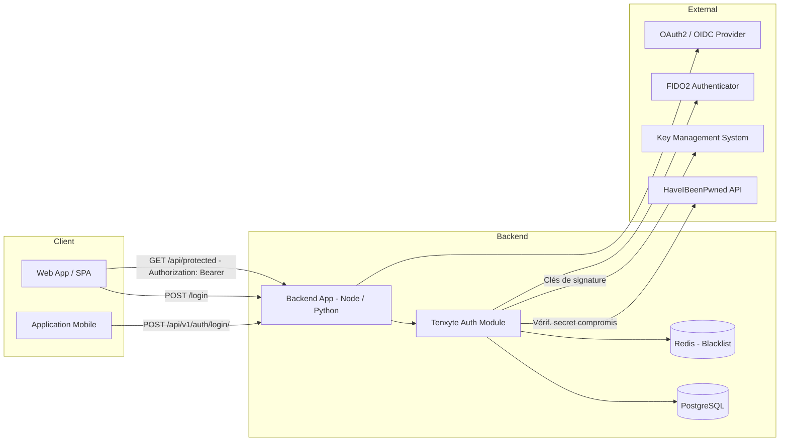
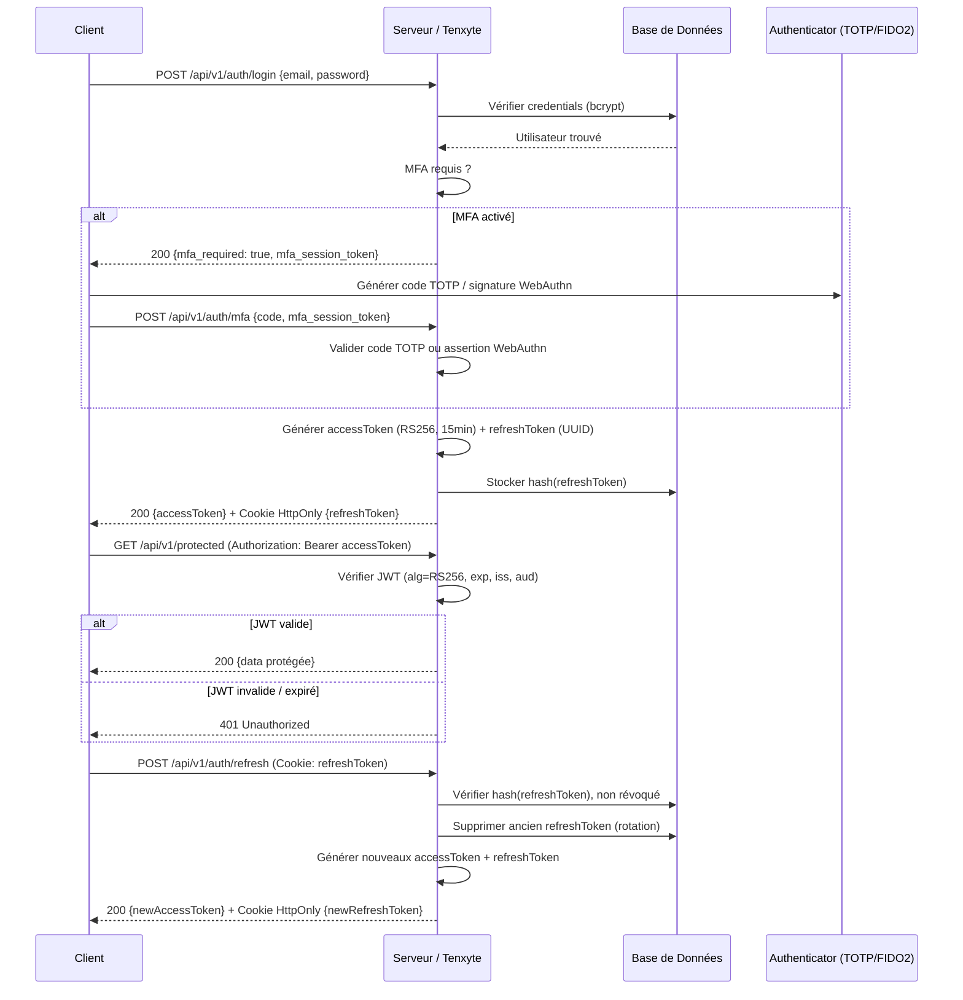
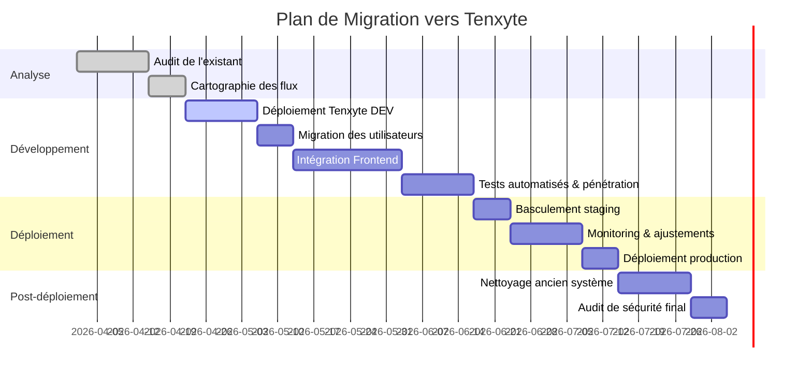

# Le Paradigme Brisé de l'Authentification Backend : Analyse Systémique et Réponse Tenxyte

> **Rapport de sécurité unifié** — Synthèse approfondie des vulnérabilités d'authentification, des standards de conformité et du positionnement de Tenxyte comme infrastructure d'identité sécurisée.

---

## Résumé Exécutif

Les architectures d'authentification backend contemporaines traversent une crise structurelle profonde. La numérisation accélérée des échanges a mis en lumière un paradoxe alarmant : les mécanismes de défense se sont déplacés vers la sécurité centrée sur l'identité, mais les fondations mêmes de l'authentification s'effondrent sous le poids de pratiques obsolètes, d'outils mal adaptés, et d'une culture du développement qui sacrifie la robustesse à la vélocité.

**Trois axes de défaillance dominent** : (1) la mauvaise gestion chronique des JSON Web Tokens (JWT), (2) l'épuisement des abstractions comme Passport.js, (3) le syndrome de réinvention permanente des briques d'authentification.

Des études récentes estiment que **près de 80 % des implémentations JWT en production** souffrent de configurations erronées ou de failles critiques. La plateforme Veracode indique qu'**une application sur quatre** contient au moins une faille de haut risque, le plus souvent concentrée dans les composants d'authentification et de contrôle d'accès. Par ailleurs, **74 % des organisations** reconnaissent que la pression des délais a conduit à des compromis directs sur la sécurité.

**Tenxyte** émerge comme réponse architecturale à cette crise : un framework d'authentification Python open-source (MIT), agnostique vis-à-vis du framework backend (Django, FastAPI…), intégrant nativement JWT avec rotation, RBAC hiérarchique, MFA (TOTP/Passkeys/FIDO2), login social, multi-tenant B2B, et conformité RGPD/OWASP ASVS by design.

---

## Table des Matières

1. [Causes Techniques Racines](#1-causes-techniques-racines)
2. [Anatomie des Vulnérabilités JWT](#2-anatomie-des-vulnérabilités-jwt)
3. [La Fatigue de Passport.js et le Coût de la Réinvention](#3-la-fatigue-de-passportjs-et-le-coût-de-la-réinvention)
4. [Risques de Sécurité et Scénarios d'Attaque](#4-risques-de-sécurité-et-scénarios-dattaque)
5. [Bonnes Pratiques d'Architecture et Protocoles](#5-bonnes-pratiques-darchitecture-et-protocoles)
6. [Conformité : OWASP ASVS, RGPD et FIDO2](#6-conformité--owasp-asvs-rgpd-et-fido2)
7. [Tenxyte : Positionnement, Architecture et Fonctionnalités](#7-tenxyte--positionnement-architecture-et-fonctionnalités)
8. [Tableau Comparatif des Solutions](#8-tableau-comparatif-des-solutions)
9. [Exemples de Code](#9-exemples-de-code)
10. [Modèle de Menaces et Matrice de Mitigation](#10-modèle-de-menaces-et-matrice-de-mitigation)
11. [Checklist et Plan de Migration](#11-checklist-et-plan-de-migration)
12. [Tests, CI/CD et Conseils DevOps](#12-tests-cicd-et-conseils-devops)
13. [Diagrammes d'Architecture et de Flux](#13-diagrammes-darchitecture-et-de-flux)

---

## 1. Causes Techniques Racines

### 1.1 Mauvaises pratiques JWT

Le standard JWT (RFC 7519) a été conçu pour offrir une méthode compacte et autonome de transmission sécurisée d'informations. Sa nature *stateless* en a fait l'outil de prédilection des microservices modernes. Pourtant, la simplicité apparente du format masque une complexité d'implémentation qui représente un terreau fertile pour les vulnérabilités.

Les erreurs les plus courantes sont :

- **Algorithme `none` accepté** : permet à un attaquant de modifier l'en-tête JOSE pour indiquer qu'aucune signature n'est requise, neutralisant la vérification serveur. Si le backend ne rejette pas explicitement les jetons non signés, un attaquant peut modifier les *claims* (identifiant, rôles…) sans être détecté.
- **Confusion d'algorithme (Algorithm Confusion)** : en forçant un serveur prévu pour RSA à utiliser l'algorithme HMAC, un attaquant peut utiliser la **clé publique du serveur** (par définition accessible) comme secret HMAC pour forger des jetons valides.
- **Secret faible ou codé en dur** : l'entropie d'un secret suit la formule $H = L \cdot \log_2(R)$ (où $L$ est la longueur et $R$ le nombre de caractères possibles). Un secret court ou prédictible permet des attaques par force brute hors ligne à une vitesse fulgurante, rendant la signature inutile avant même l'expiration du jeton.
- **Stockage côté client non sécurisé** : une proportion significative de développeurs continue de stocker les JWT dans le `localStorage`, vulnérable par conception aux attaques XSS. N'importe quel script tiers malveillant exécuté sur le domaine peut extraire et exfiltrer le jeton.
- **Absence de mécanisme de révocation** : sans rotation ni blacklisting, un token volé reste valide jusqu'à son expiration naturelle, facilitant les attaques de prise de contrôle persistante.
- **Claims surchargés ou sensibles** : inclure des adresses e-mail, des IPs, ou des rôles détaillés dans le payload augmente la surface d'attaque et soulève des enjeux RGPD (une adresse IP est une donnée personnelle au sens de la réglementation européenne).

### 1.2 La complexité structurelle de Passport.js

Passport.js a longtemps été considéré comme le standard Node.js pour l'authentification. Son architecture de « stratégies » promet une intégration facile de diverses méthodes (OAuth, LDAP, Local). En pratique, l'implémentation nécessite souvent un code de configuration verbeux qui dépasse en volume une implémentation personnalisée — phénomène qualifié de **« middleware hell »**.

Les points de friction structurels incluent :

- **Manque de support natif** pour les Promises et le flux `async/await` dans les versions historiques, forçant des wrappers complexes qui augmentent la surface d'erreur.
- **Documentation insuffisante** : les équipes se reportent sur des tutoriels tiers dont la qualité sécuritaire n'est pas garantie.
- **Fragmentation de l'écosystème** : de nombreuses stratégies tierces populaires n'ont pas reçu de mises à jour depuis plusieurs années. Chaque stratégie doit être évaluée individuellement lors des audits, ce qui les rend coûteux et complexes.
- **Aucun support natif** pour le MFA, la rotation des tokens, le blacklisting, ou le RBAC hiérarchique — toutes ces fonctionnalités doivent être réimplémentées manuellement.

### 1.3 Le syndrome de réinvention et la dette technique

Le développement d'un système d'authentification robuste exige une expertise pointue en cryptographie et gestion des sessions. En choisissant de *« rouler leur propre auth »*, les équipes s'exposent à des erreurs fondamentales :

- Utilisation d'algorithmes de hachage obsolètes (MD5, SHA-1)
- Absence de salage (*salting*) des mots de passe
- Mauvaise gestion du rate limiting et des attaques par force brute
- Anti-patterns en production : secrets JWT en clair dans les dépôts, expiration indéfinie, absence de vérification des claims `iss`/`aud`

Le temps consacré à recréer ces fonctionnalités de base est du temps soustrait au développement de fonctionnalités métier à haute valeur ajoutée.

### 1.4 La friction lors des migrations

Chaque migration de système d'authentification est un moment critique pour l'expérience utilisateur. Une mauvaise gestion peut entraîner une déconnexion massive, des réinitialisations forcées de mots de passe, ou des erreurs de session persistantes.

| Impact de la Migration | Effet sur l'Utilisateur | Risque Business |
|---|---|---|
| Invalidation de session | Déconnexion inattendue | Abandon de panier / Perte de workflow |
| Reset de mot de passe forcé | Frustration et perte de temps | Augmentation du taux de désabonnement |
| Incohérence des données | Profils corrompus ou inaccessibles | Tickets de support en masse |
| Changement de méthode MFA | Nécessité de ré-enrôlement | Blocage d'accès aux comptes sensibles |

> Les études montrent que les utilisateurs sont **20 % plus susceptibles** de finaliser un processus de connexion fluide utilisant des passkeys, par rapport aux méthodes traditionnelles par mot de passe.

---

## 2. Anatomie des Vulnérabilités JWT

| Type de Vulnérabilité | Mécanisme d'Attaque | Impact sur la Sécurité |
|---|---|---|
| **Algorithme `none`** | Modification de l'en-tête JOSE | Contournement total de l'authentification |
| **Confusion d'Algorithme** | Usage de la clé publique comme secret HMAC | Forgerie de jetons par des tiers |
| **Injection de `kid`** | Manipulation de l'identifiant de clé | Directory Traversal ou Injection SQL |
| **Absence d'expiration (`exp`)** | Vol de jeton persistant | Accès illimité en cas de compromission |
| **Fuite du Secret** | Force brute sur la signature HMAC | Compromission globale de l'autorité de confiance |
| **JWT Sidejacking** | Interception via XSS ou réseau non chiffré | Usurpation d'identité persistante |
| **Replay de Refresh Token** | Réutilisation d'un token non invalidé | Prise de contrôle de session longue durée |

> **Note** : OWASP préconise l'ajout d'un « fingerprint » ou contexte utilisateur (token CSRF en cookie `HttpOnly` dont le hash est inclus dans le JWT) pour rendre impossible la réutilisation d'un token volé en dehors du contexte original du navigateur.

---

## 3. La Fatigue de Passport.js et le Coût de la Réinvention

### 3.1 L'illusion du gain de temps

Le concept de « stratégies » Passport promet une intégration facile de méthodes d'authentification multiples. En pratique, l'implémentation d'une seule stratégie conduit à des séquences de middlewares comme :

```javascript
// Exemple d'enchevêtrement typique de Passport.js
app.use(passport.initialize());
app.use(passport.session());
passport.use(new LocalStrategy(options, callback));
passport.serializeUser((user, done) => { /* ... */ });
passport.deserializeUser((id, done) => { /* ... */ });
// + gestion manuelle JWT + OTP + rate limiting + ...
```

Ce code de configuration dépasse souvent en volume une implémentation personnalisée, tout en créant une boîte noire difficile à déboguer et à auditer.

### 3.2 Risques de la chaîne d'approvisionnement logicielle

La dépendance à de multiples stratégies tierces exposée à des risques de supply chain : des stratégies populaires n'ont pas été mises à jour depuis des années. Chaque stratégie constitue un vecteur d'attaque potentiel nécessitant une évaluation individuelle lors des audits de sécurité.

---

## 4. Risques de Sécurité et Scénarios d'Attaque

### 4.1 Vol ou falsification de token (JWT Sidejacking)

Un attaquant ayant intercepté un jeton (via XSS, sniffing sur réseau non chiffré) peut s'authentifier tant que le token est valide. Sans mécanisme de fingerprinting (token CSRF couplé au JWT), la moindre faille XSS suffit pour une usurpation complète.

### 4.2 Rejeu de Refresh Token

Les refresh tokens de longue durée stockés côté client sont des cibles prioritaires. Sans rotation systématique, un refresh token volé permet une prise de contrôle persistante. La rotation consiste à invalider l'ancien refresh token à chaque utilisation et à en générer un nouveau, rendant immédiatement détectable une tentative de réutilisation parallèle.

### 4.3 Attaques CSRF

Avec des tokens en cookie, un site tiers peut forger une requête authentifiée (le cookie est envoyé automatiquement). Les protections requises incluent `SameSite=Strict` et/ou un token anti-CSRF en double-submit.

### 4.4 Credential Stuffing et Brute Force

Sans MFA, un attaquant exploite des bases de données de mots de passe compromis pour tenter des connexions en masse. OWASP recommande :
- MFA systématique (TOTP, WebAuthn) pour tous les utilisateurs, et obligatoire pour les rôles à privilèges
- Verrouillage de compte après N tentatives échouées avec délai progressif
- Vérification des mots de passe contre des bases de données de compromission (ex. HaveIBeenPwned)

### 4.5 Attaques de Confusion d'Algorithme (Algorithm Confusion)

Une bibliothèque qui accepte dynamiquement l'algorithme spécifié dans l'en-tête du jeton est vulnérable. En changeant `RS256` en `HS256` et en signant avec la clé publique du serveur (publiquement accesssible), un attaquant forge un jeton valide. La contre-mesure est de **forcer** l'algorithme attendu côté serveur, jamais de le lire depuis le token.

### 4.6 Attaques sur OAuth/OIDC

Une mauvaise configuration OAuth (redirect URI non contrainte, absence de PKCE, scopes excessifs) peut permettre du *code hijacking* via les flux Implicit (obsolètes). La recommandation actuelle est de n'utiliser que le flux **Authorization Code + PKCE** pour les applications publiques.

### 4.7 Escalade de Privilèges via Claims

Si les autorisations sont basées uniquement sur les claims du JWT sans vérification en base de données, un attaquant ayant altéré le payload (ex. via une faille d'algorithme) peut s'attribuer des privilèges administrateur. La règle est de ne jamais faire confiance aux claims sensibles du côté client et de vérifier les autorisations critiques en base.

### 4.8 Violations RGPD sur les Logs

Inclure des adresses IP dans les logs ou les claims JWT sans anonymisation constitue une violation du RGPD (une IP est une donnée personnelle). Des politiques de purge et d'anonymisation des logs doivent être définies et appliquées.

---

## 5. Bonnes Pratiques d'Architecture et Protocoles

### 5.1 JWT : Configuration sécurisée

| Paramètre | Recommandation | Justification |
|---|---|---|
| **Algorithme** | RS256 ou EdDSA (Ed25519) | Clé asymétrique : évite de partager un secret |
| **Durée access token** | ≤ 15 minutes | Limite la fenêtre d'exploitation en cas de vol |
| **Durée refresh token** | 7 à 30 jours, stocké en DB | Permet révocation centralisée |
| **Secret** | ≥ 256 bits, stocké hors code (KMS/Vault) | Résistance aux attaques par force brute |
| **Claims** | Seul l'ID utilisateur + rôles minimaux | Principe du moindre privilège, conformité RGPD |
| **Vérification** | `iss`, `aud`, `exp`, `alg` imposé | Évite les attaques par confusion et replay |
| **Révocation** | Blacklist ou introspection pour tokens à risque | Permet de couper un token compromis immédiatement |

```python
# Exemple : vérification sécurisée d'un JWT en Python (PyJWT)
import jwt

def verify_token(token: str, public_key: str) -> dict:
    try:
        payload = jwt.decode(
            token,
            public_key,
            algorithms=["RS256"],        # Algorithme imposé, jamais lu depuis le token
            options={
                "require": ["exp", "iss", "aud"],  # Claims obligatoires
                "verify_exp": True,
            },
            audience="my-api",
            issuer="https://auth.example.com"
        )
        return payload
    except jwt.ExpiredSignatureError:
        raise ValueError("Token expiré")
    except jwt.InvalidTokenError as e:
        raise ValueError(f"Token invalide : {e}")
```

### 5.2 Stockage et transport des tokens

- **Access token** : envoyer exclusivement dans l'en-tête `Authorization: Bearer <token>` — jamais dans l'URL.
- **Refresh token** : stocker dans un cookie `HttpOnly; Secure; SameSite=Strict` pour le protéger des XSS.
- **Ne jamais** stocker de tokens sensibles dans `localStorage` ou `sessionStorage`.
- En complément, appliquer une **Content Security Policy (CSP)** stricte pour éliminer les vecteurs XSS.

### 5.3 OAuth 2.0 / OpenID Connect

- Utiliser **Authorization Code + PKCE** pour tous les clients publics (SPA, mobile).
- Bannir les flux **Implicit** (obsolètes) et **ROPC** (Resource Owner Password Credentials).
- Limiter les **scopes** demandés au strict nécessaire.
- Valider les tokens d'accès côté serveur (signature ou introspection).
- Contraindre les **redirect URIs** à une liste blanche stricte.

### 5.4 FIDO2 / WebAuthn (Passkeys)

FIDO2 utilise la cryptographie à clé publique avec **liaison à l'origine** (*origin binding*) : l'authentification est liée au domaine exact de l'application. Contrairement aux OTP (vulnérables aux proxys de phishing inverses), une tentative d'authentification sur un faux domaine est automatiquement rejetée par le navigateur.

Points d'implémentation :
1. Enregistrer la clé publique et le `userHandle` en base
2. Vérifier la signature de chaque assertion WebAuthn côté serveur
3. Valider le `RPID` (domaine) et l'`origin`
4. Activer `userVerification: required` pour les passkeys primaires
5. Prévoir une méthode de secours (OTP ou codes de récupération) en cas de perte du dispositif

> La donnée biométrique (empreinte, visage) **reste exclusivement sur l'appareil du client** et n'est jamais transmise au serveur — conformité RGPD native.

### 5.5 MFA et gestion des mots de passe

- Exiger le MFA pour tous les comptes à privilèges, et proposer l'opt-in pour tous les utilisateurs.
- Vérifier les mots de passe contre des bases de compromission (HaveIBeenPwned API).
- Appliquer les recommandations NIST SP 800-63B : longueur minimale ≥ 15 caractères si pas de MFA, favoriser les phrases de passe.
- Implémenter un verrouillage progressif (délai exponentiel, puis blocage temporaire).

### 5.6 Infrastructure sécurisée

- **TLS/HTTPS** partout, en production et en staging.
- **HSTS** (`max-age ≥ 31536000; includeSubDomains`).
- **CORS** restrictif : liste blanche d'origines, jamais de `*` sur les routes authentifiées.
- **Headers HTTP** de sécurité : `X-Content-Type-Options`, `X-Frame-Options`, `Referrer-Policy`.
- **Rotation des clés** de signature planifiée, gestion via un KMS (AWS KMS, HashiCorp Vault).
- **Monitoring** : alertes sur les échecs d'authentification répétés, les tokens expirés utilisés, les connexions depuis des IPs anormales.

---

## 6. Conformité : OWASP ASVS, RGPD et FIDO2

### 6.1 OWASP Application Security Verification Standard (ASVS)

L'OWASP ASVS définit 3 niveaux de vérification adaptés à la sensibilité des applications :

| Niveau | Description | Usage typique |
|---|---|---|
| **Niveau 1** (Opportuniste) | Sécurité minimale vérifiable par outils automatisés | Toutes les applications |
| **Niveau 2** (Standard) | Protection contre la majorité des menaces logicielles | Applications B2B, données sensibles |
| **Niveau 3** (Avancé) | Haute confiance contre des attaques ciblées | Applications critiques, secteur financier/santé |

L'ASVS couvre notamment les domaines **V2 (Authentification)** et **V3 (Gestion des Sessions)**. Tenxyte applique par défaut les contrôles de niveaux 2 et 3.

**Mapping OWASP Top 10 — Vulnérabilités traitées :**

| OWASP Top 10 | Risque Associé | Mitigation |
|---|---|---|
| A01 — Broken Access Control | Escalade de privilèges, IDOR | RBAC hiérarchique, vérification en DB |
| A02 — Cryptographic Failures | Secret JWT faible, algorithme cassé | RS256/EdDSA, clés via KMS |
| A03 — Injection | Injection SQL via `kid` | ORM paramétré, validation des inputs |
| A07 — Identification & Auth Failures | Token forgeable, absence de MFA | Forçage de l'algorithme, MFA obligatoire |
| A08 — Software & Data Integrity | Bibliothèques Passport non mises à jour | Dépendances auditées, SBOM |
| A09 — Logging & Monitoring | Absence de détection d'attaques | Audit logs, alertes sur anomalies |

### 6.2 RGPD

| Exigence RGPD | Implication technique | Implémentation |
|---|---|---|
| **Minimisation des données** | Ne pas stocker d'infos superflues dans les tokens | Claims JWT limités à `sub` + rôles minimaux |
| **Droit à l'oubli** | Suppression des données personnelles sur demande | Purge des sessions, tokens, logs utilisateur |
| **Limitation de conservation** | Logs et sessions avec durée de vie définie | Rotation mensuelle, TTL sur les tokens |
| **Protection des données biométriques** | Données biométriques = données sensibles | Avec FIDO2, elles ne quittent jamais l'appareil |
| **Journalisation des accès** | Traçabilité des accès aux données personnelles | Audit logs Tenxyte (connexions, changements de rôle) |

### 6.3 FIDO2 et standards de conformité

FIDO2 n'est pas un règlement légal, mais son adoption répond directement aux exigences des standards suivants :

- **OWASP ASVS V2.8** : authentification forte résistante au phishing
- **NIST SP 800-63B — Niveau d'Assurance AAL2/AAL3** : cryptographie à clé publique, vérification de l'utilisateur
- **eIDAS (EU)** : niveau de garantie "élevé" peut être atteint avec FIDO2 + vérification biométrique
- **PCI DSS v4.0** : MFA obligatoire pour les accès aux environnements de données de carte

---

## 7. Tenxyte : Positionnement, Architecture et Fonctionnalités

### 7.1 Présentation

Tenxyte est un framework d'authentification **open-source** (licence MIT) écrit en Python, conçu pour être **framework-agnostic** (Django, FastAPI, et via API/SDK pour Node.js). Il se positionne comme un **« Auth0 open-source self-hosted »** — une infrastructure d'identité complète sans dépendance à un service cloud externe.

> ⚠️ **Note** : Tenxyte est actuellement en **version beta**. Il convient de suivre les mises à jour et de maintenir une veille sur le dépôt GitHub.

### 7.2 Fonctionnalités Natives

| Catégorie | Fonctionnalités |
|---|---|
| **JWT** | Access + refresh tokens, rotation automatique, blacklisting, limite de sessions/devices |
| **MFA** | TOTP (Google Authenticator/Authy), liens magiques (passwordless), SMS OTP |
| **Sans mot de passe** | Passkeys / WebAuthn (FIDO2) via addon `tenxyte[webauthn]` |
| **Login Social** | Google, GitHub, Microsoft, Facebook |
| **RBAC** | Rôles hiérarchiques, permissions directes, décorateurs pour DRF |
| **Multi-tenant** | Organisations B2B, invitations, isolation des données par organisation |
| **Sécurité** | Rate limiting, vérification HaveIBeenPwned, audit logs, fingerprinting de session |
| **Infrastructure** | Middleware applicatif (`X-Access-Key/Secret`), PostgreSQL recommandé |
| **DevX** | `tenxyte.setup(globals())` : auto-configuration en une ligne |

### 7.3 Architecture et Intégration

Tenxyte s'intègre comme un module dans un projet Django existant, ou comme un service d'authentification centralisé pour une architecture microservices :

```python
# settings.py — Configuration minimale
import tenxyte

tenxyte.setup(globals())  # Enrichit INSTALLED_APPS, MIDDLEWARE, REST_FRAMEWORK

TENXYTE_JWT_SECRET_KEY = env('TENXYTE_JWT_SECRET_KEY')  # Depuis les variables d'environnement
TENXYTE_APPLICATION_AUTH_ENABLED = True  # Activer l'auth applicative (X-Access-Key/Secret)
```

L'authentification multi-applications (microservices) est gérée via des paires de clés `X-Access-Key / X-Secret` par service — chaque service s'identifie avant d'utiliser les API d'authentification.

**Composants exposés automatiquement :**
- Modèle utilisateur `tenxyte.User`
- Endpoints REST : `POST /api/v1/auth/register/`, `POST /api/v1/auth/login/`, `POST /api/v1/auth/refresh/`, etc.
- Middleware `ApplicationAuthMiddleware`
- Décorateurs et classes de permission DRF

### 7.4 Conformité Déclarée

| Standard | Couverture Tenxyte |
|---|---|
| OWASP ASVS Niveau 2-3 | Contrôles préconfigurés pour validation des jetons, rotation des clés |
| RGPD | Gestion des logs, rotation mensuelle des journaux, minimisation des claims |
| FIDO2/WebAuthn | Addon optionnel (pip install tenxyte[webauthn]) |
| NIST SP 800-63B | MFA, vérification de mots de passe compromis via HaveIBeenPwned |

| Caractéristique Tenxyte | Bénéfice Technique | Impact Stratégique |
|---|---|---|
| Agnosticisme Framework | API unique pour Django, FastAPI, Node.js via SDK | Standardisation de la sécurité à l'échelle |
| Support FIDO2 Natif | Cryptographie asymétrique côté client | Élimination radicale du phishing |
| Multi-tenancy B2B | Isolation stricte des données par organisation | Déploiement SaaS simplifié et sécurisé |
| Conformité ASVS intégrée | Contrôles de sécurité préconfigurés | Réduction des coûts d'audit |
| SDKs Open Source | Transparence et extensibilité totale | Évitement du lock-in fournisseur |

---

## 8. Tableau Comparatif des Solutions

| Critère | Tenxyte (Self-hosted) | Passport.js (Node) | JWT libs seules | Auth0 (Cloud) | Keycloak (Self-hosted) |
|---|---|---|---|---|---|
| **Sécurité** | Complète out-of-box (2FA, Passkeys, RBAC, rotation, blacklist) | Dépend entièrement de l'implémentation | Minimale — tout à implémenter manuellement | Très haute (MFA, détection d'anomalies, mises à jour auto) | Robuste (OIDC, LDAP, MFA) mais configuration manuelle |
| **Intégration** | Clé en main Python. SDK JS pour Node. Setup en 1 ligne | Simple dans Express, mais chaque stratégie = middleware supplémentaire | Très simple au démarrage, pas de structure globale | SPA SDK + règles graphiques, pas d'infra à gérer | Lourd (Java, admin console), instance indépendante requis |
| **Effort de migration** | Migration users + adaptation front. Centralisation des routes réduit la friction | N/A (existant) | Haut — tout à reconstruire | Redirection d'un endpoint login + SDK, risque de lock-in | Très long (realms, LDAP, SAML) mais centralisation complète |
| **Conformité** | OWASP, RGPD, NIST — par conception | Entièrement manuelle | Entièrement manuelle | Certifié SOC 2, GDPR (géré par Auth0) | Conforme OIDC/SAML, dépend de la configuration |
| **Extensibilité** | Modulable (SMTP, SMS, SQL/NoSQL), open-source | Très extensible via plugins Passport | Illimitée mais sans support | Hooks, règles, scripts — cadre propriétaire | SPI, providers, thèmes — nécessite Java |
| **Coût / Licence** | Gratuit (MIT). Coût : hébergement + maintenance | Gratuit. Coût : dev des fonctions manquantes | Gratuit. Coût : dev complet | SaaS, gratuit < 5000 users puis facturation croissante | Gratuit (AGPL). Coût : machines, support Red Hat |

---

## 9. Exemples de Code

### 9.1 Flux JWT sécurisé (Node.js / Express)

```javascript
// server.js — Implementation JWT avec RS256
const express = require('express');
const jwt = require('jsonwebtoken');
const fs = require('fs');

const app = express();
app.use(express.json());

// Charger les clés depuis le système de fichiers (jamais hardcodées)
const PRIVATE_KEY = fs.readFileSync(process.env.JWT_PRIVATE_KEY_PATH);
const PUBLIC_KEY = fs.readFileSync(process.env.JWT_PUBLIC_KEY_PATH);

app.post('/api/auth/login', async (req, res) => {
  const { email, password } = req.body;
  if (!email || !password) {
    return res.status(400).json({ error: 'Identifiants requis' });
  }

  // Vérification en base (pseudo-code)
  const user = await User.findOne({ email });
  if (!user) return res.status(401).json({ error: 'Utilisateur inconnu' });

  const match = await bcrypt.compare(password, user.passwordHash);
  if (!match) return res.status(401).json({ error: 'Mot de passe invalide' });

  // ✅ Payload minimal : seulement l'ID et les rôles
  const payload = { sub: user.id, roles: user.roles };

  // ✅ RS256 avec clé asymétrique, durée courte
  const accessToken = jwt.sign(payload, PRIVATE_KEY, {
    algorithm: 'RS256',
    expiresIn: '15m',
    issuer: 'https://auth.example.com',
    audience: 'my-api',
  });

  // ✅ Refresh token stocké en DB + envoyé en cookie HttpOnly
  const refreshToken = crypto.randomUUID();
  await RefreshToken.create({ token: refreshToken, userId: user.id, expiresAt: /* +7j */ });

  res
    .cookie('refresh_token', refreshToken, {
      httpOnly: true,
      secure: true,
      sameSite: 'strict',
      maxAge: 7 * 24 * 60 * 60 * 1000,
    })
    .json({ accessToken, token_type: 'Bearer', expires_in: 900 });
});

// Middleware de vérification : algorithme imposé côté serveur
function verifyJWT(req, res, next) {
  const auth = req.headers['authorization'];
  if (!auth?.startsWith('Bearer ')) return res.sendStatus(401);
  const token = auth.slice(7);

  try {
    // ✅ algorithms est une liste blanche — jamais lue depuis le token
    const decoded = jwt.verify(token, PUBLIC_KEY, {
      algorithms: ['RS256'],
      issuer: 'https://auth.example.com',
      audience: 'my-api',
    });
    req.user = decoded;
    next();
  } catch {
    return res.sendStatus(403);
  }
}
```

### 9.2 Flux complet (pseudocode agnostique)

```
fonction Authentifier(login, password) {
  user = DB.trouverUtilisateur(login)
  si (!user || !bcrypt.vérifier(password, user.hash)) → Erreur 401

  payload = { sub: user.id, roles: user.roles }  // ⛔ Pas d'email, pas d'IP
  accessToken = JWT.créer(payload, CLE_PRIVEE, algorithme="RS256", exp=15min)

  refreshToken = UUID.générer()
  DB.stockerRefresh(user.id, hash(refreshToken), expiration=7j)

  retourner { access_token, refresh_token }
}

fonction AccéderRessource(request) {
  token = extraireBearer(request.headers)
  payload = JWT.vérifier(token, CLE_PUBLIQUE, algorithme="RS256")  // ✅ Algorithme imposé

  // ✅ Vérification des autorisations en DB, pas seulement sur les claims
  si (!DB.aPermission(payload.sub, request.route)) → Erreur 403
  retourner RessourceProtégée
}

fonction RafraichirToken(refreshToken) {
  enregistrement = DB.trouverRefresh(hash(refreshToken))
  si (!enregistrement || expiré) → Erreur 401

  DB.supprimerRefresh(enregistrement.id)  // ✅ Rotation : l'ancien est invalidé
  retourner Authentifier(enregistrement.userId)  // Nouveaux tokens générés
}
```

### 9.3 Intégration Tenxyte (Django)

```python
# settings.py
import tenxyte
tenxyte.setup(globals())

TENXYTE_JWT_SECRET_KEY = env('TENXYTE_JWT_SECRET_KEY')
TENXYTE_APPLICATION_AUTH_ENABLED = not DEBUG

# urls.py
from tenxyte.urls import urlpatterns as tenxyte_urls
urlpatterns = [
    path('api/v1/auth/', include(tenxyte_urls)),
    # ...
]

# views.py — Protection d'une vue DRF avec RBAC
from tenxyte.permissions import HasRole

class AdminView(APIView):
    permission_classes = [IsAuthenticated, HasRole('admin')]

    def get(self, request):
        return Response({'admin_data': '...'})
```

---

## 10. Modèle de Menaces et Matrice de Mitigation

| Menace | Impact Potentiel | Probabilité | Mitigation Recommandée |
|---|---|---|---|
| **XSS / Vol de JWT** | Usurpation complète du compte | Élevée | Cookie `HttpOnly` + CSP stricte + fingerprinting CSRF dans le JWT |
| **CSRF (cookie auth)** | Requêtes non autorisées | Moyenne | `SameSite=Strict` + token CSRF double-submit + validation `Origin` |
| **Replay de token intercepté** | Prise de contrôle de session | Moyenne | Access tokens courts (15 min) + rotation du refresh + DPoP/nonce |
| **Credential Stuffing** | Accès non autorisé en masse | Élevée | MFA systématique (TOTP, WebAuthn) + verrouillage progressif + CAPTCHA |
| **Secret JWT faible** | Falsification de tokens | Moyenne | Clé asymétrique RS256/EdDSA + rotation régulière + audit CI |
| **Confusion d'Algorithme** | Forgerie de tokens par des tiers | Faible | Algorithme imposé côté serveur — jamais lu depuis le token |
| **Injection `kid`** | Directory Traversal ou SQLi | Faible | Valider et sanitiser le `kid`, utiliser un identifiant opaque (UUID) |
| **Manipulation de claims** | Escalade de privilèges | Moyenne | Vérifier les autorisations en DB, ne jamais faire confiance aux claims seuls |
| **Supply Chain (dépendances)** | Compromission via bibliothèque vulnérable | Croissante | SBOM, `pip-audit`/`npm audit` en CI, Dependabot |
| **Session fixation** | Réutilisation d'ancienne session | Faible | Régénérer l'ID de session après login ; invalider l'ancienne |
| **Violation RGPD (logs/IP)** | Amende légale | Moyenne | Anonymiser les logs ; politiques de purge ; chiffrement au repos |
| **Social Login (open redirect)** | Phishing, attribution de tokens | Faible | Redirect URIs en liste blanche stricte ; valider l'ID token OIDC |

> **Défense en profondeur** : Ne jamais se reposer sur une seule mitigation. OWASP préconise de combiner : storage sécurisé des tokens + CSP + RBAC + monitoring des tentatives anormales.

---

## 11. Checklist et Plan de Migration

### Phase 1 — Audit Initial
- [ ] Documenter l'état actuel : schémas de base (User, Session, Token), workflows, endpoints
- [ ] Identifier les algorithmes JWT utilisés, les durées de validité, les meccanismes de stockage client
- [ ] Évaluer les dépendances tierces (Passport strategies, JWT libs) pour les vulnérabilités connues
- [ ] Cartographier les flux d'authentification existants (login, register, refresh, logout, 2FA)
- [ ] Identifier les données personnelles stockées dans les tokens ou logs (IP, email…)

### Phase 2 — Installation et Configuration de Tenxyte
- [ ] Installer Tenxyte dans un projet Django séparé ou existant (`pip install tenxyte`)
- [ ] Exécuter `tenxyte.setup(globals())` dans `settings.py`
- [ ] Lancer `python manage.py tenxyte_quickstart` pour initialiser la base de données
- [ ] Configurer les secrets JWT hors code source (variables d'environnement, Vault)
- [ ] Laisser `DEBUG=True` initialement pour éviter la contrainte des en-têtes `X-Access-Key`

### Phase 3 — Synchronisation des Données
- [ ] Migrer les utilisateurs existants dans `tenxyte.User` (mots de passe bcrypt compatibles)
- [ ] Créer les rôles, permissions et organisations correspondant à la structure actuelle
- [ ] Vérifier la compatibilité des hashes de mots de passe existants

### Phase 4 — Mise à Jour du Frontend
- [ ] Remplacer les appels `POST /login` / `POST /register` par les endpoints Tenxyte
- [ ] Implémenter la gestion des en-têtes `X-Access-Key/Secret` côté client
- [ ] Migrer le stockage des tokens vers des cookies `HttpOnly` (access) et/ou stockage sécurisé
- [ ] Mettre à jour la logique de rafraîchissement (rotation effective)
- [ ] Utiliser le SDK JS `@tenxyte/core` si disponible pour le frontend

### Phase 5 — Parallélisation et Basculement
- [ ] Faire coexister l'ancien système (Passport) et Tenxyte en proxy
- [ ] Basculer d'abord l'inscription, puis progressivement le login et les autres flux
- [ ] Vérifier la compatibilité des codes HTTP retournés pour le frontend
- [ ] Documenter les endpoints et formats de réponse des deux systèmes pendant la transition

### Phase 6 — Tests de Bout-en-Bout
- [ ] Tester tous les scénarios : inscription, login, email de vérification, MFA, mot de passe oublié
- [ ] Vérifier la rotation effective des refresh tokens
- [ ] Confirmer que les tokens Passport ne sont plus acceptés après cutover
- [ ] Réaliser des tests de pénétration ciblés (algorithme `none`, replay, CSRF…)

### Phase 7 — Déploiement Production
- [ ] Activer `TENXYTE_APPLICATION_AUTH_ENABLED = True`
- [ ] Désactiver le mode `DEBUG`
- [ ] Activer HTTPS/TLS partout + HSTS
- [ ] Configurer les headers de sécurité (CSP, X-Frame-Options, etc.)
- [ ] Planifier la rotation régulière du secret JWT

### Phase 8 — Monitoring et Nettoyage
- [ ] Monitorer les logs d'authentification (échecs, tokens expirés utilisés, IPs anormales)
- [ ] Établir un plan de rollback (réactiver Passport en standby si nécessaire)
- [ ] Supprimer l'ancienne logique Passport une fois la migration stable
- [ ] Documenter la nouvelle API pour les équipes de développement

---

## 12. Tests, CI/CD et Conseils DevOps

### 12.1 Pipeline de Sécurité

```yaml
# Exemple de pipeline GitHub Actions
security-checks:
  steps:
    - name: Audit des dépendances Python
      run: pip-audit

    - name: Audit des dépendances Node
      run: npm audit --audit-level=high

    - name: Analyse statique (SAST)
      run: bandit -r src/  # Python
           # + ESLint security plugin pour JS

    - name: Tests d'authentification
      run: pytest tests/auth/ -v
      # Vérifie : refus algorithme none, expiration, CSRF, rotation refresh

    - name: Scan des secrets dans le code
      run: gitleaks detect --source .
```

### 12.2 Tests de Sécurité Obligatoires

| Test | Description | Outil suggéré |
|---|---|---|
| Rejet de l'algorithme `none` | Le serveur doit retourner 403 si `alg: none` | Pytest + `pyjwt` / `jsonwebtoken` |
| Expiration des tokens | Un token expiré doit être rejeté | Tests d'intégration |
| Rotation du refresh token | Un refresh réutilisé doit être invalide | Tests fonctionnels |
| Vérification CSRF | Requêtes cross-origin sans token CSRF rejetées | Selenium / Playwright |
| Résistance au brute force | Après N échecs, verrouillage ou délai | Tests de charge (Locust) |
| Headers de sécurité | Présence de CSP, HSTS, X-Frame-Options | `security-headers.com` / Zap |

### 12.3 Monitoring et Observabilité

```python
# Exemple : métriques Prometheus pour l'authentification
from prometheus_client import Counter, Histogram

login_success_counter = Counter('auth_login_success_total', 'Connexions réussies', ['method'])
login_failure_counter = Counter('auth_login_failure_total', 'Échecs de connexion', ['reason'])
token_refresh_counter = Counter('auth_token_refresh_total', 'Rafraîchissements de token')

# Dans le handler de login :
if success:
    login_success_counter.labels(method='password').inc()
else:
    login_failure_counter.labels(reason='invalid_credentials').inc()
```

**Seuils d'alerte recommandés :**
- > 10 échecs de connexion en 1 minute depuis la même IP → Alerte + blocage temporaire
- Token expiré utilisé → Log + investigation
- Rafraîchissement de refresh token révoqué → Alerte critique (possible token volé)

### 12.4 Bonnes Pratiques DevX

- Centraliser toute la logique d'authentification dans un module ou service unique
- Documenter les flux d'authentification dans l'onboarding développeur
- Fournir des collections Postman / Insomnia pour simuler les requêtes d'authentification
- Activer les options sécurisées par défaut dans tous les environnements (flags cookies, hash des refresh tokens)
- Effectuer des revues de code ciblées sur la sécurité lors de l'ajout de nouvelles routes sensibles

---

## 13. Diagrammes d'Architecture et de Flux

### Architecture Globale



### Flux d'Authentification Complet



### Plan de Migration (Gantt)



---

## Conclusion

Le constat est sans appel : l'authentification backend telle qu'elle est pratiquée par une large majorité des équipes de développement est un moteur de risque majeur. La dépendance à des implémentations JWT défaillantes et à des frameworks vieillissants comme Passport.js a créé une dette sécuritaire devenue insoutenable à l'heure des menaces avancées.

L'adoption d'une approche **Security by Design** — intégrant les standards OWASP ASVS, RGPD et FIDO2 dès la conception — n'est plus une option mais un impératif de survie pour les systèmes à enjeux.

**Tenxyte propose une rupture nécessaire** : transformer l'authentification d'une corvée technique vulnérable en une infrastructure stratégique robuste. En centralisant et sécurisant par défaut l'ensemble des mécanismes d'identité (tokens, MFA, RBAC, audit, compliance), il permet aux équipes de se concentrer sur l'innovation produit avec l'assurance d'une porte gardée par les meilleures technologies disponibles.

L'avenir de l'authentification est **agnostique, sécurisé par architecture, et centré sur l'utilisateur** — et Tenxyte en est une incarnation concrète today.

---

## Sources et Références

| Source | Domaine |
|---|---|
| Documentation officielle Tenxyte | JWT, RBAC, endpoints, configuration |
| OWASP ASVS (Application Security Verification Standard) | V2 Authentification, V3 Sessions |
| OWASP Cheat Sheet Series | JWT, Session Management, MFA, XSS |
| OWASP Top 10 (2021) | Cartographie des risques web |
| RFC 7519 — JSON Web Token | Spécification JWT |
| RFC 6749 / 6750 — OAuth 2.0 | Flux Authorization Code, PKCE |
| W3C / FIDO Alliance — WebAuthn / FIDO2 | Authentification sans mot de passe |
| NIST SP 800-63B | Niveaux d'assurance de l'authentification (AAL) |
| RGPD (Règlement UE 2016/679) | Protection des données personnelles |
| Veracode State of Software Security | Statistiques de vulnérabilités applicatives |
| HaveIBeenPwned (Troy Hunt) | Base de données de mots de passe compromis |
| Thales — FIDO2 & WebAuthn Guide | Cryptographie asymétrique, clés publiques |
| Yubico — WebAuthn Developer Guide | Implémentation WebAuthn côté serveur |

---

*Rapport généré le 24 mars 2026 — Fusion et enrichissement de deux analyses indépendantes portant sur la sécurité de l'authentification backend et le framework Tenxyte.*
